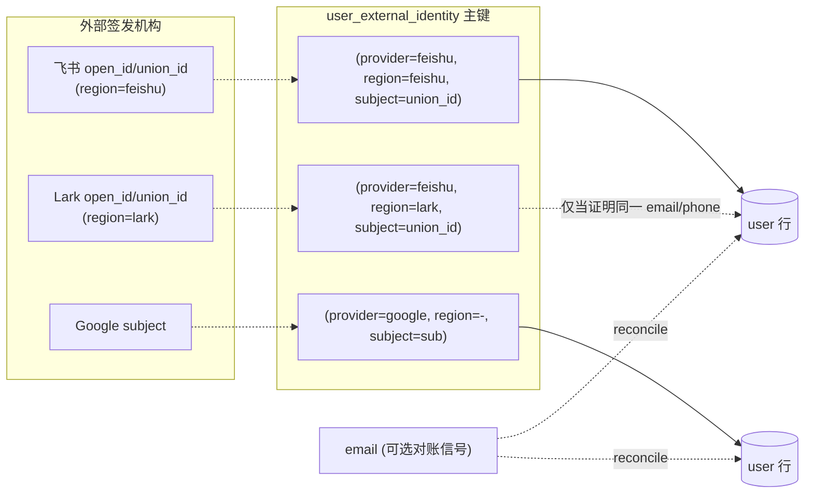
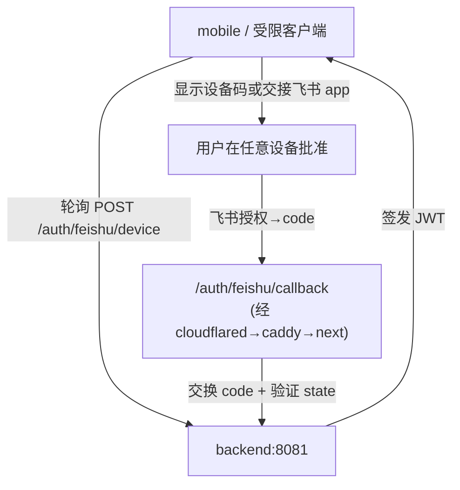

# Ideation：为 Multica 集成飞书认证登录

47 条原始想法 → 去重 33 条 → fresh-context 反驳 + 仲裁 → 7 条幸存方向。从"如何把飞书登录接进来"展开到身份模型、CSRF 缺口、fork 生存纪律等真实决策面。

## Grounding Context

**代码库现状**（self-host fork，Go/Chi+sqlc 后端 + Next.js web + Electron desktop + Expo mobile；部署在 `cloudflared → caddy:8097 → Next:3001 → backend:8081` 之后）：

- 现登录方式只有 `email → OTP` 两步。会话是无状态 HS256 JWT（`multica_auth` HttpOnly cookie，SameSite=Strict + `multica_csrf` 双重提交 CSRF）。auth 中间件按 token 前缀（`mat_`/`mcn_`/`mul_`/JWT）分发，服务端剥离 `X-Actor-Source`。
- 身份模型**纯 email 键控**：`user.email UNIQUE`，`findOrCreateUser(email)` 是所有登录路径的汇聚原语，`issueJWT(user)` 与 provider 无关。**全仓库无任何外部身份列**（无 `oauth_accounts`/`provider_subject`/`external_id`）。
- **Google OAuth 登录已存在**（`Handler.GoogleLogin` @ `server/internal/handler/auth.go:482-636`，`POST /auth/google`），是镜像飞书的现成范本——但**不用 OAuth `state` 参数**（CSRF 仅靠 cookie 双重提交，那是会话建立之后的防护，不覆盖授权往返本身）。
- 已有的 `lark_user_binding`（`server/migrations/109_lark_integration.up.sql`）是**登录后的 per-workspace bot 绑定**（FK 指向 `member`，要求已登录用户），**不是登录路径**。但它已捕获 `lark_open_id`、`union_id`（注释标明"为未来跨安装身份合并 Phase 2 预留"）、以及 `lark_installation.app_secret_encrypted`（应用层 secretbox，DB 永不见明文）。`server/migrations/116_lark_installation_region.up.sql` 已为 bot 侧建模 `region TEXT CHECK (region IN ('feishu','lark'))`——域拆分问题在 fork 内部已有先例。
- mobile（`apps/mobile`）**无任何 login/auth 代码**，且按 `apps/mobile/CLAUDE.md` 只能 `import type` + 纯函数，不能引入 `@multica/core` 的 auth store。
- `/auth/*` 是 Next.js 的 `afterFiles` rewrite（`apps/web/next.config.ts:51-88`）：**只有当没有 Next.js 页面匹配时才转发到后端 `:8081`**。verifier 已确认仓库内无 `/auth/feishu/` 目录——所以无页面时后端 handler **会**被 rewrite 命中（这点纠正了一个常见误读）。

**关键 learnings**（`docs/solutions/`）：`FRONTEND_ORIGIN`（不是 `MULTICA_APP_URL`）才是 auth/邮件 URL 的权威来源；`SUPER_ADMIN_EMAILS` 空 → deny-all 是**安全不变量**；裸 `fetch()` 会静默绕过 CSRF 双重提交（2026-08-04 rename bug）→ mutation 必须走 `@multica/core/api`；fork-only 定制是横跨 migration+handler+React+4-locale-key+CSRF-测试的不变量集合，`parity.test.ts` 强制 locale 对称，3-way merge 对 fork-code×upstream-test 碰撞视而不见。

**外部研究**（web，价值高）：飞书 OAuth2 是标准授权码流；**默认 userinfo 不含 email**（需 `contact:user.email:readonly` scope + 应用重新发布 + 管理员审批）；三个 ID——`open_id`（per-app，恒在）/ `union_id`（per-developer）/ `user_id`（per-tenant）；`open.feishu.cn`（国内）与 `open.larksuite.com`（国际）是完全独立的两套环境，同一个人 ID 不同、无 API 桥接，只有 email/phone 能跨域对账；登录 UX 有浏览器重定向 / 扫码 / JS-SDK（仅飞书客户端内）三种；`redirect_uri` 需 HTTPS + 精确匹配（错误码 20029）；免费自建应用 10,000 calls/月硬上限。Go 参考实现 Casdoor 用 `user_id → union_id → open_id` 兜底链。

**适用于所有方向的 fork 纪律**（非独立方向）：无论选哪条路，都要在 `docs/customizations.md` 账本登记（handler + route + `extra`-slot prop + 4 语言 locale key + CSRF 测试 + config 字段 + migration 编号），`parity.test.ts` 守护 locale 对称，并在每次 upstream 升级预算"跑上游新测试"以暴露碰撞。

## Topic Axes

1. **sign-in-entry-ux** — 登录入口机制与流程形态（浏览器重定向 / 嵌入式扫码 / mobile auth-session）。
2. **identity-account-linking** — 飞书身份如何挂到现有 email 键控的 user 行；email 缺席问题；首次/回头/已注册的关联策略。
3. **client-coverage** — web/desktop/mobile 谁拿飞书登录、共享还是平台特异；mobile 零先例 gap。
4. **selfhost-callback-config** — `/auth/*` 路径约束、`FRONTEND_ORIGIN` 为 URL 源、redirect_uri 注册、env、caddy rewrite、公网 vs 内网 URL。
5. **session-security** — JWT 复用、state-CSRF 问题（现有流程无 state）、deny-all 门控、backend-only 交换、域分裂、限速门控。

## Ranked Ideas

> **速览**（编号 · 标题 · 轴 · 置信度 · 复杂度）
> 1. provider-subject 身份注册表 · identity · 78% · M-H
> 2. 服务端验证 OAuth state CSRF · session-security · 88% · L-M
> 3. 邀请令牌预绑定（绕开 email scope） · identity · 82% · L-M
> 4. Feishu-first 登录，OTP 降级为绑定仪式 · sign-in-entry-ux · 80% · M
> 5. 零共享包 diff（`extra` 槽） · client-coverage · 85% · L
> 6. Device Authorization Grant 覆盖 mobile · client-coverage · 70% · M
> 7. 启动期反射式回调校验 · selfhost-callback-config · 85% · L

---

### 1. provider-subject 身份注册表（把身份与 email 解耦）

**Description:** 新增一张 `user_external_identity(provider, domain, subject, user_id, ...)` 表，把飞书 `open_id`（单应用 self-host 下的主键）/ `union_id`（跨自有应用）/ `user_id`（租户内）作为 `(provider, region, subject)` 存到 user 行上。`user.email` 保持 UNIQUE 但降级为"可选的对账信号"，不再是唯一关联键。绑定在可拿到的最稳定 ID 上（Casdoor 优先级 `union_id > user_id > open_id`），并把 `region`（`feishu`/`lark`）纳入键的一部分——直接镜像 fork 已有的 `lark_installation.region`。配套：`SUPER_ADMIN_EMAILS` 的 deny-all 门控必须从 email 改挂到 `(provider, subject)` 或显式 `is_super_admin` 列（否则对"无 email 的飞书用户"静默退化为 allow-all）；绑定策略用 TOFU（首次绑定 + 仅追加审计日志，冲突重绑需重新确认）。

**Axis:** identity-account-linking

**Basis:** `direct:` `server/migrations/001_init.up.sql:5-12` `email TEXT UNIQUE NOT NULL` 是唯一身份轴；`direct:` 全仓库无 `identity_provider`/`provider_subject`/`external_id` 列（已 grep 确认）；`direct:` `server/migrations/116_lark_installation_region.up.sql` 已建模 `region CHECK IN ('feishu','lark')` 并注释"加此列前一个部署一次只能连一个云"；`direct:` `isSuperAdmin(email)` deny-all（evidence-session §7）。`external:` Casdoor `user_id→union_id→open_id` 优先级；飞书默认 userinfo 无 email、域拆分无 API 桥接。`reasoned:` 医疗 EMPI（Master Patient Index）是无通用标识、多签发机构、不得静默合并/拆分的成熟结构解。

**Rationale:** email 是飞书默认 userinfo 里**唯一不返回**的字段。把 email 当唯一身份轴，就只能在"强制用户授 email scope（管理员审批+重新发布的高摩擦路径）"和"飞书邮箱≠Multica 邮箱时静默建重复账户"之间二选一。把 provider-subject 设为主键、email 设为对账信号，是唯一能同时扛住 email 缺席 + 域分裂 + 账户接管 + admin 门控的模型。这是一次性确立、让后续每个 IdP 集成更便宜的复合接缝。

**Downsides:** 引入新表 + 迁移（fork-only 不变量集合又增一项，需账本登记）；对"就我一个用户"的 self-host 可能过度——见下方规模分叉。还需决定 handler 形态：按 CLAUDE.md "avoid broad refactors / 无显式要求不加兼容层" + n=2 原则，倾向**内联复制 `GoogleLogin` 为 `FeishuLogin`**（gene-duplication），到第 3 个 IdP 再抽 `OAuthProvider` 接口；但若预见到半年内会接 WeCom/DingTalk/GitHub，则现在就抽 `/auth/oauth/{provider}` + registry 更划算——这是 T1 张力，需在 brainstorm 裁决。

**规模分叉（重要）：** 若用户群真的就是"你一个人"，不必建表——复用已存在的 `lark_binding_token`（15 分钟一次性 click-to-bind，`109_lark_integration.up.sql:248-267`）把自己的 `open_id` 绑到你的 user 行，再写个 ~10 行飞书 handler 调 `issueJWT`，**一下午交付、零 migration**。先确认规模再决定是否上 schema。

**Confidence:** 78%　**Complexity:** Medium-High

---

### 2. 服务端验证的 OAuth state CSRF nonce（顺带补 Google 的遗留缺口）

**Description:** 现有 Google 流程**不用 OAuth `state`**——它靠后端-only code 交换 + 会话后的 HMAC 双重提交 cookie 来防 CSRF，但授权往返本身没有绑定令牌（登录 CSRF：攻击者在自己飞书账户下发起登录，骗受害者浏览器完成它，把受害者静默登进攻击者拥有的账户——该账户可能被邀请进 workspace 泄漏共享内容）。为飞书在 `/auth/feishu/begin` 由服务端签发一个短期 HMAC 签名的 `state`（可从现有 `multica_csrf` nonce 派生），在回调**交换 code 之前**验证。同一机制日后可回溯套到 Google。

**Axis:** session-security

**Basis:** `direct:` `server/internal/handler/auth.go:482-531` Google 流程无服务端生成 state（code 走 JSON POST）；`direct:` `ValidateCSRF`（`server/internal/auth/cookie.go:217-254`）是会话后的防护，不覆盖登录往返；`direct:` 2026-08-04 CSRF-on-mutations bug 证明裸 `fetch()` 会静默绕过双重提交。`reasoned:` WebAuthn `challenge` / SAML `InResponseTo` / TLS 通道绑定都是"响应必须加密绑定到原始会话"的同构解。

**Rationale:** "Google 不需要 state" 只在 Google 的 redirect_uri 绑定 + 后端交换恰好堵住漏洞时成立。一个通用 provider 抽象不该继承这份运气——飞书是把它修对的 forcing function。成本仅一次 HMAC。

**Downsides:** 与"保持与 Google 流程一致"的惯性相悖（Pain #6 主张 state 只当不透明传输 + 加 provider 标签、保持无 state）；需在 brainstorm 决定是"飞书补 state、Google 暂不动"还是"统一补"。

**Confidence:** 88%　**Complexity:** Low-Medium

---

### 3. 邀请令牌预绑定飞书身份（绕开 email scope）

**Description:** 飞书登录最大的非技术阻碍是"申请 email scope → 重新发布应用 → 管理员审批"。对基于邀请的 workspace 入职（Multica 的典型流程），可以整个移除这一步：用户经工作区邀请链接到达时，邀请里存的 email 就是 linker——飞书只需返回 `open_id` + `name`。复用 `findOrCreateUser` 已查询的 `GetLatestPendingInvitationNameByEmail`（现用于 KTD5 名称优先级），扩展为同时取邀请指定的 email 做匹配。

**Axis:** identity-account-linking

**Basis:** `direct:` `server/internal/handler/auth.go:196-200` `findOrCreateUser` 已查询 `GetLatestPendingInvitationNameByEmail`（verifier 已核实）；`external:` 飞书默认 scope 返回 `open_id` + `name`，email 需明确 scope + 管理员审批 + 重新发布——自托管集成里最常被卡住的步骤。

**Rationale:** 把"组织变更管理事件"降为"一次性设置"。受邀用户经邀请链接获得无缝的飞书→Multica 绑定，全程零飞书管理摩擦、零"需要 email"错误。与 #1 互补：#1 解决通用身份模型，#3 解决受邀新用户的 onboarding 快路径。（全员备选 `app_access_token` 租户级读 email 因可行性未证实已剔除。）

**Downsides:** 只覆盖"经邀请来的"用户；非邀请的访客/外部用户仍需 email 确认门（回到 #1 的 OTP-claim 路径）。

**Confidence:** 82%　**Complexity:** Low-Medium

---

### 4. Feishu-first 登录：OTP 降级为"绑定仪式"，而非登录本身

**Description:** 反转当前层级：现在 email-OTP 是唯一登录方式。集成飞书后，**回头用户**扫码/点飞书即直接登录——零 OTP 往返。OTP 只在飞书身份匹配不到现有 user 行时出现，作为"把新飞书身份绑到 Multica 账户"的 email 所有权证明。登录流变为飞书优先；email-OTP 退回为边缘情况或用户自选路径。入口机制（嵌入式扫码 vs 浏览器重定向）是这个方向内的子选择。

**Axis:** sign-in-entry-ux

**Basis:** `direct:` `server/internal/handler/auth.go:174-209` `findOrCreateUser` 是所有登录路径汇聚的 email 键控原语——一旦有了飞书身份，已识别用户的 `SendCode`→`VerifyCode` 就是冗余；`direct:` `auth.go:156-165` `issueJWT` 只需一个 `db.User`，GoogleLogin 已在 `findOrCreateUser`→`issueJWT` 路径上完全绕过 OTP（证明绕过是规范的）。

**Rationale:** 用户明说要"快捷登录"。OTP 本身不快捷（发送→等待→重输）。对使用飞书的自托管群体，绝大多数用户首次绑定后不应再看到 OTP。这个反转让飞书成为快通道，仅在语义上确实需要时（证明新绑定的 email 所有权）保留 OTP。

**Downsides:** 需配合 #1 的身份模型（否则 open_id 匹配不到 user 时无路可走）；嵌入式扫码需引入飞书 QR SDK script（一个 iframe 依赖）。

**Confidence:** 80%　**Complexity:** Medium

---

### 5. 零共享包 diff：经现有 `extra` 槽挂飞书按钮

**Description:** 不要给共享 `LoginPage` 堆第三个 provider prop。`LoginPageProps.extra?: ReactNode` 已存在且在用（web 在此处渲染"Prefer the desktop app?"提示）。从 `apps/web` 经 `extra` 渲染飞书按钮，由 config store 的 `feishuAppId` 门控。共享的 `packages/views/auth/login-page.tsx` **零 diff**——无 `onFeishuLogin` prop、无泛化、无 upstream-merge 冲突。配合：handler 用新文件内联（C8）；飞书应用密钥复用 `lark_installation.app_secret_encrypted` 的 secretbox（A7），而非照抄 `GOOGLE_CLIENT_SECRET` 加一个明文 env。

**Axis:** client-coverage（fork 卫生）

**Basis:** `direct:` `packages/views/auth/login-page.tsx` `LoginPageProps { ... extra?: ReactNode }`（verifier 已核实，"Prefer the desktop app?" 是其当前用法）；`direct:` `lark_installation.app_secret_encrypted BYTEA`（secretbox，DB 永不见明文）+ `UNIQUE(app_id)`；`feedback_fork_customization_invariant_set` 记忆：共享文件里的 fork-only 改动是每次升级最痛的冲突源。

**Rationale:** 这个 fork 最贵的经常性成本是 upstream 合并撞上共享文件里的 fork 定制。证明飞书登录能做到"对 `packages/` 零 diff"，就为每个未来 fork 功能立下模板，把合并预算真正降到零。每加一个 LoginPage prop 都是多一处 fork 表面；`extra` 槽是为此类 app 层扩展设计的稳定公共 API。

**Downsides:** `extra` 是单槽——若未来要在登录卡放多个非 provider 元素会拥挤（届时再泛化）；与 #1/L7"数据驱动 provider 列表"方向相悖（后者更通用但 n=2 时过度工程）。

**Confidence:** 85%　**Complexity:** Low

---

### 6. OAuth 2.0 Device Authorization Grant（RFC 8628）覆盖 mobile / 受限客户端

**Description:** mobile 没有任何 login 代码，且按 `apps/mobile/CLAUDE.md` 不能引入 `@multica/core` 的 auth——任何"让 mobile 采用 core auth store"的提案结构上是死路。移植 Multica 已为 CLI 拥有的形态：mobile 屏幕显示一个设备码（或交接到飞书 app），用户在任何有浏览器的设备上批准，mobile 轮询 `/auth/feishu/device` 直到批准，直接在响应里拿 JWT。零原生 OAuth SDK、零深度链接基础设施。v1 的更便宜变体：mobile 经 `expo-auth-session` 应用内浏览器打开 web `/login`，回调经 `multica://auth/callback?token=...` 深链回来（复用桌面已有模式，约 20 行而非约 500 行）。

**Axis:** client-coverage

**Basis:** `direct:` `issueCliToken`（`server/internal/handler/auth.go:638-661`）是该授权的临时原型（verifier 已核实）；`direct:` `apps/mobile/CLAUDE.md` import-type-only 规则 + mobile 自管 UI/state/i18n；`direct:` 桌面 `apps/desktop/src/renderer/src/pages/login.tsx:15-23` 已用 `openExternal` + `multica://` 深链。`external:` RFC 8628 是 Roku/AppleTV/CLI 激活的标准形态。

**Rationale:** mobile 是最深的 gap（零先例 + 边界禁令）。从"在新平台造完整 OAuth"变成"渲染一个码 + 轮询一个端点"是数量级的成本下降，且同一路径未来可服务任何受限客户端（kiosk、CLI 变体、嵌入式 widget）。

**Downsides:** Device Grant 需后端新增 `/auth/feishu/device` 端点 + 轮询协议（中等成本）；若 mobile 飞书登录不在 v1 范围，可先只建 `api.oauthLogin(provider, code, redirectUri)` 接缝（L6）、把 mobile UI 留到有真实需求——这是 brainstorm 要定的范围问题。

**Confidence:** 70%　**Complexity:** Medium

**Confidence:** 70%　**Complexity:** Medium

---

### 7. 启动期反射式回调校验 + FEISHU_DOMAIN 开关（fail-fast）

**Description:** 把飞书 `redirect_uri` 当作 NAT 穿透意义上的反射地址凭据——公网 URL（cloudflared 主机）不是任何内部跳（Next:3001、backend:8081）。在**服务启动时**交叉校验 `FEISHU_REDIRECT_URI`：(a) 已设置，(b) 主机匹配 `FRONTEND_ORIGIN` 派生的公网主机，(c) 是 HTTPS，(d) 路径未被任何 `apps/web/app/auth/*` 页面路由遮蔽。同时 `FEISHU_DOMAIN=feishu|lark` 集中选择所有端点（授权/token/userinfo/contact）。配置错误 = 启动时一条清晰的单一失败信息，而不是部署数小时后用户看不到的飞书侧 20029。

**Axis:** selfhost-callback-config

**Basis:** `direct:` `apps/web/next.config.ts:51-88` `/auth/:path*` 是 `afterFiles` rewrite（页面会遮蔽后端）；`direct:` `FRONTEND_ORIGIN` 是 auth/email URL 的权威来源（evidence-selfhost §4）；`direct:` 四跳拓扑无直连 `:8081` caddy 路由。`external:` 飞书 redirect_uri 需 HTTPS + 精确匹配（错误 20029）；`reasoned:` STUN/TURN 反射地址发现——内部地址不是世界看到的地址，反射地址错了每次握手都失败。

**Rationale:** 自托管 Multica 由一个人运维；配错的 redirect_uri 表现为"飞书登录就是部署几小时后不工作"且带一个用户看不到的飞书侧不透明错误。启动校验器把它变成 30 秒的修复。页面遮蔽风险是简单路径测试能抓到的潜伏正确性 bug。（注：曾有候选声称"后端回调会 404"——已由 verifier 证伪：afterFiles 在无页面时确实命中后端。）

**Downsides:** 启动探针需在 deploy/launchd 钩子里被实际触发才有用（属于 `install.sh` reload 缺陷系列的同类失败面，需确保钩子覆盖）。

**Confidence:** 85%　**Complexity:** Low

---

## Rejection Summary

| # | 想法 | 淘汰理由 |
|---|------|----------|
| 1 | `app_access_token` 租户级读 email | WEAK：租户级 scope 能否读 email 未证实；#3（邀请令牌）更稳妥地达成"绕开 email scope" |
| 2 | QR 作为"设备绑定仪式"（WhatsApp/WebAuthn 类比） | WEAK：类比推测、低于此规模的会议门槛；受限客户端的实质由 #6 承载 |
| 3 | 飞书 WebView 内 JS-SDK 免登自动登录 | WEAK：in-Feishu 访问占比未证实 + 需飞书应用域名白名单未处理 |
| 4 | mobile 原生 `expo-auth-session` 构建 | WEAK：对此规模过重 + 违反 mobile import 边界；#6 取代 |
| 5 | `multica setup feishu` 交互式 CLI | WEAK：单运维者低于会议门槛的"锦上添花"；#7 覆盖核心 fail-fast 需求 |
| 6 | 回调建成 Next.js 页面（"后端会 404"） | REFUTED：afterFiles 陷阱推理是反的（无页面时后端会被命中）；"镜像 Google"理由仅作为被 #1/#7 吸收的次级依据存活 |
| 7 | 现在就泛化 `/auth/oauth/{provider}` + registry | n=2 过早抽象（违反 CLAUDE.md 反过度工程）；折进 #1 的 T1 张力，第 3 个 IdP 再议 |
| 8 | 数据驱动 provider 列表（`/api/config`） | 同 #7，过早泛化 |
| 9 | workspace 级 SSO-only 模式 | 是 #4 的一个配置，非独立方向 |
| 10 | 从飞书组织结构 push 预置用户（10x 反转） | 仅在确认团队规模 + 飞书组织花名册在范围内才成立；暂缓 |
| 11 | 飞书不可达时缓存+回退 email | 韧性加固，次要；折进 #2/#4 实现 |
| 12 | 10K 上限：每 JWT 周期仅一次 token 交换 | 是 #1/#2 的实现纪律，非方向 |
| 13 | 在 `docs/customizations.md` 账本登记 7-surface 不变量集 | 适用于**所有**方向的 fork 纪律，已在 Grounding 注明，非独立方向 |
| 14 | 直接提升 `lark_user_binding` 为登录身份 | 被 #1 更干净的 user 级表取代；且放松 member FK 会破坏"无 workspace 成员"不变量（候选未承认，verifier 指出） |
| 15 | 提升 `lark_binding_token` + `union_id` Phase 2 | 折进 #1 的最小替代（B8） |

所有 5 个轴均有幸存方向（identity: #1/#3；session-security: #2；sign-in-entry-ux: #4；client-coverage: #5/#6；selfhost-callback-config: #7）——无刻意留白轴。
