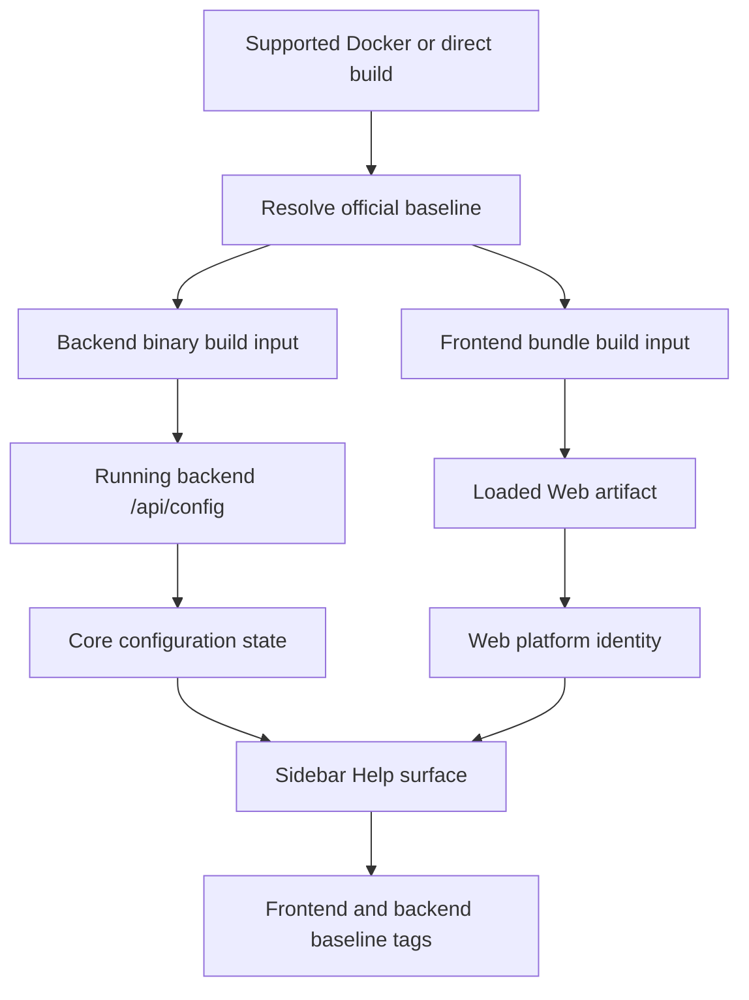
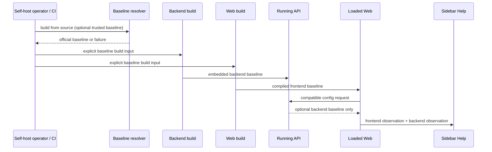

# Runtime Build Provenance - Plan

## Goal Capsule

- **Objective:** Make a self-hosted Web sidebar show the official release baseline of the frontend bundle and backend binary that are actually serving the member.
- **Product authority:** The Product Contract below is the source of truth for behavior and scope. This plan resolves its build, API, UI, compatibility, and verification decisions.
- **Execution profile:** Cross-cutting build and runtime metadata work; execute units in dependency order and preserve independent frontend/backend values throughout.
- **Stop conditions:** Do not add mismatch alerts, host-Git diagnostics, image digests, or a new diagnostics endpoint. Do not claim an official tag when none was reliably supplied at build time.
- **Tail ownership:** The implementer owns code, tests, self-host documentation, and a final direct-deployment verification. No database migration or rollout coordination is required.

## Product Contract

### Summary

Self-hosted Multica stamps each supported backend and frontend build with its official release baseline and shows the two running tags together in a compact two-row grouped readout in the Web app's left-sidebar Help surface. The values identify the loaded artifacts, not the current checkout or a deployment configuration's intended image tag.

### Problem Frame

An administrator can update a local checkout while an old container or process keeps serving traffic after an incomplete rebuild or restart. Git history then describes the checkout, not the frontend and backend actually in use. Official release builds already receive tag inputs, and the Help surface already receives optional backend configuration, but local builds collapse to development placeholders and the two identities are not presented together.

### Key Decisions

- **Use an official baseline, not only an exact-release claim.** A local customized build is associated with its nearest reachable official release tag, so administrators can orient an issue against upstream. (session-settled: user-approved — chosen over requiring an exact tag match: local builds need a useful baseline.)
- **Treat each component as its own running artifact.** The sidebar presents frontend and backend values independently; matching values do not prove deployment health.
- **Keep the first release direct.** Show two tags without a mismatch warning, separate diagnostics workflow, or support bundle. (session-settled: user-directed — chosen over alerts and curl diagnostics: the immediate need is a clear sidebar readout.)
- **Resolve build provenance before building.** Supported build entry points automatically derive the nearest official tag, accept an administrator-supplied trusted baseline when derivation is impossible, and otherwise fail rather than emit a misleading value. (session-settled: user-approved — chosen over silently showing `dev`/unknown: unsupported source contexts must be corrected at build time.)
- **Expose only the baseline through existing public configuration.** The public configuration response may carry the official baseline tag, but never commit IDs, dirty state, repository paths, image references, or host details. (session-settled: user-approved — chosen over a protected parallel endpoint: the existing compatibility path is sufficient for this non-sensitive value.)

### Requirements

**Build provenance**

- R1. Every supported official and self-hosted build of the backend and frontend carries an official release baseline tag identifying the upstream release it is based on.
- R2. A self-hosted build with local commits or modifications retains its nearest reachable official release tag—verified against the canonical upstream release tags—rather than presenting the checkout state as a release tag.
- R3. A supported build path that cannot establish a trustworthy official baseline first accepts an explicitly supplied trusted baseline; if neither source exists, it fails rather than silently treating a development placeholder as a valid tag.

**Sidebar visibility and privacy**

- R4. The Web app's left sidebar shows the frontend's running official baseline tag and backend's running official baseline tag together in a stable, discoverable, compact grouped readout.
- R5. Every signed-in member may view the sidebar values. The backend may return only the official baseline through its public configuration needed before sign-in; it must not expose source revision, dirty state, repository/host paths, or image/deployment details.
- R6. The displayed backend value originates in the backend artifact serving the app, and the displayed frontend value originates in the loaded frontend artifact—not host Git or a deployment configuration's intended tag.

**Lifecycle and compatibility**

- R7. After a successful rebuild and restart, refreshing the Web app shows the new running artifact baselines, enabling a member to detect that a rebuild or restart did not take effect.
- R8. Existing clients and self-hosted deployments lacking the metadata continue to load. Missing or failed provenance is represented as an explicit per-component unavailable state, never borrowed from the other component or shown as a valid tag.

### Key Flows

- F1. **Verify a self-hosted deployment:** A signed-in member opens Web after deployment. The loaded frontend supplies its compiled baseline, the app obtains the running backend baseline through compatible configuration, and the Help surface renders the values in parallel.
- F2. **Build from a modified checkout:** A self-host administrator invokes a supported Docker or direct build entry point. It derives the closest official tag before compilation, or requires the administrator to supply one; both artifacts receive the same selected baseline for that build.
- F3. **Partial/legacy deployment:** A new frontend reaches an older backend, an old frontend is still cached, or configuration fails. The app remains usable and marks only the unavailable component instead of inventing a version.

### Acceptance Examples

- AE1. Given official frontend and backend images for `vX.Y.Z`, when a member opens Web, the sidebar shows `vX.Y.Z` for both components.
- AE2. Given a self-hosted build containing local changes after `vX.Y.Z`, when rebuilt and started, each display uses `vX.Y.Z` rather than a development placeholder.
- AE3. Given the host checkout changed but earlier artifacts remain running, when a member refreshes, the sidebar still shows the earlier artifact values and exposes the failed replacement.
- AE4. Given a new Web client talks to an older compatible backend, or configuration cannot load, when the app loads, it remains usable and labels the backend value unavailable without changing the frontend value.

### Success Criteria

- After refresh, a self-hosted administrator can determine both running baselines from the sidebar without inspecting host Git.
- Supported local Docker and direct build paths cannot silently stamp `dev` as an official baseline.
- A partial rollout remains diagnosable: frontend and backend can visibly differ or one can be unavailable without causing startup failure.

### Scope Boundaries

- Not in this release: automatic mismatch warnings, upgrade prompts, support bundles, a standalone diagnostics command, image digests, or detailed deployment receipts.
- Not in this release: treating image tags, Helm values, or host Git state as proof of a serving artifact.
- The sidebar is not an anonymous UI. Only the minimal baseline tag is public through the existing configuration response because login configuration already depends on that route.

### Dependencies / Assumptions

- Official release CI continues to pass its release tag into both Docker builds and is trusted without re-verification.
- A source build has reachable official Git tags that are verifiable against the canonical upstream remote, or its operator knows the trusted baseline to pass explicitly. Shallow clones without tags, source archives, forks whose `v*` tags are not on the upstream remote, and offline/air-gapped builds that cannot reach the upstream remote are expected unsupported derivation contexts that require the explicit override.
- Provenance remains independent of database, liveness, and readiness behavior.

### Sources / Research

- Release injection: `.github/workflows/release.yml`, `Dockerfile`, and `Dockerfile.web`.
- Current local defaults and entry point: `Makefile`, `docker-compose.selfhost.build.yml`, `SELF_HOSTING.md`.
- Backend config compatibility: `server/cmd/server/router.go`, `server/internal/handler/config.go`, and `server/internal/handler/config_test.go`.
- Client propagation and Help surface: `packages/core/api/schemas.ts`, `packages/core/platform/auth-initializer.tsx`, `packages/core/config/index.ts`, `apps/web/components/web-providers.tsx`, and `packages/views/layout/help-launcher.tsx`.
- Canonical upstream for source-build tag verification: `https://github.com/multica-ai/multica` (project root documentation).

### Product Contract Preservation

This plan preserves the brainstorm contract and adds planning-confirmed detail to R3, R5, and R8: build resolution is automatic-then-explicit-then-fail; only the tag may be public through configuration; and compatibility failures render an explicit per-component unavailable state. These additions record decisions settled with the user during planning rather than changing the product goal.

Resolved during 2026-07-16 plan review: (1) tag derivation uses `git describe --tags --abbrev=0 --match 'v[0-9]*'` so the baseline is exactly the nearest tag, with no commit-distance/hash suffix; (2) source-build derivation verifies the candidate against the canonical upstream release tags (`https://github.com/multica-ai/multica`), treating local/fork-only tags and offline builds as derivation-unavailable (explicit override required); (3) the sidebar layout is a compact two-row grouped readout—`side by side` in the product wording means presented together in one Help group, not a horizontal single row; (4) a distinct client loading state separates an in-flight non-blocking config request from a genuinely unavailable backend.

## Planning Contract

### Key Technical Decisions

- **KTD1 — One pre-build resolver is the authority for source builds.** Add a small repository-owned resolver that emits exactly one official baseline tag. It derives the nearest reachable tag with `git describe --tags --abbrev=0 --match 'v[0-9]*'` (so the result is exactly the tag, never a commit-distance/hash suffix), then verifies that candidate exists among the canonical upstream release tags via `git ls-remote --tags https://github.com/multica-ai/multica` before accepting it; a tag that is only local or fork-created, or an upstream that cannot be reached, leaves derivation unavailable. It falls back to an explicit trusted operator override only when derivation is unavailable, and exits non-zero when neither is available. Official release CI keeps supplying its release tag directly and is trusted without re-verification. Run the resolver on the host before Docker context creation because `.dockerignore` excludes `.git`; verification needs network access to the upstream remote, so air-gapped/offline source builds must use the explicit override. Reuse it from supported Compose and direct build commands. This gives Docker and non-Docker deployments the same semantics. (supports R1–R3, R6; session-settled: user-approved; refined 2026-07-16 for `--abbrev=0` and upstream verification.)
- **KTD2 — Build values are explicit inputs, not runtime Git discovery.** Thread the resolved tag into Go linker variables for the API binary and into Next's public build-time variable for the Web bundle. Release CI keeps supplying its release tag directly. The server and browser therefore report the artifacts that were compiled, even after the checkout changes or disappears. (supports R1, R2, R6, R7.)
- **KTD3 — Extend the optional configuration field, but make its semantics baseline-only.** Reuse `server_version` as the self-hosted backend official-baseline field rather than introduce a second endpoint or a broad build manifest. Keep it optional and omit `dev`/empty values; the public response remains safe because it contains no revision or infrastructure metadata. (supports R5, R8; session-settled: user-approved.)
- **KTD4 — Keep platform-specific environment access in the Web app.** `apps/web` reads the compiled frontend baseline and passes it to the core provider/config store through an explicit platform boundary; `packages/core` only stores and consumes values. Remove package-version/`dev` fallback as a provenance source, so an unstamped bundle becomes unavailable instead of a false official tag. (supports R4, R6, R8; conforms to package boundaries.)
- **KTD5 — Render component-local availability with a loading state.** The Help menu shows a compact two-row version group whenever either value is known, unavailable, or still loading, with translated labels for frontend, backend, loading, and unavailable. Loading is distinct from unavailable so a slow non-blocking config request is not misread as a missing backend. It must retain the existing Base UI group wrapper. The UI reports observations only; it does not calculate mismatch or freshness. (supports R4, R5, R8; two-row layout and loading state confirmed 2026-07-16.)

### High-Level Technical Design

The provenance boundary is the build entry point. Runtime code only transports data that was embedded in the artifact; it never consults the host checkout.

### Implementation Constraints

- The resolver must match only official `v…` tags, strip any commit-distance/hash suffix via `--abbrev=0`, and must not use `--always`, commit hashes, or dirty suffixes as valid output. It must verify the candidate against the canonical upstream release tags before accepting it.
- Raw `docker compose` must not retain a `${VERSION:-dev}` bypass. It should require the resolved value and documentation should direct administrators through the supported command or show the explicit override requirement.
- Direct deployments need a documented build invocation for both Go and Next artifacts; `go run`, `next dev`, and other development entry points may remain unstamped but must display unavailable rather than a tag.
- Do not change `/health`, `/readyz`, or `/healthz`; build provenance is not readiness.
- Continue using lenient Zod configuration parsing and the existing non-blocking config request. A malformed or missing value degrades only the corresponding display. While the request is in flight, the affected component shows a loading state rather than unavailable.

### Sequencing

1. Establish and test the source-build baseline resolver and thread it into Docker/direct build entry points.
2. Make backend config carry the embedded backend baseline safely.
3. Add frontend baseline injection and core-state transport.
4. Render the two component values with localization and compatibility tests.
5. Update self-host documentation and run end-to-end build/config checks.

### System-Wide Impact

- **Security/privacy:** `/api/config` remains public; only a release tag is added. No checkout details, commit IDs, image names, build timestamps, or secrets enter that response.
- **Backward compatibility:** The configuration schema stays additive and optional. New Web with old backend shows backend unavailable; old Web ignores the added behavior. No migration or cache invalidation is needed.
- **Deployment:** Local Docker, direct source builds, and official release images use the same tag semantics; raw manual Compose receives an explicit, visible prerequisite.
- **Operations:** The display distinguishes artifact identity from health. It assists post-rebuild diagnosis without altering probes or deployment orchestration.

### Risks & Mitigations

| Risk | Mitigation |
| --- | --- |
| Shallow clone, archive, fork with only local tags, or offline build cannot verify an upstream tag | Allow a trusted explicit baseline; otherwise fail before producing a falsely stamped supported build, with documentation for the recovery path. |
| Only frontend or backend is redeployed | Store and render values independently; test unequal values and missing backend metadata. |
| Cached/legacy Web or backend lacks the new field | Optional schema/store values and an unavailable label preserve app usability. |
| A UI change removes the required Base UI group context | Extend the existing Help test that asserts rendering does not throw. |
| Manual Compose skips the supported Make target | Require the build argument in the override file and document the resolver/override rather than retaining a `dev` default. |

## Implementation Units

### U1. Establish official-baseline resolution for supported source builds

- **Goal:** Make one host-side resolver choose a trustworthy official tag for Docker and direct deployments before either artifact is compiled.
- **Requirements:** R1, R2, R3, R6; F2; AE2.
- **Dependencies:** None.
- **Files:** `scripts/` (new resolver and focused shell test), `Makefile`, `docker-compose.selfhost.build.yml`, `Dockerfile`, `Dockerfile.web`.
- **Approach:**
  - Add a testable shell resolver that derives the nearest reachable tag with `git describe --tags --abbrev=0 --match 'v[0-9]*'`, then verifies the candidate against the canonical upstream release tags (`git ls-remote --tags https://github.com/multica-ai/multica`) before accepting it. It uses an explicit trusted operator baseline only when derivation is unavailable (no tag, candidate not present upstream, or upstream unreachable). Reject empty, `dev`, hash-like, suffix-bearing, and non-official fallback output; do not encode dirty state in the result.
  - Have `make selfhost-build` resolve once, export/pass the selected value to the Compose build invocation, and print the selected baseline before starting services.
  - Replace Compose's backend and frontend development-default provenance arguments with a required common build value. Preserve local image names if desired; image naming is separate from embedded provenance.
  - Add documented Make targets or variables for direct Go/Next production builds that invoke the same resolver and inject the identical value into linker/public build inputs. Preserve development commands as deliberately unstamped rather than silently claiming a tag.
  - Keep Dockerfiles as consumers of explicit arguments; do not attempt `git` discovery inside Docker.
- **Test scenarios:** exact official checkout; local commits after an official tag still resolve to exactly that tag (no commit-distance suffix); dirty working tree; candidate tag present upstream (accept); candidate tag local/fork-only (reject → override/fail); upstream unreachable/offline (derivation unavailable → override/fail); explicit override without `.git`; shallow/archive context with neither tags nor override fails; Compose configuration contains the resolved tag for both builds and no provenance default of `dev`.
- **Verification:** Run the resolver test; run `bash scripts/selfhost-config.test.sh` extended for build override configuration; inspect `docker compose ... config` with a test tag; build the Go binary through the supported direct path and confirm its embedded value via its configuration test seam.

### U2. Surface the running backend baseline through compatible configuration

- **Goal:** Return the backend binary's embedded baseline to self-hosted Web clients without exposing additional build metadata.
- **Requirements:** R1, R5, R6, R8; F1, F3; AE1, AE4.
- **Dependencies:** U1.
- **Files:** `server/cmd/server/main.go`, `server/cmd/server/router.go`, `server/internal/handler/handler.go`, `server/internal/handler/config.go`, `server/cmd/server/main_test.go`, `server/internal/handler/config_test.go`.
- **Approach:**
  - Rename or clarify the current server-version normalization and configuration plumbing as an official-baseline value. Treat only a resolved official tag as reportable; preserve omission for unstamped development binaries and managed cloud.
  - Keep the existing additive `server_version` response field (or an equally narrow optional successor only if existing naming proves misleading during implementation), with its public self-host gate and no commit/dirty/path companions.
  - Cover config behavior at the router/handler boundary so the test proves the value comes from the binary build variable, not a request, environment, or host repository.
- **Test scenarios:** stamped self-host binary returns its tag; `dev`/empty binary omits it; managed-cloud deployment omits it; an ordinary configuration response remains parseable; the public JSON contains no additional provenance fields.
- **Verification:** Run targeted Go tests for `cmd/server` and `internal/handler`, then the relevant `make test` coverage when local database prerequisites are available.

### U3. Transport the loaded frontend baseline and backend baseline through client state

- **Goal:** Give views independently reliable frontend and backend observations without violating package boundaries.
- **Requirements:** R4, R6, R7, R8; F1, F3; AE1, AE3, AE4.
- **Dependencies:** U1, U2.
- **Files:** `apps/web/components/web-providers.tsx`, `packages/core/api/schemas.ts`, `packages/core/api/schemas.test.ts`, `packages/core/config/index.ts`, `packages/core/platform/auth-initializer.tsx`, and focused core/platform tests where the existing provider test conventions locate them.
- **Approach:**
  - Change Web's compiled public value from analytics-only identity fallback to an explicit frontend official-baseline observation. A missing, `dev`, or invalid public value becomes absent/unavailable; package metadata is not an official release source.
  - Pass that observation through the Web platform boundary to core configuration state. Expand state/setters to hold frontend and backend values separately while retaining compatibility for existing `serverVersion` consumers during the migration or replacing them in the same change.
  - Extend the lenient app-config schema for optional backend provenance and set it from the non-blocking config initializer. Track a third client state—loading—distinct from available and unavailable: set it while the non-blocking request is in flight, and resolve to unavailable only when the request completes with no or invalid value. Leave previously fetched UI functional when the request rejects or the older backend omits the field.
  - Keep analytics identity behavior intentionally separate from sidebar provenance if analytics still needs package-version fallback.
- **Test scenarios:** config parses a valid optional tag and omits it safely; malformed/missing config cannot create a trusted tag; a request in flight renders the backend value as loading rather than unavailable; new frontend plus old backend retains frontend value and unavailable backend; rejected config leaves frontend usable; values can differ after a partial deployment.
- **Verification:** Run focused core schema/platform tests and `pnpm --filter @multica/core test`; run `pnpm typecheck` after cross-package type changes.

### U4. Render two localized sidebar values with safe degradation

- **Goal:** Make the left-sidebar Help surface answer the administrator's question at a glance without adding a health judgment.
- **Requirements:** R4, R5, R7, R8; F1, F3; AE1, AE3, AE4.
- **Dependencies:** U3.
- **Files:** `packages/views/layout/help-launcher.tsx`, `packages/views/layout/help-launcher.test.tsx`, `packages/views/locales/en/layout.json`, `packages/views/locales/zh-Hans/layout.json`, `packages/views/locales/ja/layout.json`, `packages/views/locales/ko/layout.json`; inspect `packages/views/layout/app-sidebar.tsx` only to preserve the footer placement.
- **Approach:**
  - Replace the single conditional server-version row with a localized, compact two-row grouped readout of frontend and backend. Both labels remain visible after the Help menu opens; each value is its tag, the explicit loading copy while its observation is pending, or the explicit unavailable copy.
  - Keep the current `DropdownMenuGroup` around labels and separators needed by Base UI. Do not introduce a modal, an admin-only condition, a mismatch badge, or a derived “healthy/current” status.
  - Ensure the sidebar's existing signed-in placement remains stable while noting that the data fetch itself must work pre-login.
- **Test scenarios:** two equal tags; two different tags; frontend tag with backend loading; frontend tag with missing backend; backend tag with missing frontend; config failure/default state; rendering never throws due to missing menu-group context; translated key sets (including loading) stay aligned.
- **Verification:** Run `pnpm --filter @multica/views test` for Help tests and `pnpm --filter @multica/views typecheck`; manually open the Help menu in a self-hosted build and confirm the two values after a hard refresh.

### U5. Document supported Docker and direct deployment verification

- **Goal:** Make administrators able to use the supported provenance-bearing build paths and verify a restart from the UI.
- **Requirements:** R1–R3, R7; F2; AE2, AE3.
- **Dependencies:** U1–U4.
- **Files:** `SELF_HOSTING.md`, `README.md`, any source-build instructions in `scripts/install.sh` and `scripts/install.ps1` that advertise raw Compose/source build, plus Make help text affected by U1.
- **Approach:**
  - Make `make selfhost-build` the recommended local Docker source-build path and update manual Compose instructions to require the resolved/explicit baseline rather than a default development value.
  - Add a direct-deployment subsection that uses the supported backend and frontend build entry points, explains the automatic → explicit → fail behavior, and gives the sidebar refresh check after restart.
  - Document common inference failures (shallow clone without tags, source archive, fork whose tags are not on the upstream remote, and offline/air-gapped builds that cannot verify upstream) and the trusted override recovery path. State that the displayed value is an upstream-verified baseline, not proof of clean source or an exact official artifact.
- **Test scenarios:** Documentation commands correspond to available Make/script interfaces; direct build and Compose both describe the same override semantics; no user-facing source-build instruction recommends a raw path that defaults provenance to `dev`.
- **Verification:** Execute the documented local Compose config command with a fixture tag, follow the direct-build command in a checkout, and complete a browser smoke check where the sidebar reflects the restarted artifacts.

## Verification Contract

Run checks in increasing scope after implementation:

1. `bash scripts/selfhost-config.test.sh` plus the new resolver's focused test script, including no-Git/override/offline/unverifiable-upstream failure fixtures.
2. `cd server && go test ./cmd/server ./internal/handler` for binary-to-config propagation.
3. `pnpm --filter @multica/core test` and `pnpm --filter @multica/views test` for schema/state and Help UI cases.
4. `pnpm typecheck` for workspace boundary/type regressions.
5. `make test` when the local database setup is available, followed by `make check` before landing if its full runtime cost is acceptable for the change.
6. Manual self-host smoke: build and start from a tagged/customized checkout, refresh Web, record frontend/backend values; repeat after changing and rebuilding one side or using a legacy/missing metadata condition to prove component-local degradation.

No release publishing validation is required: release CI already passes tags to both Dockerfiles. If those build arguments are renamed or their semantics change, add a release-workflow validation step in the same implementation and run the repository's release workflow checks.

## Definition of Done

- U1 resolves a single official baseline for supported local Docker and direct production builds, accepts a trusted explicit value only as documented, and rejects unresolvable contexts before a supported artifact is produced.
- U2 embeds and safely exposes only the running backend baseline through optional self-host configuration; dev and managed-cloud behavior remain non-reporting.
- U3 records frontend and backend observations independently, with no `package.json`/`dev` provenance fallback and no client-startup failure on missing or invalid backend metadata.
- U4 shows two localized sidebar values to every signed-in member in a two-row group, distinguishes a loading value from an unavailable one, and retains the menu-group safety invariant.
- U5 documents Docker and direct deployment commands, override recovery, and post-restart UI verification without presenting checkout/image configuration as runtime proof.
- All Verification Contract gates relevant to changed code pass, and the manual smoke demonstrates that a stale artifact remains visibly stale after the checkout changes.
- No abandoned resolver variants, debug-only output, or unused metadata fields remain in the final diff.

## Appendix

### Canonical Terminology

- **Official release baseline:** the nearest reachable official release tag—verified against the canonical upstream release tags—that a self-hosted build is based on. It is embedded at build time and can differ from the exact checkout, commit, image tag, or deployment configuration. If it cannot be derived and verified upstream, or explicitly trusted at build time, the artifact must not claim one.
