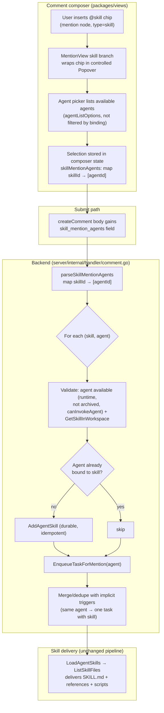

# feat: @skill mention routes via explicit agent gesture with bind-on-submit

## Summary

The fork already ships an `@skill` mention type (PR #5346, unmerged upstream). Today it only *routes* to an agent — `resolveSkillMentionTrigger` reverse-looks-up `agent_skill` bindings to pick an executor — but the chosen agent is never told *which* skill to use, and the routing guesses wrong when the user means someone specific. This plan replaces binding-table reverse-lookup with an **explicit gesture**: a `@skill` chip carries a "pick an agent" popover; once the user designates an agent, submitting the comment first durably binds the skill to that agent (reusing the existing `agent_skill` pipeline) and then enqueues the task. The skill's full bundle — `SKILL.md`, references, scripts — reaches the agent through the normal bound-skill delivery path with zero new delivery plumbing.

---

## Problem Frame

A `@skill` mention should mean "make this agent do work using this skill." Two gaps prevent that today:

1. **Skill identity is dropped after routing.** `EnqueueTaskForMention(issue, agentID, commentID)` (`server/internal/service/task.go:1033`) carries no skill parameter; once the agent is chosen, "which skill" is lost. The agent receives only its *bound* skills (`LoadAgentSkillBundles`, `server/internal/service/task.go:3573`), and the built-in `multica-mentioning` skill doc doesn't even acknowledge the `skill` type.
2. **Routing guesses the executor.** `resolveSkillMentionTrigger` (`server/internal/handler/comment.go:2437`) reverse-queries `agent_skill` and applies the R13 assignee rule — it cannot honor "I'm replying to agent-2" or "I want agent-4 specifically," and falls back to an arbitrary `candidates[0]` (ordered by skill name).

The user's insight: don't make the system *guess* the executor — let the user *designate* it. A `@skill` chip becomes an explicit, self-contained instruction: "this agent, use this skill."

## Requirements

- **R1** — A `@skill` chip exposes a gesture to designate any *available* agent (workspace-scoped, online-capable, not archived, invocable by the current user), not only agents already bound to the skill.
- **R2** — Designating an agent and submitting triggers that agent to run *with* the mentioned skill, regardless of prior binding.
- **R3** — If the designated agent is not yet bound to the skill, the skill is durably bound at submit time (before the task runs), so references and scripts arrive via the existing bound-skill pipeline. The binding persists.
- **R4** — A skill chip with no designated agent falls back to plain text: the `@skill` has no effect and existing triggers (reply-parent / assignee / explicit `@agent`) behave exactly as today.
- **R5** — When a skill-mention designates an agent, it suppresses the implicit contextual executor for that skill's intent; the designated agent is what fires. If the same agent is also the implicit executor (reply-parent / assignee), they merge into one task that carries the skill — never two runs.
- **R6** — One skill may be designated to multiple agents ("each of you use skill-A"); the contract supports `skill_id → [agent_id, ...]`.
- **R7** — A `@skill` that resolves to no executor (issue assigned to a human / unassigned, and no agent designated) is silent — it never triggers on its own.
- **R8** — The built-in `multica-mentioning` skill doc and the trigger-chip source labels are updated to reflect the new `skill` contract (repo rule: built-in skill behavior changes ship with their `SKILL.md` + source-map).

## Key Technical Decisions

- **KTD1 — Explicit gesture over NLU.** Executor designation is a UI gesture serialized to `skill_mention_agents`, not natural-language parsing. Rationale: deterministic, zero added latency, 100% reproducible. (Alternatives considered: LLM semantic parsing — rejected for latency/cost/non-determinism; comment-level positional pairing — impossible because `ParseMentions` drops position, `server/internal/util/mention.go`.)
- **KTD2 — Bind-on-submit over runtime injection.** A designated-but-unbound skill is bound via the existing `AddAgentSkill` (`server/pkg/db/queries/skill.sql:103`, `INSERT ... ON CONFLICT DO NOTHING`) at submit, so delivery rides the normal `LoadAgentSkills` → `ListSkillFiles` pipeline. Rationale: no `forced_skill_ids` migration column, no dispatch-layer `allowed`-set injection, no second delivery path; references/scripts arrive for free. (Alternative considered: runtime temporary grant — rejected; it needed a new column + dispatch changes + a parallel delivery path.)
- **KTD3 — Gesture selection lives in composer React state**, keyed by skill id, mirroring the existing `suppressedAgentIds` pattern. The mention node spec (`mention-extension.ts`) and `util/mention.go` stay untouched. Rationale: smallest upstream-merge surface; matches an established in-composer pattern. (Alternative considered: a new mention node attr `agentId` — rejected; it mutates the node spec and markdown serialization, a hotter upstream file.)
- **KTD4 — Reuse the `Popover` picker idiom** from `comment-trigger-chips.tsx` (`MultiTriggerChip`) for the on-chip agent picker, anchored in `MentionView`'s skill branch. Rationale: established pattern, correct package layer (`packages/views/`, not `packages/ui/`).
- **KTD5 — Delete the reverse-lookup routing.** `resolveSkillMentionTrigger`'s `agent_skill` candidates + R13 logic is removed; `skill_mention_agents` becomes the *only* skill-routing input. Rationale: the gesture supersedes guessing; keeping both reintroduces ambiguity.

## Scope Boundaries

**Out of scope / non-goals:**
- LLM or NLU parsing of comment text to infer skill→agent intent.
- Any DB migration, `forced_skill_ids` column, or dispatch-layer (`daemon.go`) `allowed`-set injection.
- Changes to `server/internal/util/mention.go` mention syntax or the mention node spec.
- Auto-unbinding a skill after the task completes (binding is durable per R3).
- Changing how *bound* skills are delivered to agents.

### Deferred to Follow-Up Work
- Agent-side surfacing that "this run was explicitly asked to use skill X" in the prompt (the bind-on-submit path delivers the skill, but a dedicated `forced_skill_names` prompt callout is a separable enhancement — see Open Questions).

## High-Level Technical Design

The gesture never touches the mention node or markdown; selection rides the request body. The backend trusts nothing — it re-validates every `skill_mention_agents` entry against availability and workspace scoping before binding or enqueuing.

---

## Implementation Units

### U1. Backend: bind-and-trigger on `skill_mention_agents`

**Goal:** Make `CreateComment` treat `skill_mention_agents` as the authoritative skill-routing input: validate, durably bind unbound skills, enqueue the designated agent, and remove the reverse-lookup path.

**Requirements:** R2, R3, R5, R7

**Dependencies:** none

**Files:**
- `server/internal/handler/comment.go` (modify)
- `server/internal/handler/handler.go` (modify — `parseSkillMentionAgents` value type)
- `server/internal/handler/skill_mention_trigger_test.go` (modify)
- `server/internal/handler/comment_trigger_preview_test.go` (modify if it asserts skill routing)

**Approach:**
- Widen the request DTO `SkillMentionAgents` and `parseSkillMentionAgents` from `map[string]string` / `map[string]pgtype.UUID` to `map[string][]string` / `map[string][]pgtype.UUID` (skill mention id → agent ids). Reject malformed agent UUIDs at the boundary (`parseUUIDOrBadRequest`).
- In the comment trigger flow, replace the `m.Type == "skill"` branch (`resolveSkillMentionTrigger`, `comment.go:2437`): for each skill mention, look up its designated agent list in `opts.SkillMentionAgents`. For each designated agent:
  - Validate the agent is available — `GetAgentInWorkspace`, `RuntimeID.Valid`, not archived, `canInvokeAgent` (mirror the existing gates at `comment.go:2495-2504`).
  - Validate the skill via `GetSkillInWorkspace` (already used at `comment.go:2442`).
  - If the agent is not bound to the skill, call `AddAgentSkill` (idempotent) to durably bind it.
  - Enqueue via `EnqueueTaskForMention`, deduped against pending tasks (`hasPendingTaskForIssueAndAgent`).
- A skill mention with **no** designated agents produces no trigger (R4/R7 — silent), but does NOT suppress the comment's other triggers.
- Delete the `agent_skill` candidates reverse-lookup and the R13 assignee-wins logic now inside `resolveSkillMentionTrigger`.
- **Merge/dedupe (R5):** when the designated agent is also selected by an implicit path (reply-parent or assignee) for the same issue, ensure a single task results — the explicit designation already enqueues that agent; implicit dedup against the same pending task collapses them naturally. Verify no double-enqueue.
- Update the `mention_skill` trigger-source reason string (`comment.go:1134`) to reflect explicit designation ("A skill mention designated this agent.").

**Patterns to follow:** the existing `resolveSkillMentionTrigger` gate sequence (availability + `canInvokeAgent`); `AddAgentSkill` usage in `server/internal/handler/skill.go`; the pending-task dedup in `hasPendingTaskForIssueAndAgent`.

**Test scenarios:**
- Happy: comment with `@skill` + `skill_mention_agents{skill: [agentA]}` → agentA enqueued; agentA becomes bound to skill if previously unbound (assert `agent_skill` row created).
- Happy (multi): `skill_mention_agents{skill: [agentA, agentB]}` → both enqueued with the skill (R6).
- Already-bound: designated agent already bound → no duplicate `agent_skill` row (`ON CONFLICT DO NOTHING`), still enqueued.
- Edge: `skill_mention_agents` references an agent not in the comment's skill mention → ignored, no enqueue.
- Edge: designated agent is the issue assignee who would also fire implicitly → exactly one task for that agent (R5).
- Error: designated agent archived / offline / not invocable → skipped, no enqueue, no binding; other valid designations still processed.
- Error: unknown / cross-workspace skill id → that designation dropped silently.
- Error: malformed agent UUID in `skill_mention_agents` → 400 at boundary.
- Regression: `@skill` with no `skill_mention_agents` entry → no trigger from the skill; reply-parent/assignee triggers still fire as before.
- Update `TestEnqueueSkillMention_FallsBackToAgentSkillBinding` and `TestEnqueueSkillMention_AssigneeWithSkillWins` — reverse-lookup is removed; these become "no designation → silent" cases. Update `TestEnqueueSkillMention_UnboundSkillSilentlyDropped` → unbound-but-designated now binds + triggers.

**Verification:** `make test` (Go) green; the new bind-and-trigger behavior is covered for single, multi, already-bound, unavailable-agent, and no-designation paths.

---

### U2. Frontend: `skill_mention_agents` request plumbing

**Goal:** Thread the gesture's selection from composer state into the create-comment request body, mirroring `suppressAgentIds`.

**Requirements:** R2, R6

**Dependencies:** none (can land in parallel with U1; contract is the field name)

**Files:**
- `packages/core/api/client.ts` (modify — `createComment` body; `updateComment` for edit path)
- `packages/core/api/schemas.ts` (modify — zod schema for the field if responses echo it)
- `packages/core/issues/mutations.ts` (modify — `useCreateComment` pass-through)
- `packages/views/issues/hooks/use-issue-timeline.ts` (modify — `submitComment` pass-through)
- `packages/core/api/*.test.ts` or schema test (add malformed-response test per repo API-compat rule)

**Approach:**
- Add an optional trailing `skillMentionAgents?: Record<string, string[]>` param through `createComment` → `useCreateComment` → `submitComment` → composer `onSubmit`, exactly as `suppressAgentIds` is threaded today.
- Request body gains `skill_mention_agents` only when non-empty.
- Per repo API-compat hard rule: add a zod schema for any response surface that consumes this field and a malformed-response test (defensive optional-chaining, `=== true` checks).
- Keep `updateComment` symmetric for the edit path (backend accepts the field on edit at `comment.go:1335`).

**Patterns to follow:** `suppressAgentIds` threading end-to-end (the closest analog); `parseWithFallback` for response parsing.

**Test scenarios:**
- Happy: `createComment` with a `skillMentionAgents` map → request body contains `skill_mention_agents` with array values.
- Edge: empty / undefined map → key omitted from body.
- Malformed: schema parse of a response with a wrong-typed `skill_mention_agents` (e.g. string instead of array) → falls back safely, no throw.

**Verification:** `pnpm typecheck` and the schema/mutation tests pass.

---

### U3. Frontend: skill-chip agent-picker gesture

**Goal:** Add the "pick an agent" popover to the in-editor skill chip, store the selection in composer state, and render the chip's three states.

**Requirements:** R1, R4

**Dependencies:** U2 (needs somewhere to put the selection)

**Files:**
- `packages/views/editor/extensions/mention-view.tsx` (modify — skill branch, lines ~59-67: wrap chip in a controlled `Popover`)
- `packages/views/editor/components/` (new — e.g. `skill-agent-picker.tsx`, the popover content listing agents)
- `packages/views/issues/components/comment-input.tsx` (modify — hold `skillMentionAgents` state, pass to `onSubmit`)
- `packages/views/issues/components/reply-input.tsx` (modify — same for the reply composer)
- `packages/ui/components/common/skill-mention-chip.tsx` (modify — visual affordance for designated vs undesignated state; keep it presentational, no `@multica/core` import)
- `packages/views/editor/*.test.tsx` (add)

**Approach:**
- In `MentionView`'s skill branch, wrap the `SkillMentionChip` in a controlled `Popover` (reuse the `MultiTriggerChip` popover idiom from `comment-trigger-chips.tsx`). Keep the existing `MentionHoverCard` for hover; the popover opens on click.
- The picker lists **all available agents** for the workspace via `useQuery(agentListOptions(wsId))` — NOT filtered by skill binding (R1), and **useQuery, not `getQueryData`**, to avoid the cold-cache bug documented in `docs/solutions/ui-bugs/skill-autocomplete-cold-cache.md`.
- Selection is written to composer-local React state keyed by skill id (KTD3), surfaced from `comment-input.tsx` / `reply-input.tsx` and passed into `onSubmit` for U2's plumbing. The editor and composer state must stay in sync: deleting a `@skill` chip removes its map entry; this is the text-gesture consistency contract.
- Chip three states (R4): undesignated (visual "needs an agent" affordance), designated (shows the chosen agent), and reverting to plain text when the designation is cleared — on submit, a skill with no designated agent is serialized without a `skill_mention_agents` entry so the backend leaves it inert.
- Agent availability for display: filter out `archived_at` agents (mirrors `selectSkillAssignments`, `packages/core/workspace/queries.ts:101`); online/runtime presence via `useAgentPresenceDetail` for display only.
- Package boundary: the picker lives in `packages/views/` (it needs `@multica/core` queries); only the presentational chip affordance stays in `packages/ui/`.

**Patterns to follow:** `MultiTriggerChip` popover (`comment-trigger-chips.tsx:269`); `selectSkillAssignments` archived-filter; the cold-cache lesson (prime via `useQuery`).

**Test scenarios:**
- Happy: click skill chip → popover lists workspace agents; selecting one marks the chip designated and records `skillMentionAgents[skillId] = [agentId]`.
- Happy (multi): selecting multiple agents for one skill → array grows (R6).
- Edge: picker opens with a cold agent cache → `useQuery` fetches, list populates (regression for the cold-cache bug).
- Edge: archived agents do not appear in the picker.
- Consistency: delete the `@skill` chip after designating → its `skillMentionAgents` entry is removed; submit omits it.
- Consistency: clear the designation → chip shows undesignated; submit produces no `skill_mention_agents` for that skill (R4).
- Boundary: no `next/*` or `react-router-dom` mocks in views tests (repo rule).

**Verification:** `pnpm typecheck`, `pnpm test` for the new/edited view tests.

---

### U4. Frontend: trigger-chip source labels + docs/skill updates

**Goal:** Surface the new trigger sources in the composer chips and update the built-in `multica-mentioning` skill doc per repo rule.

**Requirements:** R8

**Dependencies:** U1 (trigger-source semantics), U3 (chip states)

**Files:**
- `packages/views/issues/components/comment-trigger-chips.tsx` (modify — add `mention_skill` + `thread_parent` source labels; currently `default` → unknown)
- `packages/views/locales/en/issues.json` + `packages/views/locales/zh/issues.json` (new copy keys)
- `server/internal/service/builtin_skills/multica-mentioning/SKILL.md` (modify — document the `skill` mention contract)
- `server/internal/service/builtin_skills/multica-mentioning/references/mentioning-source-map.md` (modify — pin the new routing to source)
- `packages/views/locales/*/skills.json` (if picker copy is added)

**Approach:**
- Add explicit `case "mention_skill"` and `case "thread_parent"` to the trigger-chip `sourceLabel`/`sourceReason` so the designated-agent chip and reply-parent chip render meaningful labels instead of `default` "unknown". Follow the i18n glossary in `apps/docs/content/docs/developers/conventions.zh.mdx` for Chinese copy.
- Update `multica-mentioning/SKILL.md`: the parser now accepts a `skill` type; a `@skill` mention triggers the agent explicitly designated via the client's `skill_mention_agents`, binding the skill on submit if unbound; a `@skill` with no designation is a silent no-op. Keep the doc's "verified contract, pinned to source" style and update the source-map with file:line evidence. Respect the L2 body-line budget enforced by `builtin_skills_test.go`.

**Test scenarios:**
- Happy: trigger chips render a readable label for a `mention_skill` trigger (designated agent) and a `thread_parent` trigger (reply-parent), in en + zh.
- Contract: `TestMentioningSkillTeachesTheParserContract`-style test still passes; if the SKILL.md body shape changed, the skill-contract tests in `builtin_skills_test.go` stay green.

**Verification:** `pnpm test` (locales/chips) and `make test` (skill doc contract) pass.

---

### U5. Ledger registration

**Goal:** Record this customization in the local-customization ledger with its upstream-merge risk profile.

**Requirements:** traceability (self-host workflow)

**Dependencies:** U1–U4 (final file set known)

**Files:**
- `docs/customizations.md` (modify)

**Approach:** Add an entry under the appropriate customization table noting: feature (@skill explicit gesture + bind-on-submit), related PR (#5346), hot files (`server/internal/handler/comment.go`, the frontend mention cluster `packages/views/editor/extensions/mention-view.tsx`, `comment-trigger-chips.tsx`), and merge-risk notes (mention cluster is the recurring-cost file per the ledger's own drift notes; `comment.go` is a perennial upstream hot file).

**Test expectation:** none — documentation only.

---

## Verification Contract

- `make test` — Go: U1 bind-and-trigger paths, updated skill-mention trigger tests, built-in skill doc contract.
- `pnpm typecheck` — TS across `packages/core`, `packages/views`, `packages/ui`.
- `pnpm test` — TS/Vitest: U2 schema/mutation, U3 chip gesture, U4 chips/locales.
- `pnpm lint` — repo lint.
- Manual smoke (self-host): in a workspace with ≥2 agents and a skill bound to only one, (a) `@skill` + designate the *unbound* agent → that agent runs and now has the skill (bound, with references/scripts); (b) `@skill` with no designation → nothing fires from the skill; (c) reply-to-agent + `@skill` designating a *different* agent → only the designated agent runs with the skill.

## Definition of Done

- A `@skill` chip with a designated agent triggers exactly that agent, which runs with the skill's full bundle (references + scripts), having been durably bound at submit if previously unbound.
- A `@skill` with no designation is inert and never changes existing trigger behavior.
- Designation works for any available agent, not only pre-bound ones, and supports multiple agents per skill.
- The reverse-lookup routing (`agent_skill` candidates + R13) is removed; `skill_mention_agents` is the sole skill-routing input.
- Trigger chips and the `multica-mentioning` skill doc reflect the new contract.
- Ledger updated; all Verification Contract gates green.

## Open Questions

- **OQ1 (defer to implementation):** Should the delivered run *name* the explicitly-requested skill in the agent's prompt (a `forced_skill_names` callout), beyond just delivering the bundle? Bind-on-submit makes the skill *available*; a dedicated prompt pointer is a separable enhancement. Recommend deferring — evaluate after the base path lands.
- **OQ2 (defer to implementation):** Exact copy/i18n for the picker's "needs an agent" affordance and the new trigger-chip labels — confirm against the conventions glossary during implementation.

## Sources & Research

- Local code read this session: `server/internal/handler/comment.go` (trigger computation, `resolveSkillMentionTrigger`), `server/internal/service/task.go` (`EnqueueTaskForMention`, `LoadAgentSkills`, `LoadAgentSkillBundles`), `server/internal/handler/daemon.go` (`buildClaimedTaskResponse`, `ResolveTaskSkillBundles`), `server/pkg/db/queries/skill.sql` (`AddAgentSkill`, `ListSkillFiles`), `server/internal/util/mention.go` (`ParseMentions`), `server/internal/service/builtin_skills/multica-mentioning/SKILL.md`.
- Frontend integration map (subagent): `mention-view.tsx` (skill chip NodeView anchor), `comment-trigger-chips.tsx` (`MultiTriggerChip` popover idiom), `packages/core/workspace/queries.ts` (`agentListOptions`, `selectSkillAssignments`), comment-submit plumbing via `client.ts` / `mutations.ts` / `use-issue-timeline.ts` (`suppressAgentIds` analog).
- Institutional learnings: `docs/solutions/ui-bugs/skill-autocomplete-cold-cache.md` (prime agent list via `useQuery`), `docs/solutions/ui-bugs/mention-hover-card-inconsistency.md` (picker belongs in `packages/views/`), `docs/solutions/ui-bugs/skill-hover-card-shows-uuid.md` (resolve skill display name via API, not label).
- `CONCEPTS.md`: Skill, AccessScope, Skill Import vocabulary.
- Local customization ledger: `docs/customizations.md`.
