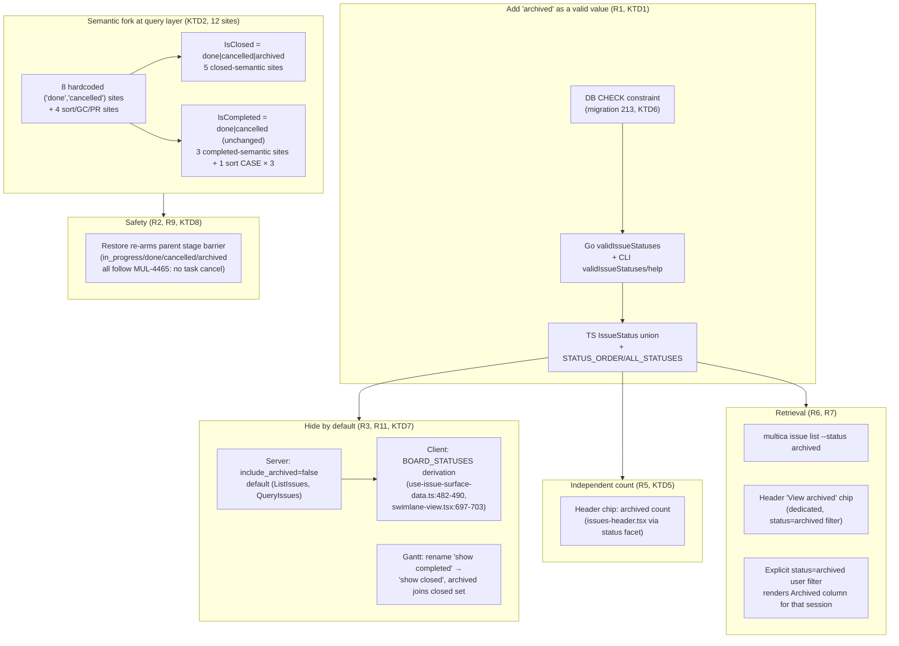

# feat: Add archived issue status

**Target repo:** `multica` (all paths repo-relative). Origin: issue FZG-340 — add an "已归档" (archived) issue status so historical `done` issues can be retired out of the default list, semantically distinct from `cancelled`.

---

## Goal Capsule

Introduce a first-class `archived` issue status. Archived issues are closed (they leave the default list, board, and search, and count as terminal for stage-barrier / parent-wake) but are **not** "completed" (they are excluded from done-counts and get their own independent archived count). Archiving and restoring are ordinary free-form status changes — no transition guards — matching Multica's existing any-status→any-status model. Archived is **hidden by default** at the list/board/gantt/search surfaces, retrievable on demand via `status=archived`, and rendered with a distinct icon and label.

---

## Problem Frame

As `done` issues accumulate, the default issue list becomes noisy. Today there is no way to retire finished work without hard-deleting it (`DeleteIssue`) — `done` and `cancelled` are the only terminal statuses, and both stay visible/countable in several surfaces. The user wants a third terminal status that (a) hides finished work from the default list, (b) is tracked separately from `done` so completion metrics stay meaningful, and (c) is reversible.

Multica's status is a Postgres `TEXT` column with an inline `CHECK` constraint (`server/migrations/001_init.up.sql:57`) and **no transition matrix** — any status may be set to any other via the update / batch / CLI paths (`issue.go:81` validation is membership-only). There is **no shared "closed/terminal" constant**: the literal pair `('done','cancelled')` is hardcoded in **8 sites across 5 query/handler files** (the author's earlier "7 sites / 4 files" count omitted `ArchiveCompletedInbox` — corrected here per review). Those sites mix two distinct semantics ("closed/leave-the-board" vs "completed/counts-as-done"), and several sort/GC/PR-autoclose sites use the same literals in ways not enumerated at first pass. Adding `archived` correctly is mostly an exercise in classifying each site — that, not the enum addition, is where the risk lives. The board-column auto-derivation from `ALL_STATUSES` and the `ALL_STATUSES`-cascades-into-14-files pattern mean a careful frontend sweep is also required.

---

## Requirements

| ID | Requirement | Settled by |
|----|-------------|-----------|
| R1 | Add `archived` as a valid issue status across DB, backend, CLI, and frontend. | ideate A1 |
| R2 | Archive and restore are ordinary free-form status changes (no transition guards, no target-picker, no `previous_status`). Any status may move to/from `archived`. | session (free-form model, verified `issue.go:78`) |
| R3 | `archived` is **closed**: excluded from default list, kanban board, and default search; counts as terminal for stage-barrier / parent-wake. | ideate D / decision #3 |
| R4 | `archived` is **not completed**: excluded from done-counts (`ChildIssueProgress`, `GetProjectIssueStats`). | decision #3 |
| R5 | An **independent archived count** appears in the issue-list header chip and the status facet. | decision #3 |
| R6 | `archived` is retrievable on demand via `status=archived` (CLI `--status archived` + web status filter + a dedicated header chip), not lumped with done/cancelled. | ideate D2 + review |
| R7 | `archived` does **not** render as a default kanban column; an explicit user `status=archived` filter (R6) DOES render the column for that session. | ideate D4 + review |
| R8 | `archived` has its own icon + neutral/muted color, visually distinct from done ✓, cancelled ✗, backlog, todo; in all 4 locales (`已归档`). | ideate D + review |
| R9 | When restoring `archived → in_progress` (or any active status) on an issue that was already terminal-for-barrier, the parent re-evaluates its stage barrier so progress + stage counters stay in sync. | review (F3) |
| R10 | When a child is archived while its parent is `in_progress`, the parent stage barrier fires correctly; the parent's progress chip annotates the drop (`3/5 done · 1 archived`) so R4 ≠ R3 reads coherently. | review (F4) |
| R11 | `archived` is **hidden by default** at the server surface (`include_archived=false` mirrors `include_closed`), so the default list/board payload does not waste cache or bandwidth on rows the default view will not render. | review (F6) |

## Scope Boundaries

**In scope:** the `archived` status value end-to-end; IsClosed/IsCompleted classification of the 8 hardcoded sites (KTD2) plus 4 newly-classified sort/GC/PR sites (KTD2 extended); board/search/list hiding via a `BOARD_STATUSES` derivation (not a per-status flag); dedicated retrieval entry points in CLI + web; archived count (header chip only — no project-stats surface); icon + i18n in 4 locales; server-side `include_archived` default; cascade sweep of `ALL_STATUSES` consumers.

**Out of scope (non-goals):**
- Transition guards / a state machine. Explicitly rejected — the model stays free-form (R2). Archiving an `in_progress` agent-owned issue follows the codebase's established rule (MUL-4465): no status change cancels or warns on in-flight agent tasks; `archived` behaves exactly like `cancelled`/`done` here.
- An `archived_at`/`previous_status` column or "was done" provenance tracking. Free-form model makes this unnecessary.
- Bulk-archive ("archive all done older than N days") or scheduled auto-archive. Single-status-change only; bulk is a follow-up.
- Moving archived rows to a separate table (soft-delete-via-move). Rejected in ideation (A5).

### Deferred to Follow-Up Work
- Bulk / scheduled auto-archive entry point (needs grace-period + permission + audit design).
- The latent refactor to a shared `IsClosed`/`IsCompleted` constant across the 8 sites — this plan edits the literals in place (correct, minimal blast radius); consolidating them into named constants is worthwhile but is its own change.
- Q1 — `ArchiveCompletedInbox` behavior. Resolved 2026-07-24: archived does NOT auto-archive inbox items (inbox state is independent of issue state). Plan leaves inbox.sql unchanged.
- Q2 — `ChildIssueProgress` denominator. Resolved 2026-07-24: numerator stays ChildIssueProgress (done|cancelled only), denominator total children unchanged. Plan shows `3/5 done · 1 archived` via UI copy.
- ~~Q3 — U5 scope~~. Resolved 2026-07-24: U5 removed from plan (out of FZG-340 scope).

---

## Key Technical Decisions

**KTD1 — `archived` is a new enum value, not a flag.** `session-settled: user-approved — chosen over archived_at flag (A2/A3): the request is explicitly for a status; a flag can't be queried as status='archived' and creates two drifting "closed" truths.` Add `'archived'` to the DB CHECK, the two Go/CLI validation slices, the TS union, and the frontend status config. Governs R1.

**KTD2 — Classify every literal `('done','cancelled')` site into closed vs completed, plus handle sort/GC/PR sites.** `session-settled: user-approved — a single terminal constant is insufficient because archived is closed-but-not-completed.` Per-site classification (verified against current source — the literal `done/cancelled` lives 3 lines below each `-- name:` comment, so cite is the literal line):

| Site | File:line (literal) | Semantics | Change |
|------|---------------------|-----------|--------|
| `FindActiveDuplicateIssue` | `server/pkg/db/queries/issue.sql:141` | closed | add `archived` |
| `FindRecentAutopilotDuplicateIssue` | `server/pkg/db/queries/issue.sql:151` | closed | add `archived` |
| `ListOpenIssues` | `server/pkg/db/queries/issue.sql:183` | closed | add `archived` |
| `ChildIssueProgress` (done count) | `server/pkg/db/queries/issue.sql:339` | **completed** | **no change** (R4) |
| `GetProjectIssueStats` (done_count) | `server/pkg/db/queries/project.sql:50` | **completed** | **no change** (R4) |
| `ArchiveCompletedInbox` | `server/pkg/db/queries/inbox.sql:136` | **completed** | **no change** — Q1 |
| `buildSearchQuery` includeClosed gate | `server/internal/handler/issue.go:475-477` | closed | add `archived` |
| `isTerminalChildStatus` + 2 inline parent guards | `server/internal/handler/issue_child_done.go:337-342, 90, 188` | closed (stage-barrier) | add `archived` (KTD3) |
| **NEW — Stage done counter** | `server/cmd/multica/cmd_issue.go:943` | **completed** (CLI stage Done++) | **no change** (R4) |
| **NEW — PR auto-close reeval** | `server/internal/handler/github.go:976` | **closed** (don't auto-close PRs on archived issues) | add `archived` |
| **NEW — Task-dir GC eligibility** | `server/internal/daemon/gc.go:410` | **closed** (archived task dirs are GC-eligible) | add `archived` |
| **NEW — Sort CASE expressions (×3)** | `server/internal/handler/issue.go:541, 966, 1689` | sort ordering | `WHEN 'cancelled' THEN 6 WHEN 'archived' THEN 7 ELSE 8 END` (archived sorts with cancelled at the bottom of lifecycle order) |

Governs R3, R4.

**KTD3 — The stage-barrier terminal check must treat `archived` as terminal.** Archiving the last open child of a parent must not wedge the parent's stage barrier. `isTerminalChildStatus` (`issue_child_done.go:337-342`) and the two inline parent guards (`:90`, `:188`) gain `archived`. A wrong answer here deadlocks pipelines, not just mis-renders a list. Governs R3.

**KTD4 — Suppress the auto kanban column via a `BOARD_STATUSES` derivation, NOT a per-status flag.** Replacing the earlier KTD4 per-status `showOnBoard: false` flag with a named constant `BOARD_STATUSES = ALL_STATUSES.filter(s => s !== 'archived')` at the single board column-derivation site (`use-issue-surface-data.ts:482-490`) and the swimlane ordering site (`swimlane-view.tsx:697-703`) — avoids introducing a single-purpose abstraction (review F1/F8). Archived stays a first-class `IssueStatus` in `ALL_STATUSES` for picker/filter/cursor use. When a user explicitly opts into `status=archived` (R7), the `BOARD_STATUSES` derivation is bypassed and the column renders for that session — explicit user filter wins. Governs R7.

**KTD5 — The independent archived count is nearly free via the status facet.** The issue-table status facet does `GROUP BY i.status` with no hardcoded list (`issue_table_facets.go:185-186`), so `archived` appears in facet counts automatically once rows exist. The header chip (`issues-header.tsx:1149`) iterates `ALL_STATUSES` over facet counts and will render `archived` automatically once it is in `ALL_STATUSES`. Governs R5.

**KTD6 — Migration uses the established DROP/re-ADD CHECK idiom with `NOT VALID`.** The status CHECK is inline (no explicit name) → Postgres auto-named it `issue_status_check`. Mirror migration `202_runtime_profile_add_qwen`: `DROP CONSTRAINT IF EXISTS issue_status_check` then `ADD CONSTRAINT issue_status_check CHECK (status IN (... 'archived')) NOT VALID`. `NOT VALID` avoids a full table scan/lock on existing rows. Apply-time verification: confirm the constraint name with `SELECT conname FROM pg_constraint c JOIN pg_class t ON t.oid=c.conrelid WHERE t.relname='issue' AND c.contype='c' AND pg_get_constraintdef(c.oid) ILIKE '%status%';` before applying. Governs R1.

**KTD7 — Server-side `include_archived=false` default mirrors `include_closed`.** Add an `include_archived` query param + handler-side default (`issue.go:778 ListIssues`, `issue.go:758 QueryIssues`, the issue-table surface) that defaults to `false`. The default list/board payload then never includes archived rows unless the user explicitly opts in (R6). `PAGINATED_STATUSES` (`packages/core/issues/queries.ts:219`) need not be split — it caches per-status keys, not full lists, so the server-side gate is the source of truth. Governs R3, R11.

**KTD8 — Restore-after-wake re-arms the stage barrier.** When an archived child is restored to an active status (`archived → todo/in_progress/...`), the parent's stage-barrier helper (`issue_child_done.go` `stageBarrierClosed`) must re-evaluate on that transition (not just on the original archive). Without this, restoring a child after its parent already fired the stage-complete notification leaves the parent mid-stage-transition with the resurrected child still in its old stage snapshot — silent data drift (review F3). Concretely: the batch-update and update handlers (`issue.go:2705`, `:3202`) call the existing parent-wake helper whenever a status change moves a child between terminal and active. Governs R9.

---

## High-Level Technical Design

The change is a vertical slice: one new enum value propagated through layers, plus a semantic fork at the query layer, plus two server-side gates (default-hide + parent re-arm), plus a UX sweep across the `ALL_STATUSES`-derived surfaces. There is no new state machine.

---

## Implementation Units

### U1. DB migration: allow `archived` in the status CHECK

**Goal:** Make `archived` a storable status value.

**Requirements:** R1 (KTD1, KTD6)

**Dependencies:** none

**Files:**
- `server/migrations/213_issue_status_archived.up.sql` (create)
- `server/migrations/213_issue_status_archived.down.sql` (create)

**Approach:**
1. Up: `ALTER TABLE issue DROP CONSTRAINT IF EXISTS issue_status_check;` then `ALTER TABLE issue ADD CONSTRAINT issue_status_check CHECK (status IN ('backlog','todo','in_progress','in_review','done','blocked','cancelled','archived')) NOT VALID;`
2. Down preamble: `DO $$ BEGIN IF EXISTS (SELECT 1 FROM issue WHERE status='archived') THEN RAISE EXCEPTION 'cannot roll back: archived rows exist; run sweep first'; END IF; END $$;` then mirror DROP + re-ADD without `'archived'` (review F-down-migration).
3. Ship a documented `scripts/sweep_archived_issues.sql` (`UPDATE issue SET status='cancelled' WHERE status='archived'`) referenced from the rollback doc.
4. Use `NOT VALID` (per migration `202`) so existing rows are not re-validated under a lock.
5. **Apply-time verification:** the constraint name `issue_status_check` is the Postgres default for an inline column CHECK — it is not spelled out in `001_init.up.sql`. Before applying, confirm the live name with `SELECT conname FROM pg_constraint c JOIN pg_class t ON t.oid=c.conrelid WHERE t.relname='issue' AND c.contype='c' AND pg_get_constraintdef(c.oid) ILIKE '%status%';` and adjust the migration if the deployment uses a different name.

**Patterns to follow:** `server/migrations/202_runtime_profile_add_qwen.up.sql` / `.down.sql` (DROP/re-ADD CHECK with `NOT VALID`).

**Test scenarios:**
- Migration applies cleanly on a scratch DB.
- After migration, an issue can be created/updated to `status='archived'` (no CHECK violation).
- An invalid status (e.g. `'archive'`) is still rejected by the CHECK.
- `NOT VALID` leaves pre-existing rows untouched (no full-table validation).
- Down-migration preamble aborts the down with the expected EXCEPTION when archived rows exist; succeeds when none exist.
- `sweep_archived_issues.sql` is syntactically valid and the sweep updates rows to `cancelled` (or per product call).

**Verification:** Migration up/down applied; `'archived'` accepted; sweep script runs.

### U2. Backend: recognize `archived` + classify the 12 sites

**Goal:** The Go backend accepts `archived` as a valid status and routes every hardcoded `('done','cancelled')` site (plus the 4 sort/GC/PR sites) to the correct closed/completed semantics. Add server-side `include_archived` gate.

**Requirements:** R1, R3, R4, R9, R11 (KTD1, KTD2, KTD3, KTD7, KTD8)

**Dependencies:** U1

**Files:**
- `server/internal/handler/issue.go` (modify — `validIssueStatuses` :78; search gate :475-477; ListIssues :778 / QueryIssues :758 add `include_archived` param)
- `server/pkg/db/queries/issue.sql` (modify — `:141`, `:151`, `:183`; regenerate sqlc; add new `ListIssues` / `QueryIssues` variant that takes `include_archived` and excludes `status='archived'` when false)
- `server/internal/handler/issue_child_done.go` (modify — `isTerminalChildStatus` :337-342 + inline guards :90, :188; **also call the existing parent-wake helper on the restore transition** — KTD8)
- `server/internal/handler/github.go` (modify — PR auto-close reeval :976 add `archived`)
- `server/internal/daemon/gc.go` (modify — task-dir GC eligibility :410 add `archived`)
- `server/cmd/multica/cmd_issue.go` (modify — stage Done++ counter :943 — leave as `done|cancelled`)

**Approach:**
1. Add `"archived"` to `validIssueStatuses` (`issue.go:78`).
2. **Closed-semantic sites (add `archived`):** `FindActiveDuplicateIssue` (:141), `FindRecentAutopilotDuplicateIssue` (:151), `ListOpenIssues` (:183), `buildSearchQuery` includeClosed gate (`:475-477`), `isTerminalChildStatus` + 2 inline parent guards (`issue_child_done.go`), GitHub PR auto-close reeval (`:976`), daemon task-dir GC (`:410`).
3. **Completed-semantic sites (no change):** `ChildIssueProgress` (`issue.sql:339`), `GetProjectIssueStats` (`project.sql:50`), `ArchiveCompletedInbox` (`inbox.sql:136`), CLI stage Done++ (`cmd_issue.go:943`).
4. **Sort CASE expressions** (`issue.go:541, :966, :1689`): extend the `cancelled THEN 6` tier to `cancelled THEN 6 ... WHEN 'archived' THEN 7 ELSE 8 END` — archived sorts with the cancelled tier (bottom of lifecycle).
5. **Server-side default-hide** (KTD7): add `include_archived` query param + handler default (default `false`) to `ListIssues` / `QueryIssues`. The default list/board payload never carries archived rows.
6. **Restore re-arms barrier** (KTD8): in update (`:2705`) and batch (`:3202`) handlers, when the status transition moves a child between terminal and active (e.g. `archived → todo`), call the existing parent-wake helper so the stage barrier re-evaluates. Do not change the wake logic itself.
7. **Agent-task coupling (MUL-4465, unchanged):** archiving an `in_progress` agent-owned issue does NOT cancel or warn on the in-flight agent task — `archived` follows the exact same rule as `cancelled`/`done` (no status change interrupts agent work; only `DeleteIssue` cancels tasks). No new code; do not add a warning.
8. Regenerate sqlc after editing `.sql` files.

**Patterns to follow:** existing `('done','cancelled')` literals; the includeClosed gate's shape (mirror it for `include_archived`); the existing parent-wake helper signature.

**Test scenarios:**
- `archived` accepted by the handler (200); invalid status still 400.
- `ListOpenIssues` excludes archived (closed-semantic).
- Duplicate detection does NOT treat archived as an active duplicate.
- Search with `include_closed=false` excludes archived; `include_closed=true` includes it.
- Search with `include_archived=false` excludes archived regardless of `include_closed` (the two are independent gates — both must be true to surface archived in the default search).
- Stage-barrier integration: archiving the last open child fires the parent wake.
- **Restore integration (NEW, KTD8):** an archived child is restored to `todo`; the parent's stage barrier re-evaluates and the resurrected child is correctly counted.
- `ChildIssueProgress`, `GetProjectIssueStats`, `ArchiveCompletedInbox`, CLI stage Done++ all exclude archived (completed-semantic — R4).
- Archiving an `in_progress` agent-owned issue does NOT cancel its task (MUL-4465 parity with `cancelled`); no warning is emitted.
- `include_archived` param: default behavior excludes archived; explicit `include_archived=true` includes it.
- Sort ordering: archived issues sort alongside cancelled at the bottom of the status-order column.

**Verification:** Backend builds; sqlc regenerated; closed/completed split verified by tests on both sides; restore-re-arm + include_archived paths covered.

### U3. CLI: accept `archived`

**Goal:** `multica issue status <id> archived` and `multica issue list --status archived` work from the CLI.

**Requirements:** R1, R6 (KTD1)

**Dependencies:** U2

**Files:**
- `server/cmd/multica/cmd_issue.go` (modify — `validIssueStatuses` :361-363; help text :222-223)

**Approach:**
1. Add `"archived"` to the CLI `validIssueStatuses` (:361-363).
2. Update the `issue status` help text (:222-223) to list `archived`.
3. Retrieval (R6): `--status archived` already works generically (`issue list --status` filters by passed status); no separate flag needed for v1.

**Patterns to follow:** existing CLI validation + help string.

**Test scenarios:**
- `multica issue status <id> archived` succeeds.
- `multica issue status <id> bogus` still errors with the valid-values message (now including `archived`).
- `multica issue list --status archived` returns only archived issues.
- Restore: `multica issue status <id> todo` from `archived` succeeds (free-form, R2).

**Verification:** CLI sets/lists/restores `archived`; help text matches.

### U4. Frontend: status value, board suppression, default-hide, retrieval entry point, count, icon, i18n, cascade sweep

**Goal:** `archived` renders correctly across the web UI — valid status with its own icon/label, hidden from default list/board/gantt/search by default, counted independently in the header chip, retrievable via a dedicated "View archived" chip + the status filter, with cascade-sweep consistency across all `ALL_STATUSES` consumers.

**Requirements:** R1, R3, R5, R6, R7, R8, R10, R11 (KTD1, KTD4, KTD5, KTD7)

**Dependencies:** U2 (needs backend to serve `archived` + `include_archived` gate)

**Files:**
- `packages/core/types/issue.ts` (modify — `IssueStatus` union :4-11)
- `packages/core/issues/config/status.ts` (modify — `STATUS_ORDER`, `ALL_STATUSES`, `STATUS_CONFIG`; add new `BOARD_STATUSES` exported constant)
- `packages/views/issues/surface/use-issue-surface-data.ts` (modify — gantt filter :57-61; `visibleStatuses` :482-490; introduce `BOARD_STATUSES` derivation)
- `packages/views/issues/components/swimlane-view.tsx` (modify — column order :697-703; use `BOARD_STATUSES`)
- `packages/views/issues/components/issues-header.tsx` (modify — add dedicated "View archived" chip near the existing done chip; archived chip rendering per spec below; ensure archived count is rendered when `>=1`)
- `packages/views/issues/components/board-view.tsx` (modify — `BoardHiddenColumnsPanel` :720 must NOT include `archived` in its hiddenStatuses set when `BOARD_STATUSES` derivation is the source)
- `packages/views/issues/components/status-icon.tsx` (modify — `STATUS_RENDERERS` + new `ArchivedIcon` shape per spec below)
- `packages/core/issues/stores/view-store.ts` (modify — initialize `statusFilters` to `ALL_STATUSES.filter(s => s !== 'archived')` on first load; the dedicated "View archived" chip toggles this)
- `packages/core/issues/queries.ts` (modify — `PAGINATED_STATUSES` stays `ALL_STATUSES`; per-status fetch uses the new `include_archived` server param)
- `packages/views/locales/en/issues.json`, `zh-Hans/issues.json`, `ja/issues.json`, `ko/issues.json` (modify — `status.archived` block)

**Cascade-sweep sub-step:** When `archived` is added to `ALL_STATUSES`, the following consumers will iterate it automatically. Audit and confirm each renders correctly:

- `packages/core/issues/queries.ts:219` — `PAGINATED_STATUSES = ALL_STATUSES` — caches per-status fetch keys (no change needed; server-side `include_archived` controls payload).
- `packages/core/issues/stores/view-store.ts:355-362` — `toggleStatusFilter` over `ALL_STATUSES` — covered by the view-store initialization above.
- `packages/views/issues/components/status-picker.tsx:50, 68` — picker dropdown items will include `archived`; verify the icon/label render.
- `packages/views/issues/components/actions/issue-actions-menu-items.tsx:156` — actions menu may list `archived` as a target status; verify the menu item shape.
- `packages/views/issues/components/issues-header.tsx:1147` — `DropdownMenuCheckboxItem` over `ALL_STATUSES` — archived appears as a status filter chip.
- `packages/views/issues/components/issues-header.tsx:1149` — count rendering uses `counts.status.get(s)`; archived count surfaces automatically once facet includes it.
- `packages/views/issues/components/issues-header.tsx:1159` — label lookup via locale; covered by i18n step.
- `packages/views/issues/components/use-issue-status-branches.ts:73, 103, 371` — initial cursor cache seeds an `archived` key; per-status fetch uses `include_archived` param.
- `packages/views/issues/components/hidden-columns-panel.tsx:65` — hidden-columns panel — board filter show/hide. Exclude archived from this panel so a user cannot re-pin it as a default column (it can still appear for an explicit `status=archived` session).
- `packages/views/issues/components/issue-actions-menu-items.tsx:156` — "set status to archived" menu item must render with the ArchivedIcon and the new label.
- `packages/views/issues/surface/use-issue-surface-controller.ts:302-303` — server-side `statuses` filter — `archived` flows through normally.
- `packages/views/issues/components/table-view.tsx:1655, 2187` — status column rendering — covered by i18n.
- Test mocks (review F-test-mocks): update `issues-page.test.tsx:265`, `swimlane-view.test.tsx:103`, `issue-detail.test.tsx:288` to include `archived` in the literal `ALL_STATUSES`/`STATUS_CONFIG` mocks.
- `packages/views/inbox/components/inbox-list-item.tsx:107-109` — inbox rows render the linked issue's status via the shared `StatusIcon` (read-time LEFT JOIN `iss.status as issue_status` in `inbox.sql`). Once `ArchivedIcon` is registered in `STATUS_RENDERERS` (step 5), inbox rows show the archived icon automatically — verify both the active inbox and the archived-inbox views render it (no inbox-specific code change needed).

**Approach:**
1. Add `"archived"` to `IssueStatus` and to `STATUS_ORDER`/`ALL_STATUSES` (last). Do NOT add it to `STATUS_CONFIG` with a `showOnBoard` flag (per KTD4 review correction).
2. Add exported constant `BOARD_STATUSES: IssueStatus[] = ALL_STATUSES.filter(s => s !== 'archived')` in `status.ts`. Use it at `use-issue-surface-data.ts:482-490` and `swimlane-view.tsx:697-703` so the default board never shows an Archived column. When the user's `statusFilters` includes `archived`, render the Archived column for that session (R7).
3. Hiding (R3): add `archived` to the gantt default-filter (`use-issue-surface-data.ts:60`) alongside done/cancelled. **Rename the gantt affordance from "show completed" to "show closed"** (review F13) — archived joins the closed set semantically per R3; the old label was inconsistent with R4 (archived is NOT completed).
4. Default-hide (R11): initialize `view-store.statusFilters` to `ALL_STATUSES.filter(s => s !== 'archived')` on first load. The dedicated "View archived" chip (step 6) toggles this seed to include `archived`.
5. Icon (R8): add `ArchivedIcon` — a 14×14 outlined rectangle (or inbox-tray silhouette) with `strokeWidth=1.5`, **viewBox 0 0 14 14**, no surrounding circle — distinct silhouette from the existing circle-family icons. Add a `STATUS_RENDERERS` entry. Without an explicit entry, unknown statuses silently fall back to `TodoIcon` (`status-icon.tsx:171`) — covered by the test below.
6. **Distinct iconColor token (review F11):** use a new token `text-muted-foreground/70` (opacity-variant) for `archived` in `STATUS_CONFIG`. The default `text-muted-foreground` is already used by backlog/todo/cancelled — reusing it would defeat R8's "visually distinct" requirement. `text-muted-foreground/70` preserves the muted/neutral feel (R8) while being visually separable on a compact list. Same hover/divider/columnBg tokens as cancelled (no need to invent new variants).
7. **Dedicated retrieval chip** (review F5, R6): add a "View archived" chip in `issues-header.tsx` next to the existing done badge — visible by default whenever `archived` count is > 0. Clicking it sets `statusFilters = ['archived']` and pre-applies the filter. Mirror in CLI via `--status archived` (U3). Also surface `archived` in the status filter dropdown for users who prefer the chip model (already covered by step 4 cascade-sweep).
8. **Archived count chip spec** (review F12): placement next to done badge; label "已归档" / "Archived"; shows count when ≥ 1 (suppress when 0 to avoid badge noise); loading skeleton mirrors the existing done chip; error state omits the chip from the badge (the count is best-effort, not critical).
9. **Parent progress annotation** (review F4, R10): when the parent's progress chip is rendered (`issue_child_done.go:426` stage-progress comment + any related UI), the format becomes `"3/5 done · 1 archived"` when `archived` children exist. The numerator counts `ChildIssueProgress` (done|cancelled per R4); the parenthetical surfaces the archived count so the R3/R4 split reads coherently.
10. **Empty-state / migration nudge:** when the default list is empty AND `archived` count > 0, render a one-line empty-state hint pointing to the "View archived" chip (review F-empty-state). Spec the copy per locale.
11. **Action affordance states** (review F-action-affordance): the status picker surfaces `archived` as a target with `ArchivedIcon` + label; success on archive shows a toast "已归档" with a "View archived" link that pre-applies the filter; error on archive (no network / already-archived) surfaces a non-blocking error chip in the card.
12. i18n (R8): add `status.archived` to all four locale files; zh-Hans = `"已归档"` (matches the `已X` terminal-state convention). The locale parity test (`packages/views/locales/parity.test.ts`) fails if any locale is missed.
13. **Accessibility (review F-a11y):** the ArchivedIcon receives `aria-label="archived"` / `"已归档"`; the count chip receives `aria-label="archived: N"`; focus management moves to the Archived chip when the dedicated "View archived" affordance opens the filter.
14. Update test mocks (review): `issues-page.test.tsx`, `swimlane-view.test.tsx`, `issue-detail.test.tsx` to include `archived` in the literal `ALL_STATUSES`/`STATUS_CONFIG` mocks.

**Patterns to follow:** `cancelled` entry in `STATUS_CONFIG` (muted treatment); existing `STATUS_RENDERERS` shape; the `已X` zh convention.

**Test scenarios:**
- Type/config: `archived` is a valid `IssueStatus`; `BOARD_STATUSES` excludes it.
- Board: no Archived column by default; all other columns still render.
- Board: when `statusFilters = ['archived']`, an Archived column renders for that session (R7).
- Gantt: archived issues hidden by default; appear when "show closed" is on (renamed from "show completed").
- Icon: archived issue renders `ArchivedIcon` (not `TodoIcon` fallback); `text-muted-foreground/70` color distinct from backlog/todo/cancelled.
- Count: archived chip renders next to done when count ≥ 1; suppressed at 0; loading skeleton matches done chip.
- Parent chip: a parent with 3 done + 1 archived child shows "3/5 done · 1 archived".
- Retrieval: clicking the "View archived" chip pre-applies the filter; the Archived column renders (R7).
- Inbox: an issue set to `archived` shows the `ArchivedIcon` on its inbox rows (both active and archived-inbox views) — no `TodoIcon` fallback.
- Empty state: when default list is empty AND archived > 0, the empty state shows a hint pointing to "View archived".
- i18n parity: all four locales contain `status.archived`; zh-Hans shows `已归档`.
- Test mocks updated: all `ALL_STATUSES`/`STATUS_CONFIG` mocks across the three test files include `archived`.

**Verification:** Web builds; board/list/gantt/search hide archived by default; dedicated chip + status filter + cascade sweep work; archived has distinct icon + opacity-variant color; parent chip annotation renders correctly; empty-state nudge renders.

---

## Verification Contract

- Migration `213` applies and rolls back cleanly (with the archived-rows preamble guard); sweep script present; `archived` accepted by the DB CHECK.
- Backend: all 12 KTD2-classified sites behave per their semantic; stage-barrier fires on archive and **re-arms on restore** (KTD8); archiving an agent-owned `in_progress` issue does NOT cancel/warn on the task (MUL-4465 parity); `include_archived=false` is the default and excludes archived from default list/board payload.
- CLI: set / list / restore `archived`; help text updated.
- Web: no Archived column by default; list/gantt/search hide archived by default (gantt renamed to "show closed"); dedicated "View archived" chip pre-applies the filter; explicit `status=archived` user filter renders the column for that session; archived has distinct icon + opacity-variant color + label in all 4 locales; parent progress chip annotates archived children; empty-state nudge renders when default empty AND archived > 0; cascade sweep covers all `ALL_STATUSES` consumers; test mocks updated.

## Definition of Done

All four units landed; every unit's test scenarios pass; the KTD2 closed/completed classification is covered by tests on both sides for all 12 sites; the KTD8 restore-re-arm path is integration-tested; the locale parity test passes; `archived` issues are hidden from default surfaces yet retrievable and independently counted, with no regression to existing done/cancelled behavior.

---

## Open Questions

**Q1 — Resolved 2026-07-24.** `ArchiveCompletedInbox` stays `done|cancelled` only. Archived issues do NOT auto-clear inbox items. Rationale (user): inbox messages have their own state; don't conflate issue state with message state.

**Q2 — Resolved 2026-07-24.** Parent progress numerator stays ChildIssueProgress (done|cancelled only, archived excluded). Denominator stays total children. Parent chip shows `"3/5 done · 1 archived"` (numerator per R4, parenthetical surfaces the archived count).

**Q3 — Resolved 2026-07-24.** U5 (per-project `archived_count` in `GetProjectIssueStats`) is out of FZG-340 scope. Removed from this plan. No project-dashboard consumer exists yet; ship when one is requested.

---

## Risks & Dependencies

- **Constraint-name assumption (U1).** Migration relies on Postgres-default name `issue_status_check`. Mitigated by apply-time verification step; residual risk low.
- **Down-migration with live archived rows.** Rolling back U1 while any row has `status='archived'` will violate the restored CHECK. Mitigated by U1's preamble guard + sweep script; standard for enum-shrinking rollbacks.
- **Semantic drift across the 8 sites (deferred refactor).** This plan edits the literals in place — correct and minimal blast radius — but the next person adding a status must repeat the classification. The consolidated `IsClosed`/`IsCompleted`-constant refactor is deliberately deferred (Scope Boundaries) to keep this change reviewable.
- **R3 + R4 surface tension.** Archived children release the parent barrier (KTD3) but are excluded from done counts (R4) — same data, two stories. Mitigated by R10's parent progress annotation; surfaced as Q2.
- **Free-form R2 + agent tasks (MUL-4465).** A user can archive an `in_progress` agent-owned issue; the in-flight agent task continues and finds out on its next read/write (identical to `cancelled`/`done`). No warning or cancellation is added — `archived` follows the codebase's established rule. Only `DeleteIssue` cancels tasks.
- **Cascade sweep completeness.** 14 `ALL_STATUSES` consumers identified and listed in U4 step 1. Risk of a missed call site is real; covered by the explicit cascade-sweep sub-step and per-site verification.
- **PAGINATED_STATUSES caching.** Caches per-status fetch keys; the server-side `include_archived` gate (KTD7) is the source of truth. No frontend cache split needed.