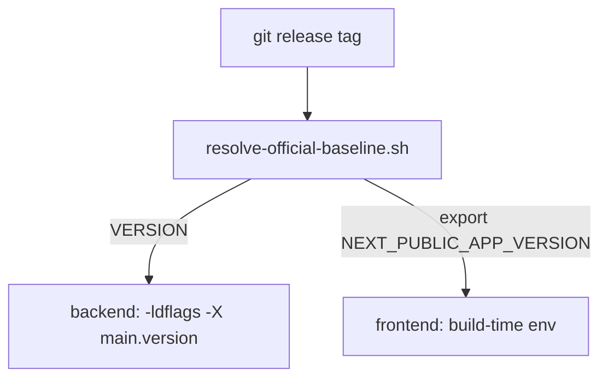

# Single-Source Versioning & CLI Version in Help Menu - Plan

## Goal Capsule

- **Objective:** Make the git release tag the single source for the frontend and backend versions so a production rebuild or deploy needs no manual version edit, and replace the Help menu's frontend-version row with a CLI-version row showing the most-recently-active daemon, flagged red only when that daemon is older than the server.
- **Product authority:** This plan owns the version-source consolidation and the Help menu CLI-version row. Multi-daemon drift signaling, dev-mode auto-tracking of the tag, and daemon/server sync enforcement are not active scope (see Scope Boundaries).
- **Execution profile:** Code, via `ce-work` or `/goal`. Units are dependency-ordered U1 → U2 → U3, with U4 (docs) last.
- **Stop conditions:** If `resolve-official-baseline.sh` cannot derive a tag on the operator's host (shallow clone, archive, offline), the install.sh path fails closed rather than silently stamping a fallback; the operator sets `MULTICA_TRUSTED_BASELINE` and re-runs. Do not weaken the sanitizer to "make it work."
- **Tail ownership:** `ce-work` owns implementation, simplification, review, and commits against these units.
- **Open blockers:** None. OQ1 was resolved during planning (see KTD3).

---

## Product Contract

*Product Contract preserved unchanged from the requirements-only artifact; OQ1 resolved during planning (see KTD3).*

### Summary

Consolidate frontend and backend version stamping onto the git release tag as a single source, and swap the Help menu's frontend-version row for a CLI-version row that shows the most-recently-active daemon and flags drift only when that daemon is older than the server.

### Problem Frame

The frontend and backend versions are stamped from two independent sources — the frontend reads a build-time env value, the backend a build-flag value — so consistency depends on build-script discipline rather than mechanism. On the self-host launchd path the backend version is derived from the same env file as the frontend, which means every upgrade requires manually editing that file, and forgetting to re-source it silently stamps a stale hardcoded fallback. Meanwhile the Help menu shows a frontend row and a backend row that, once consolidated, would always read identically — redundant — while the daemon (an independently upgraded binary whose version mismatch with the server is a known 502 cause) is not surfaced at the glance level at all.

### Key Decisions

- **Git release tag is the single version source for production frontend and backend**, resolved the same way across every production build path. (session-settled: user-approved — chosen over keeping the static env value as the production source: a deploy then touches zero version fields). Governs R1.
- **The static env version value is retained as a dev-only fallback, not removed.** Bare removal breaks dev's version display because the package.json fallback lacks the `v` prefix the baseline check requires. Governs R2.
- **The Help menu CLI row shows one representative — the most-recently-active daemon — not the full set of connected daemons.** (session-settled: user-directed — chosen over listing all distinct connected versions and over strict any-drift signaling: multi-runtime status belongs to the sidebar Runtimes indicator, keeping the Help row a single glance). Governs R4.
- **The drift flag fires only when the representative daemon is older than the server.** (session-settled: user-directed — chosen over flagging any mismatch: a newer daemon is backward-compatible and not 502-risk, so older-only avoids false reds). Governs R6.

### Requirements

**Version source**

- R1. Production frontend and backend versions derive from one source — the git release tag — resolved uniformly across all production build paths, so a production rebuild or deploy requires no manual version field edit.
- R2. Local development continues to display a version without regressing after production stops reading the static env value.

**Help menu CLI version**

- R3. The Help menu replaces its frontend-version row with a CLI-version row showing the connected daemon's version.
- R4. The CLI-version row shows the most-recently-active daemon's version as the representative, rather than every connected daemon.
- R5. When no daemon is connected, the CLI-version row shows unavailable.

**Drift flag**

- R6. The CLI-version row flags drift only when the representative daemon is older than the server; a daemon newer than or equal to the server does not flag.

Behavior here is conditional-display rather than multi-step, so it is specified through Acceptance Examples instead of Key Flows.

### Acceptance Examples

- AE1. Daemon matches server
  - **Given:** the most-recently-active daemon reports CLI `v0.4.12`; the server reports `v0.4.12`.
  - **When:** the Help menu renders.
  - **Then:** the CLI-version row shows `v0.4.12` with no drift flag.
  - **Covers R4, R6.**
- AE2. Daemon older than server
  - **Given:** the most-recently-active daemon reports CLI `v0.4.11`; the server reports `v0.4.12`.
  - **When:** the Help menu renders.
  - **Then:** the CLI-version row shows `v0.4.11` flagged as drifted.
  - **Covers R6.**
- AE3. Daemon newer than server
  - **Given:** the most-recently-active daemon reports CLI `v0.4.13`; the server reports `v0.4.12`.
  - **When:** the Help menu renders.
  - **Then:** the CLI-version row shows `v0.4.13` with no drift flag.
  - **Covers R6.**
- AE4. No daemon connected
  - **Given:** no daemon runtime is connected.
  - **When:** the Help menu renders.
  - **Then:** the CLI-version row shows unavailable.
  - **Covers R5.**
- AE6. Runtimes query in flight (pending state)
  - **Given:** the runtimes query has not yet resolved (cold load, or the query cache is cold).
  - **When:** the Help menu renders during that window.
  - **Then:** the CLI-version row shows `cli_loading` — not `cli_unavailable` — so an actually-connected daemon is not briefly misreported as absent.
  - **Covers R5.**
- AE5. Production rebuild needs no version edits
  - **Given:** the release tag is checked out.
  - **When:** a production build runs.
  - **Then:** frontend and backend are both stamped with the tag's version, with no manual version field edited.
  - **Covers R1.**

### Scope Boundaries

- Dev mode auto-tracking the git tag — dev keeps the manual env fallback and is not coupled to the tag checkout.
- Enforcing daemon/server version synchronization — the daemon stays an independently upgraded binary; this work only displays and flags drift.
- Multi-daemon drift signaling inside the Help menu — per Multica's design, multi-runtime status is surfaced by the sidebar Runtimes entry's indicator, not the Help summary.
- No new backend version field or endpoint — the CLI version is read through the runtimes data the frontend already accesses.
- Mobile — the Help menu change is web/desktop shared; mobile is independent.
- Other static version stamps (desktop build version, root package.json) — not touched.

### Sources / Research

- Help menu renders two independent rows today — frontend baseline (build-time env) and backend baseline (`server_version` from the config endpoint), each with its own loading/unavailable state: `packages/views/layout/help-launcher.tsx`.
- Config store holds `frontendBaseline`, `backendBaseline`, `backendBaselineStatus`; setters run through `officialBaseline()`: `packages/core/config/index.ts`.
- `officialBaseline()` rejects `dev`, non-`vX.Y.Z`, `-dirty`, and `-N-g<hash>` describe suffixes — three twins at `packages/core/config/index.ts`, `server/cmd/server/provenance_baseline.go`, `scripts/resolve-official-baseline.sh`. Full design: `docs/solutions/architecture-patterns/runtime-build-provenance.md`.
- Backend version source: `main.version` via `-ldflags -X main.version`; tag resolution: `scripts/resolve-official-baseline.sh` (`git describe --tags --abbrev=0` + upstream verify).
- Production build paths already tag-driven: `make build-prod`, `make selfhost-build`. The alignment gap this plan closes is `scripts/selfhost/install.sh`, which derives the backend version from `.env` rather than the tag.
- Daemon CLI version already reaches the backend on register (`cli_version` in runtime metadata) and the frontend via `GET /api/runtimes/`; fetched inline as `useQuery(runtimeListOptions(wsId))` (`packages/core/runtimes/queries.ts`). `readRuntimeCliVersion` reads one row's `metadata.cli_version` (`packages/core/runtimes/cli-version.ts`).
- Per-machine representative logic (online-first + newest-seen) lives in `packages/views/runtimes/components/runtime-machines.ts` (`currentMachineMetadata`, `compareRuntimeReports`); it is per-machine, not cross-list.
- Describe-aware semver parse (`parseSemver`/`lessThan`/`DEV_DESCRIBE_RE`) is module-private in `packages/core/runtimes/cli-version.ts` — the only comparator that tolerates a daemon's git-describe suffix.
- Help-row locale keys: `packages/views/locales/{en,zh-Hans,ja,ko}/layout.json` (`help.frontend_label`, `help.backend_label`, `help.*_unavailable`, `help.backend_loading`).
- No test covers `scripts/selfhost/install.sh` today; shell-test convention is `scripts/*.test.sh` (e.g. `scripts/resolve-official-baseline.test.sh`).

---

## Planning Contract

### Key Technical Decisions

- KTD1. install.sh derives `VERSION` from `scripts/resolve-official-baseline.sh` and exports `NEXT_PUBLIC_APP_VERSION` so both the backend ldflags stamp and `build-frontend.sh` consume the resolved tag, overriding any value the `.env` source block loaded; the `.env` block stays for `REMOTE_API_URL` and its comment is rewritten. (session-settled: user-approved — chosen over keeping `.env` as the production source: a deploy then touches zero version fields). Governs R1.
- KTD2. The CLI representative selector and drift comparator are pure functions in `packages/core/runtimes`; the Help launcher computes the row inline from the runtimes React Query and mirrors nothing into the config store, keeping server data in Query per the repo's state rules. (session-settled: user-approved — chosen over adding a `cliBaseline` store field: avoids duplicating server data into client state). Governs R3, R4.
- KTD3. The drift comparison uses the describe-aware `parseSemver`/`lessThan` from `cli-version.ts` (exported), not `officialBaseline`, so a dev-build daemon version carrying a `-N-g<hash>` suffix compares against the server's clean tag instead of reading as unavailable; both unparseable sides suppress the flag rather than false-alarming. Resolves OQ1. (session-settled: user-directed — chosen over flagging any mismatch: older-only is the 502-risk direction). Governs R6.
- KTD4. A shell test for install.sh's version resolution is added as net-new infra under `scripts/`, stubbing the resolver/git and asserting the resolver-derived stamp and the `.env` override, rather than smoke-only verification. (session-settled: user-directed — chosen over smoke-only: pins the stamp behavior in CI instead of relying on a manual run). Governs R1.

### High-Level Technical Design

The consolidation turns two independent version sources into one fan-out from the git tag:

Before, the launchd path read the version from `.env`; `make build-prod`/`make selfhost-build` already used the resolver. After U1, all three production paths share the resolver as the single source.

The Help-menu CLI row is a separate fan-in, computed inline in the launcher: the runtimes React Query supplies the daemon `cli_version`, the existing config store supplies the server baseline, and the comparator decides the flag. Nothing from this path is written to the config store.

---

## Implementation Units

### U1. install.sh stamps both halves from the git release tag (+ shell test)

- **Goal:** Production launchd builds derive frontend and backend versions from the git release tag via the resolver, with a shell test pinning the behavior.
- **Requirements:** R1, R2.
- **Dependencies:** none.
- **Files:** `scripts/selfhost/install.sh` (modify), `scripts/selfhost-install.test.sh` (new).
- **Approach:**
  1. Replace `VERSION="${NEXT_PUBLIC_APP_VERSION:-v0.4.6}"` with `VERSION="$(bash "$REPO/scripts/resolve-official-baseline.sh)"`; under `set -euo pipefail` this fails the script when the resolver exits non-zero.
  2. After resolving `VERSION`, add `export NEXT_PUBLIC_APP_VERSION="$VERSION"` so `build-frontend.sh` inherits the tag and overrides any `.env` value.
  3. Keep the `.env` source block (still supplies `REMOTE_API_URL`); rewrite its comment — the version now comes from the resolver and `.env`'s value is dev-only, overridden in this path.
  4. Confirm `build-frontend.sh`'s `${NEXT_PUBLIC_APP_VERSION:-v0.4.6}` fallback no longer triggers in the install.sh flow (the export covers it); leave the fallback for standalone `build-frontend.sh` calls.
  5. Shell test mirrors `scripts/resolve-official-baseline.test.sh`'s sandbox style — stub the resolver/git, source/parse install.sh's resolution, assert the stamp and override behavior without running real builds or launchd.
- **Patterns to follow:** `scripts/resolve-official-baseline.test.sh` (sandboxed shell-test pattern).
- **Test scenarios:**
  - Happy path: resolver returns `vX.Y.Z` → `VERSION=vX.Y.Z` and exported as `NEXT_PUBLIC_APP_VERSION`.
  - Override: `.env` has stale `NEXT_PUBLIC_APP_VERSION=vOld` → resolved tag wins in the export.
  - Covers AE5 (backend and frontend both receive the tag).
  - Fail-closed: resolver exits non-zero → install.sh aborts, no fallback to `v0.4.6`.
- **Verification:** `bash scripts/selfhost-install.test.sh` passes; on a real host, `bash scripts/selfhost/install.sh` then `curl -s http://localhost:8081/api/config` shows `server_version` equal to the resolved tag, and the built frontend bundle greps clean for the tag.

### U2. Reusable daemon-version selector and drift comparator

- **Goal:** Provide the pure functions the Help row needs — a cross-list "most-recently-active daemon cli_version" selector and a describe-aware "daemon older than server" comparator — by exporting and extending existing `cli-version.ts` logic.
- **Requirements:** R4, R6.
- **Dependencies:** none.
- **Files:** `packages/core/runtimes/cli-version.ts` (modify — export `parseSemver`/`lessThan`/`DEV_DESCRIBE_RE`, add comparator), `packages/core/runtimes/select-cli-version.ts` (new — cross-list representative selector), `packages/core/runtimes/cli-version.test.ts` (extend), `packages/core/runtimes/select-cli-version.test.ts` (new).
- **Approach:**
  1. Export the currently module-private `parseSemver`, `lessThan`, and `DEV_DESCRIBE_RE` so the comparator and selector reuse them.
  2. Add `isDaemonOlderThanServer(daemon, server)` per KTD3: parse both with `parseSemver` (describe-aware), return `false` if either is unparseable, else `lessThan(daemonParsed, serverParsed)`. Do not route through `officialBaseline`.
  3. Add `selectRepresentativeCliVersion(runtimes: AgentRuntime[])`: reuse the online-first + newest-`last_seen_at`/`updated_at` ordering pattern from `runtime-machines.ts`. Iterate the sorted runtimes and return the first row's non-empty `metadata.cli_version` via `readRuntimeCliVersion`, falling through to the next daemon if the top-ranked row has no `cli_version` (mirrors `currentMachineMetadata`'s behavior); return `null` when no row has a value. Cross-list (all machines/daemons), unlike the per-machine `currentMachineMetadata`.
- **Patterns to follow:** `packages/views/runtimes/components/runtime-machines.ts` (`compareRuntimeReports`/`runtimeReportTime` ordering), `packages/core/runtimes/cli-version.ts` (`readRuntimeCliVersion`, existing parse/compare).
- **Test scenarios:**
  - Selector returns the online daemon's version over a stale offline report.
  - Selector returns `null` on an empty runtime list.
  - Comparator: daemon `v0.4.11` < server `v0.4.12` → `true`. Covers AE2.
  - Comparator: daemon `v0.4.13` < server `v0.4.12` → `false`. Covers AE3.
  - Comparator: daemon `v0.4.12` vs server `v0.4.12` → `false`. Covers AE1.
  - Comparator tolerates describe suffix: daemon `v0.4.11-5-gabc` vs server `v0.4.12` → `true`.
  - Comparator returns `false` when either version is unparseable (no false drift flag).
- **Verification:** `pnpm --filter @multica/core test` green; `pnpm typecheck`.

### U3. Help menu CLI-version row with older-than-server drift flag

- **Goal:** Render a CLI-version row in the Help menu showing the most-recently-active daemon, flagged red only when older than the server.
- **Requirements:** R3, R4, R5, R6.
- **Dependencies:** U2.
- **Files:** `packages/views/layout/help-launcher.tsx` (modify), `packages/views/locales/en/layout.json` (modify), `packages/views/locales/zh-Hans/layout.json` (modify), `packages/views/locales/ja/layout.json` (modify), `packages/views/locales/ko/layout.json` (modify), `packages/views/layout/help-launcher.test.tsx` (extend).
- **Approach:**
  1. Subscribe to runtimes via the same shared queryKey as other on-screen consumers — `runtimeKeys.list(wsId)` from `packages/core/runtimes/queries.ts` — using the inline `useQuery(runtimeListOptions(wsId))` pattern (as in `tab-presentation.tsx`); this reuses the React Query cache already warm from sidebar/Runtimes/presence consumers, so the loading window is negligible in practice. Compute `cliVersion = selectRepresentativeCliVersion(runtimes)` (U2). Add no config-store field. Branch the row on the query's `isPending` / `isLoading` state for the loading row described in step 3 (mirrors the backend row's three states).
  2. Read the server baseline from the existing `backendBaseline` store field; compute drift = `cliVersion && backendBaseline && isDaemonOlderThanServer(cliVersion, backendBaseline)` (U2).
  3. Replace the existing frontend-version row (its `frontendText` derivation and rendering) with the CLI-version row inside the same `DropdownMenuGroup` per R3 — the menu keeps two rows, not three. Label `help.cli_label`, value = `cliVersion` when the runtimes query is settled and a non-null representative exists, `help.cli_unavailable` when settled with no representative, or `help.cli_loading` while the runtimes query is still pending (mirrors the backend row's three states — tag / loading / unavailable). Apply `text-destructive` to the value span when drift is true.
  4. When `wsId` is unavailable (no workspace context) or the query returns no runtimes, the row shows unavailable.
  5. Add `help.cli_label`, `help.cli_unavailable`, and `help.cli_loading` to all four locale files (en, zh-Hans, ja, ko). The frontend row's removal leaves `help.frontend_label` / `help.frontend_unavailable` unused in the launcher — grep for other references and remove them from the four locales if dead.
  6. Rewrite the existing `help-launcher.test.tsx` cases that assert the frontend row so they assert the CLI row against AE1–AE4; the frontend row no longer exists, so its assertions must not remain.
- **Patterns to follow:** existing two-row rendering in `help-launcher.tsx` (`frontendText`/`backendText` derivation, `text-muted-foreground`/`text-foreground` spans); `text-destructive` red styling used elsewhere in `packages/views`.
- **Test scenarios:**
  - Covers AE1: daemon matches server → row shows the version with no destructive styling.
  - Covers AE2: daemon older → row shows the version with destructive styling.
  - Covers AE3: daemon newer → row shows the version with no destructive styling.
  - Covers AE4: no runtimes → row shows `cli_unavailable`.
  - Covers AE6: runtimes query pending → row shows `cli_loading` (not `cli_unavailable`).
  - No workspace context → row shows unavailable without crashing.
- **Verification:** `pnpm --filter @multica/views test` green; `pnpm typecheck`; manual check against a running daemon for the four states.

### U4. Update docs/solutions to reflect the git-tag stamp path

- **Goal:** Keep the two docs/solutions entries honest now that the launchd path derives the version from the resolver instead of `.env`.
- **Requirements:** documentation supporting R1.
- **Dependencies:** U1.
- **Files:** `docs/solutions/workflow-issues/install-sh-upgrade-reload-defects.md` (modify), `docs/solutions/workflow-issues/version-reporting-after-upstream-upgrade.md` (modify).
- **Approach:**
  1. In `install-sh-upgrade-reload-defects.md`, update the long-term-fix / Prevention note: the version stamp now comes from `resolve-official-baseline.sh` and the `.env` source is no longer the version authority; keep the launchd reload guidance that still applies.
  2. In `version-reporting-after-upstream-upgrade.md`, update the manual two-step re-stamp to reflect that the launchd `install.sh` path now stamps both halves from the tag automatically; the manual two-step remains the fallback for non-install.sh paths.
  3. Follow each doc's existing frontmatter and section shape; bump `last_updated`.
- **Test expectation:** none — documentation only.
- **Verification:** docs render; cross-references between the two entries and to `runtime-build-provenance.md` stay consistent.

---

## Verification Contract

- `bash scripts/selfhost-install.test.sh` — the new shell test for install.sh's version resolution (U1).
- `pnpm --filter @multica/core test` — selector + comparator unit tests (U2).
- `pnpm --filter @multica/views test` — Help launcher row + drift tests (U3).
- `pnpm typecheck` — strict-mode types across the TS changes.
- `pnpm lint` — lint the changed packages.
- `make test` — Go tests (no Go change expected; run only if a server file was touched).
- Smoke (manual, not CI): `bash scripts/selfhost/install.sh` then `curl -s http://localhost:8081/api/config` asserts `server_version` equals the resolved tag; grep the built frontend bundle for the tag; open the Help menu and confirm the CLI row against a running daemon.

---

## Definition of Done

- U1 ships: install.sh stamps both halves from the resolved tag, fail-closed when the resolver fails, overriding any stale `.env` value; the shell test passes.
- U2 ships: `selectRepresentativeCliVersion` and `isDaemonOlderThanServer` exist in `packages/core/runtimes`, exported from `cli-version.ts` where reused, with the listed test scenarios green.
- U3 ships: the Help menu shows a CLI-version row with `text-destructive` drift exactly when the representative daemon is older than the server, and `cli_unavailable` otherwise; all four locales carry the new keys; AE1–AE4 hold.
- U4 ships: both docs/solutions entries reflect the resolver-driven launchd path.
- All gates in the Verification Contract pass (`bash scripts/selfhost-install.test.sh`, `pnpm --filter @multica/core test`, `pnpm --filter @multica/views test`, `pnpm typecheck`, `pnpm lint`).
- Cleanup: no dead-end or experimental code from abandoned approaches remains in the diff.
