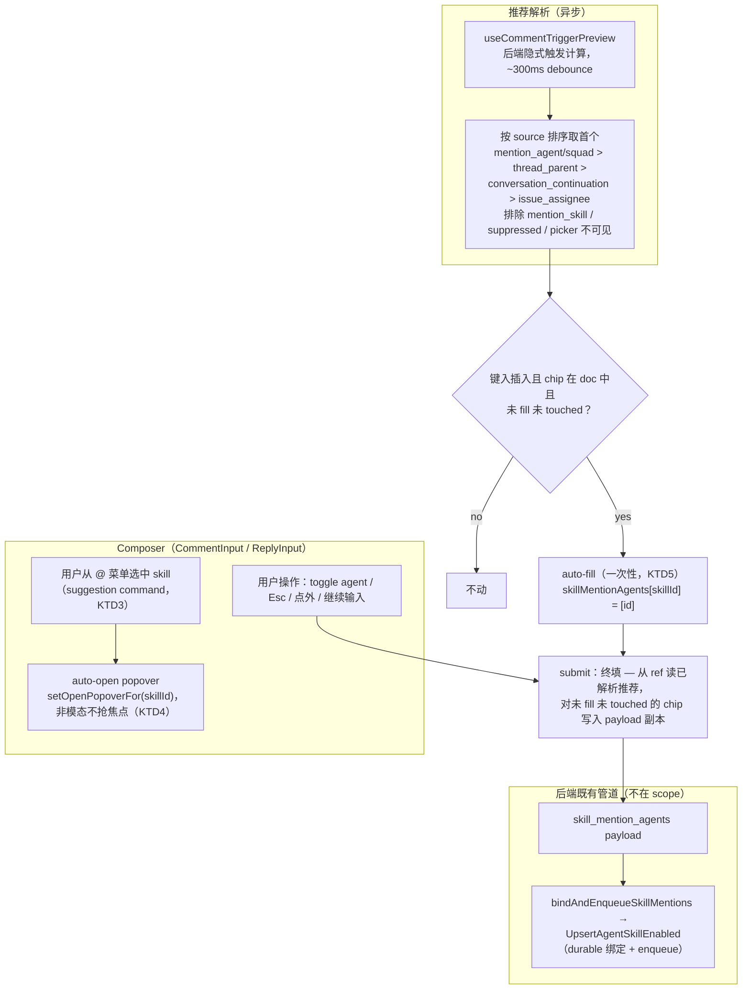
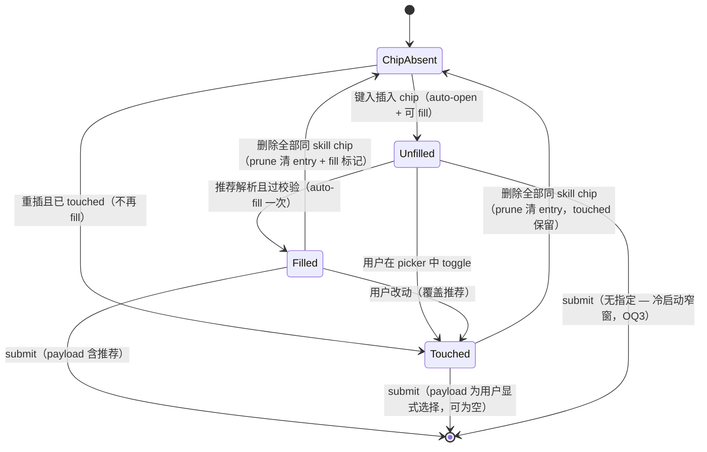

# Skill Auto-Bind Popover - Plan

## Goal Capsule

- **Objective:** 消除 `@skill` mention 的鼠标交互摩擦 — chip 键入插入后自动弹出 agent-picker popover 并预选推荐 agent，用户确认或关闭即完成 durable 绑定。消除「@skill 被静默忽略」路径（R4 反转）。
- **Product authority:** 本 plan owns popover 自动弹出交互、隐式推荐默认的计算来源、以及回复路径 `skill_mention_agents` 转发修复。skill 绑定的底层管道（`bindAndEnqueueSkillMentions`、`UpsertAgentSkillEnabled`、payload 契约）已由 `2026-07-17-001` 和 `2026-07-24-001` 建立且不在 active scope。
- **Scope:** 只覆盖创建路径的两条 composer（新评论 `CommentInput` + 回复 `ReplyInput`）。issue 描述编辑器与评论编辑模式均无 skill picker（planning 研究发现），defer 到 follow-up（见 Scope Boundaries）。
- **Open blockers:** 无。

---

## Product Contract

*Product Contract preservation: R1–R7、KD1–KD4、F1–F3、AE1–AE4 含义与 ID 保留。唯一 scope 变化——F3（issue 描述 @skill）从 active 移至 Deferred to Follow-Up Work：planning 研究发现描述编辑器没有 skill picker、后端也没有描述路径的绑定管道（`skill_mention_agents` 只在评论接口处理），实现它是独立新特性而非交互层改动；评论编辑模式同样无 picker，一并 defer。用户已在 scoping 确认。另一处澄清——R2 的推荐优先级补充最高层「显式 `@agent`/`@squad` mention」：依据用户 session 原话（`@agent` > reply-parent > assignee）与 R5 语义（被点名运行的 agent 必须拿到 skill，否则该 agent 裸跑、复现本 plan 要消除的原问题）；R2 已写的隐式层序不变。*

### Summary

`@skill` chip 键入插入后自动弹出 agent-picker popover，预选推荐 agent（按触发优先级显式 mention > reply-parent > 会话延续 > assignee）。用户确认或关闭 popover 都会把 skill durable 绑定到该 agent；用户主动选其他 agent 则覆盖默认。「@skill 被静默忽略」的路径被消除 — 当工作区存在可绑定 agent 时，每个 @skill mention 都产生绑定。

### Problem Frame

当前 `@skill` 的 agent 指定依赖手动点击 chip 打开 popover。这个交互成本高：用户在快速评论流程中需要离开键盘、移动鼠标、精确点击 chip 区域。实际使用中，用户经常跳过这一步直接提交，导致 `skill_mention_agents` 为空，`bindAndEnqueueSkillMentions` 走 `len(designated) == 0 { continue }` 静默跳过。被 mention 的 skill 不会绑定到任何 agent，agent 运行时读不到 workspace skill 内容（SKILL.md / references / scripts），可能 fallback 到 runtime 自带的同名 skill。

这不是个别用户习惯问题 — 是交互设计把「指定 agent」设为了高摩擦操作，而「跳过」成了默认路径。

### Key Decisions

- KD1. **Auto-open popover over click-to-open** (session-settled: user-directed — chosen over keyboard-only dropdown, text-pairing syntax, and post-submit chip: popover 是已有 UI，auto-open 只移除点击成本，不改变视觉模型). Governs R1, R7.
- KD2. **Recommended default from implicit trigger priority** (session-settled: user-directed — chosen over assignee-only, all-agents, and no-default: 与 computeCommentAgentTriggers 的隐式 trigger 优先级一致，用户预期「我在跟谁说话就是给谁」). Governs R2, R3.
- KD3. **Dismiss = accept recommended default** (session-settled: user-directed — chosen over silent no-op, explicit "not applicable" option, and post-submit correction chip: 用户核心诉求是「@skill 不能丢」，任何路径都该产生绑定). Governs R3, R6.
- KD4. **Durable binding over ephemeral injection** (session-settled: user-directed — chosen over per-task-only injection: 与 R3 (2026-07-17) 的 durable 语义一致，skill 出现在 agent 的技能列表中可审计). Governs R5.

### Requirements

**Popover 交互**

- R1. `@skill` chip 插入 composer 后，agent-picker popover 自动弹出，无需用户点击 — 前提：工作区存在可绑定 agent（列表为空则不自动弹，保留手动手势）；agent 列表 in-flight 时待就绪再弹（门控见 KTD4）。
- R2. Popover 打开时预选推荐 agent：显式 `@agent`/`@squad` mention 的 agent（如果本条评论点名了 agent）> reply-parent agent（如果是 reply）> conversation-continuation agent（如果有活跃会话）> issue assignee（如果是 agent）。无候选时 popover 不预选。
- R3. 用户关闭 popover（Esc、点击外部、或直接提交评论）时，接受推荐默认 — `skillMentionAgents` 自动填入推荐 agent。
- R4. 用户可以在 popover 中主动选择其他 agent，覆盖推荐默认。

**绑定语义**

- R5. 推荐默认被接受（或用户主动选中）后，skill 通过 `UpsertAgentSkillEnabled` durable 绑定到目标 agent，写入 `agent_skill` 表。
- R6. 当工作区存在可绑定的 agent 时，每个 `@skill` mention 都产生绑定 — 不存在「有 agent 可绑但 @skill 被静默忽略」的路径（绑定保证覆盖键入插入的 mention；粘贴 / undo / 水合来源不自动绑定，见 KTD5）。

**兼容性**

- R7. 现有手动点击 chip 打开 popover 的手势保持功能不变 — auto-open 是其超集，不破坏已有行为。

### Key Flows

- F1. 评论中 @skill + 确认推荐默认
  - **Trigger:** 用户在评论 composer 输入 `@skill`，chip 插入。
  - **Steps:** Popover 自动弹出，预选推荐 agent → 用户按 Enter 确认或直接继续输入 → 提交评论 → `skill_mention_agents` 包含推荐 agent → 后端 durable 绑定 + enqueue。
  - **Outcome:** 推荐 agent 被绑定并触发。
  - **Covers:** R1, R2, R3, R5, R6.

- F2. 评论中 @skill + 覆盖推荐默认
  - **Trigger:** 用户在评论 composer 输入 `@skill`，chip 插入。
  - **Steps:** Popover 自动弹出，预选推荐 agent → 用户选择另一个 agent → 提交评论 → `skill_mention_agents` 包含用户选中的 agent → 后端 durable 绑定 + enqueue。
  - **Outcome:** 用户选中的 agent 被绑定并触发。
  - **Covers:** R1, R2, R4, R5, R6.

- F3. Issue 描述中 @skill *(deferred to follow-up — 见 Scope Boundaries；本 flow 已整体 defer，非本 plan 在册要求，其 Covers 仅在后续 plan 激活时适用)*
  - **Trigger:** 用户在 issue 描述编辑器输入 `@skill`。
  - **Steps:** （deferred）Popover 自动弹出，预选 assignee → 用户确认或关闭 → 保存描述 → 后端 durable 绑定。
  - **Outcome:** （deferred）Assignee 被绑定（不触发 enqueue — 描述编辑不触发任务）。
  - **Covers:** R1, R2, R3, R5, R6.

### Acceptance Examples

- AE1. **Reply 场景 — 推荐默认正确**
  - **Given:** 用户在 reply 一条 agent 评论，输入 `@skill`。
  - **When:** Popover 自动弹出，预选 reply-parent agent。
  - **Then:** 用户直接提交，`skill_mention_agents` 包含 reply-parent agent，该 agent 被 durable 绑定。Covers R1, R2, R3, R5, R6.

- AE2. **覆盖推荐默认**
  - **Given:** 用户在评论中输入 `@skill`，popover 预选 assignee。
  - **When:** 用户在 popover 中选择另一个 agent。
  - **Then:** `skill_mention_agents` 包含用户选中的 agent，不是 assignee。Covers R4.

- AE3. **无推荐候选**
  - **Given:** Issue 未分配 agent，评论不是 reply，无活跃会话。
  - **When:** 用户输入 `@skill`。
  - **Then:** Popover 自动弹出但不预选任何 agent；用户关闭 popover 不提交时 `skill_mention_agents` 为空（无 agent 可绑）。Covers R2, R6.

- AE4. **引用性 @skill**
  - **Given:** 用户在评论中写「我们应该用 @code-review」，无意触发任何 agent。
  - **When:** Popover 自动弹出，预选推荐 agent。
  - **Then:** 用户关闭 popover 后 skill 被绑定到推荐 agent — 这是 R4 反转的已知代价。用户如需纯提及，可在 popover 弹出后按 Esc 再删除 chip。Covers R3, R6.

### Scope Boundaries

**Out of scope / non-goals:**
- 文本配对语法（`@agent use @skill` 自然语言解析）— 对话中已排除。
- Ephemeral 任务注入（不写 `agent_skill` 表的临时交付）— 用户选择 durable。
- 修改 mention node spec 或 `ParseMentions` — 不需要。
- 后端绑定管道改动（`bindAndEnqueueSkillMentions` / `UpsertAgentSkillEnabled` / 预览 handler）— 全部沿用现状。

**Deferred to Follow-Up Work**
- F3 issue 描述 @skill：描述编辑器需要接入 `skillMentionContext` + picker + 提交路径，后端 issue create/update 需要新增 `skill_mention_agents` 绑定管道（现只在评论接口，`server/internal/handler/issue*.go` 无任何 skill-mention 处理）。独立特性，非交互层改动。
- 评论编辑模式 picker：edit composer 的 `ContentEditor`（`packages/views/issues/components/comment-card.tsx` 内两处）未传 `skillMentionContext`，chip 仅 hover-only；接入还需后端在 timeline 暴露历史绑定信息才能 hydrate（`onEdit` 签名与后端 `UpdateComment` 已接受该字段，`server/internal/handler/comment.go` 的 edit request 已含 `SkillMentionAgents`）。
- 冷启动竞态的产品级处理（提交前等待推荐解析 / 未解析时提示）— 当前接受窄窗（见 OQ3）。
- `multica-mentioning` SKILL.md 表述复核：agent 可见契约未变（designated → 运行携带 skill；无指定仍 silent），预计无需改；若 review 认为 "silent no-op" 表述误导再补。

### Dependencies / Assumptions

- 依赖 `skill_mention_agents` payload 和 `bindAndEnqueueSkillMentions` 后端管道（已由 2026-07-17-001 和 2026-07-24-001 建立且正常工作）。
- 推荐 agent 的计算来源已在 planning 确定为前端复用 `useCommentTriggerPreview`（后端自己的触发计算结果）— 见 KTD1；新增一个轻量 hook（U2）。

### Outstanding Questions

- OQ1 (resolved in planning). 多 skill popover 策略：顺序逐个自动弹出，沿用现有单槽 `openPopoverFor`（KTD2）。
- OQ2 (resolved in planning). 推荐计算：前端复用 trigger preview 按 source 排序，不新增 endpoint、不重写触发逻辑（KTD1）。
- OQ3 (deferred, non-blocking). 冷启动竞态：chip 插入后 ~300–700ms 内提交（推荐尚在 300ms debounce + 网络 in-flight），该 chip 以无指定发出 — 残余的窄静默窗口。U4 的提交时终填已把窗口缩窄到「preview 仍 in-flight」一种场景。接受此行为（不阻塞提交）；若产品后续要「提交前等待/提示」，单独评估。

### Sources & Research

- 现有 skill mention 手势实现：`docs/plans/2026-07-17-001-feat-skill-mention-agent-gesture-plan.md`（shipped）、`docs/plans/2026-07-24-001-fix-skill-mention-bind-decouple-plan.md`（shipped）。
- 后端绑定管道：`server/internal/handler/comment.go`（`bindAndEnqueueSkillMentions`、`bindDesignatedSkillsForTriggers`、trigger source 常量 `:1499-1509`）、`server/pkg/db/queries/skill.sql`（`UpsertAgentSkillEnabled`）。
- Runtime skill fallback 根因：`server/internal/daemon/execenv/hermes_home.go`、`docs/solutions/integration-issues/autopilot-reads-workspace-skill-not-hermes-local.md`。
- 前端机制测绘（planning 研究）：`packages/views/editor/skill-mention-context.ts`（openPopoverFor 单槽）、`packages/views/editor/extensions/mention-view.tsx`（skill 分支受控 Popover）、`packages/views/editor/extensions/mention-suggestion.tsx`（suggestion factory，未覆写 command）、`packages/views/issues/components/comment-input.tsx` / `reply-input.tsx`（skillMentionAgents 状态）、`packages/views/issues/components/comment-card.tsx`（onReply 边界丢参）、`packages/views/issues/hooks/use-comment-trigger-preview.ts`（后端隐式触发的现成来源）、`packages/core/types/comment.ts`（CommentTriggerSource 联合类型为 stale 子集，source 字段实为 `| string` 兼容）。
- 边界分析（planning 研究）：冷启动竞态（submit 闭包读 `optsRef`）、焦点归属、touched 守卫必要性、粘贴/undo 与键入插入的区分、edit 模式无 picker、推荐自指（fill 自身产生 `mention_skill` 预览行）、suppression 与 designation 独立。
- Institutional learnings：`docs/solutions/logic-errors/bind-on-skip-when-dedup-rewrites-source.md`（YUP-407 — bind 永不以 trigger source 为 key）、`docs/solutions/ui-bugs/skill-autocomplete-cold-cache.md`（agent 列表必须 `useQuery` 预热）、`CONCEPTS.md`「Skill Mention Gesture」词条（行为反转后需更新，见 U5）。

---

## Planning Contract

### Key Technical Decisions

- KTD1. **推荐 agent 复用现有 trigger preview，按 source 排序**（instantiates session-settled KD2）。推荐 = 后端隐式触发 agents 按 source 优先级取首个：`mention_agent` / `mention_squad_leader` > `thread_parent` > `conversation_continuation` > `issue_assignee`（常量见 `server/internal/handler/comment.go:1499-1509`）。后端 preview 跑的就是提交时 `computeCommentAgentTriggers` 的同一逻辑（read-only），前端只排序不重算 — 消除 OQ2 担心的漂移，不新增 endpoint。三条排除规则：排除 `mention_skill` source（自指防护）；排除被 suppress 的 agent；推荐 id 必须通过**推荐侧**可见性校验：unarchived 且 runtime-bound（严于 picker —— 实测 picker 可见列表仅过滤 `archived_at`、无 runtime-bound 检查，手动选择可选 unbound，差异为有意设计；等 agent 列表就绪）。**推荐计算的输入不得是合并后的预览行**：`useCommentTriggerPreview` 的 merge 用 designated 行（`source=mention_skill`）整行替换同 agent 的后端行，直接消费合并行会让同评论第二个 @skill chip 把「已被指定的 agent」误当自指排除（正是 KTD2 支持的多 skill 场景）；纯函数须取未合并的后端原始行，或先剥离 designated 遮蔽行、还原后端 source 后再排序 — `mention_skill` 排除仅适用于 designated-only、后端未产出的前端行。回复父作者与 issue assignee 提供同步 fast-path（同样过三重校验，不满足则退回 async），消除冷启动闪变；fast-path 写入的推荐为临时值（未 touched 时可被 async 结果替换恰好一次，见 KTD5 例外条款）。Governs R2.
- KTD2. **多 skill 顺序逐个弹出**（OQ1 裁决）。沿用单槽 `openPopoverFor`（skill id 键控）：新插入 chip 弹自己的 popover，前一个自动关闭；引用同一 skill 的两个 chip 合并为一个 entry（既有行为，`skillMentionAgents` 与 popover 均按 skill id 键控）。推荐对所有 skill 相同（上下文不随 skill 变化）。
- KTD3. **插入检测挂 suggestion command 路径，只认键入选择**。在 `createMentionSuggestion` 的 suggestion command（用户从 @ 菜单选中 item 时执行）上通知 composer → `setOpenPopoverFor(skillId)`。粘贴含 skill markup、undo/redo、quick-action 插入的 chip 不自动弹出（doc-diff 无法区分这些来源，会误弹 + 水合误判；arming 机制只挡 suggestion 弹层、不挡 node 创建）；它们保留手动点击手势（R7 超集语义不变）。
- KTD4. **自动弹出不抢焦点**。popover 非模态打开，焦点留在 editor（Base UI Popover 需显式控制 initial focus）；Tab / ↓ 将焦点移入 popover 列表完成选择 — 键盘-only 覆盖推荐默认的路径（R4）；Esc 与 editor 首次击键（焦点未进入列表时）关闭 popover。auto-open 以 agent 列表 query 已返回且非空为门控 — in-flight 沿用 picker 既有 loading 态待就绪再弹，为空则不自动弹（手动点击手势保留）。dismiss = 接受默认由 KTD5 的 fill 落地保证，与 popover 开关状态无关。
- KTD5. **auto-fill 一次性 + touched 守卫 + sticky**。fill 按 skillId 键控（不锚定当前开着的 popover — 单槽下插入 A→弹 A→关掉→插入 B→弹 B 时，A 的推荐解析仍须 fill A）。每 skill 在「chip 存在于 doc」期间至多 fill 一次，且仅键入插入的 chip 参与 fill（资格锚定 KTD3 插入信号 — 内存 `insertedRef: Set<skillId>`，随 prune 清除；粘贴 / undo / 草稿水合的 chip 不参与 auto-fill 与提交终填，保留手动点击手势）；entry 被 prune（chip 删光）后重插可重新 fill；`touchedRef: Set<skillId>` 在每次 `onSkillMentionChange`（toggle on/off 都算）时标记，touched 后永不再 fill（显式清空不被覆盖）。suppress 交互：用户 suppress 某 agent 时，清除「非 touched 且包含该 id」的 auto-fill entry，提交终填同样跳过被 suppress 的推荐 id — 显式「别跑」手势不被机器默认覆盖。推荐升级（如 assignee→continuation）sticky 在首个 fill 值，接受 preview strip 与 chip badge 的短暂不一致（重新跟随会引入 badge 身份闪变，代价更高）— 唯一例外：**fast-path 来源的 fill 是临时值**，entry 未 touched 时允许被 async 确认结果替换恰好一次（badge 只闪一次），防止同步 fast-path 以低优先级 source（reply-parent / assignee）抢先锁定、async 解析出的更高优先级推荐（如显式 `@agent` mention）永远无法胜出（被点名 agent 裸跑）；async 来源的 fill 立即 sticky。issueId 切换时 fill/touched 守卫随 `skillMentionAgents` 一并重置。守卫必须与指定 map 同生命周期：`skillMentionAgents` 随 draft store 持久化并在虚拟化 timeline remount 时水合，守卫若为纯组件内存态，remount 后用户显式清空会被 fill 回滚（违反 DoD「显式清空永不被覆盖」）— `CommentDraftPayload` 增加 touched/filled 的 skillId 集合，随草稿一并持久化与水合（防御层；「插入锚定」已采纳 — 水合 chip 不再参与 fill，持久化为收窄后场景的防御层）。
- KTD6. **回复路径转发修复为硬前置**。`CommentCard` 的 `onReply` 类型与 wrapper 补转发 `skillMentionAgents`（`useIssueTimeline.submitReply` 与后端均已支持，断点只在 `comment-card.tsx` 的类型声明与 onSubmit wrapper 两处）。与本特性同车或先行合入 — 否则回复场景（thread_parent 主场，AE1）整体失效：用户看到预选、确认、发送，然后什么都不发生。

### High-Level Technical Design

交互生命周期（组件 × 异步推荐 × 用户操作三线汇合到 payload）：

每个 skill chip 的 designation 状态机（touched 优先于一切自动行为）：

（粘贴 / undo / 草稿水合产生的 chip 不进入 Unfilled — 无 fill 资格，仅保留手动点击手势；fast-path fill 为临时值，可被 async 结果替换恰好一次，见 KTD5。）

### Sequencing

U1 独立先行（可单独合入，本身就是 bug fix）；U2 与 U3 并行；U4 依赖 U1+U2+U3；U5 收尾。

---

## Implementation Units

### U1. 回复路径 `skillMentionAgents` 转发修复

- **Goal:** 回复 composer 的 skill 指定真正到达后端 — 修补 `CommentCard` 边界的静默丢参（KTD6）。
- **Requirements:** R5, R6 的回复路径前置（Covers AE1 的提交链路）。
- **Dependencies:** none。
- **Files:**
  - `packages/views/issues/components/comment-card.tsx`（`CommentCardProps.onReply` 类型 + `ReplyInput` onSubmit wrapper）
  - `packages/views/issues/components/comment-card-reply-skill-forward.test.tsx`（新）
- **Approach:**
  1. `CommentCardProps.onReply`（`comment-card.tsx`）：类型现为 4 参（`parentId, content, attachmentIds?, suppressAgentIds?`），`skillMentionAgents?: Record<string, string[]>` 为新增的第 5 个可选参数（对齐 `useIssueTimeline.submitReply` 与 `onEdit` 的既有形状）。
  2. `ReplyInput` 的 onSubmit wrapper（`comment-card.tsx` 内）：从转发 3 参扩为转发其收到的全部 4 参（第 4 参即 `skillMentionAgentsPayload`）— 注意这是 `ReplyInput` submit 回调的 4 参签名，与上一行 `onReply` 的 5 参类型是两级不同签名。
  3. `useIssueTimeline.submitReply`、`useCreateComment`、`api.createComment`、后端均已支持，不动。
- **Patterns to follow:** `submitComment`（顶层路径）的 4 参透传；`onEdit` 的可选尾参形状。
- **Test scenarios:**
  - 回复 composer 中指定 agent 并提交 → mock 的 `onReply` 收到第 5 参且内容正确（当前为缺失行为，先红后绿）。
  - 未指定任何 skill 的回复提交 → 第 5 参为 `undefined`（不传空对象）。
  - 顶层评论提交路径回归不变。
- **Verification:** `pnpm typecheck` + 新测试绿；回复中手动指定 skill agent 提交后，后端日志/`agent_skill` 出现绑定（smoke）。

### U2. 推荐 agent 计算（纯排序 + hook）

- **Goal:** 输出「当前 composer 上下文下的推荐 agent id」，OQ2 落地（KTD1）。
- **Requirements:** R2。
- **Dependencies:** none（与 U1/U3 并行）。
- **Files:**
  - `packages/core/issues/skill-mention-recommendation.ts`（新 — 纯排序函数）
  - `packages/core/issues/skill-mention-recommendation.test.ts`（新 — 矩阵，node env）
  - `packages/views/issues/hooks/use-recommended-skill-agent.ts`（新 — React 组合）
  - `packages/core/types/comment.ts`（`CommentTriggerSource` 联合类型补 `thread_parent`、`conversation_continuation`、`mention_skill` — 现为 stale 子集）
- **Approach:**
  1. 纯函数：输入未合并的后端原始预览行（含 source；不得消费 designated 合并行，遮蔽规则见 KTD1）、agent 可见性集合（unarchived + runtime-bound — 推荐侧校验严于 picker 的仅过滤 `archived_at`）、suppressed 集合 → 输出推荐 agent id 或 null。排序 `mention_agent`/`mention_squad_leader` > `thread_parent` > `conversation_continuation` > `issue_assignee`；排除 `mention_skill` source（自指）、suppressed、不可见 id。
  2. Hook：组合 `useCommentTriggerPreview` 结果 + `agentListOptions(wsId)`（`useQuery`，非 `getQueryData` — 冷缓存教训）+ 同步 fast-path（reply-parent：父评论 actor 经 timeline 查找或 prop；assignee：issue query 的 `assignee_type`/`assignee_id`）。fast-path 候选同样过可见性三重校验，不满足退回 async。preview 未解析时输出 null。
  3. hook 接受 `wsId` 参数（repo 规则：需要 workspace 上下文的 hook 收 `wsId`）。
- **Patterns to follow:** `useSkillDesignatedPreviewAgents` 的 agent 解析与静默丢弃；`selectSkillAssignments` 的 archived 过滤。
- **Test scenarios:**
  - 排序矩阵：`mention_agent` 胜过 `thread_parent`；`thread_parent` 胜过 `conversation_continuation`；`conversation_continuation` 胜过 `issue_assignee`。
  - `mention_skill` source 被排除（自指防护）。Covers R2。
  - designated 遮蔽行不污染推荐：同评论先指定 skillA→X 再插 skillB，推荐仍为 X（纯函数不得消费以 `mention_skill` 整行替换了后端来源的合并行）。
  - 被 suppress 的 agent 被排除。
  - archived / runtime-unbound 的候选不输出（fast-path 与 async 同规则）。
  - 无任何候选 → null。Covers AE3。
  - preview 空 / 未解析 → null。
- **Execution note:** 纯函数矩阵先写失败测试再实现（行为性变更）。
- **Verification:** `pnpm test`（core 矩阵 + views hook）绿。

### U3. 键入插入自动弹出 popover（不抢焦点）

- **Goal:** 用户从 @ 菜单选中 skill 后，agent-picker 自动弹出，无需点击（R1）。
- **Requirements:** R1, R7。
- **Dependencies:** none（与 U1/U2 并行）。
- **Files:**
  - `packages/views/editor/extensions/mention-suggestion.tsx`（suggestion 配置增加 `onSkillMentionInserted` 回调通道，command 路径触发）
  - `packages/views/editor/content-editor.tsx`（回调经 editor options 透传）
  - `packages/views/issues/components/comment-input.tsx`、`reply-input.tsx`（接收回调 → `setOpenPopoverFor`）
  - `packages/views/editor/skill-mention-context.ts`（如需暴露非抢焦点的打开方式）
  - `packages/views/issues/components/comment-input.test.tsx`（新增或扩充）
- **Approach:**
  1. `createMentionSuggestion` 增加可选回调（经 editor options 注入），在用户从 suggestion 菜单选中 `type === "skill"` 的 item、command 插入 node 后调用，携带 skill id。
  2. 两个 composer 把回调接到 `setOpenPopoverFor(skillId)`，auto-open 以 agent 列表 query 已返回且非空为门控（KTD4）— in-flight 待就绪再弹、为空不弹。粘贴 / undo / quick-action 路径不经过 suggestion command，天然不触发（KTD3）。
  3. Popover 非模态打开、初始焦点留在 editor（Base UI Popover 的 initial-focus 控制）；Tab / ↓ 进入 popover 列表完成选择（键盘-only 覆盖推荐默认，R4）；Esc 与 editor 首次击键（焦点未进入列表时）关闭 popover；点击 chip 的手动手势不变。
- **Patterns to follow:** `SkillMentionContext` 单槽受控模式（`skill-mention-context.ts`）；Base UI `Popover` 的受控 `open`/`onOpenChange`。
- **Test scenarios:**
  - 键入选择 skill → popover 自动打开。Covers R1。
  - 手动点击 chip 仍可打开 popover（R7 回归）。
  - 粘贴含 skill markup 的文本 → 不自动打开。
  - Esc 关闭后继续输入 → 不重开（除非重新从菜单插入）。
  - agent 列表为空 → 不自动弹出；列表 in-flight → 就绪后再弹出。
  - 键盘-only 覆盖推荐默认：Tab 进入列表、方向键 + Enter 选中其他 agent → payload 为用户选中。Covers R4。
  - 顶层评论与回复两个 composer 都生效。Covers AE1 的弹出环节。
- **Verification:** `pnpm typecheck` + `pnpm test`（views 交互）绿。

### U4. auto-fill + dismiss=accept + 覆盖语义

- **Goal:** 推荐落地为 designation；显式操作优先；关闭 popover 或提交即接受默认（R3, R4, R6）。
- **Requirements:** R3, R4, R6。
- **Dependencies:** U1（提交路径）、U2（推荐来源）、U3（触发时机）。
- **Files:**
  - `packages/views/issues/components/comment-input.tsx`、`reply-input.tsx`（fill effect + touched 守卫 + 提交终填）
  - `packages/views/issues/hooks/use-recommended-skill-agent.ts`（消费方接线，如需）
  - `packages/views/issues/components/comment-input.test.tsx`、`reply-input.test.tsx`（新增或扩充）
- **Approach:**
  1. fill effect 遍历「键入插入且 chip 仍在 doc」的 skillId（`insertedRef` ∩ `getSkillMentionIds`），对未 fill 且未 touched 的 skill，推荐解析且过可见性校验后写 `skillMentionAgents[skillId] = [id]`（KTD5：一次性、按 skillId 键控、entry 被 prune 后重插可重新 fill、仅键入插入参与）。fast-path 来源的 fill 为临时值，未 touched 时可被 async 确认结果替换恰好一次；async 来源 fill 立即 sticky。fill 晚于 popover 打开属预期（cold-start），badge/strip 随之更新。
  2. `touchedRef: Set<skillId>` 在每次 `onSkillMentionChange`（toggle on/off 都算）标记；touched 后推荐永不覆盖。suppress toggle 时清除「非 touched 且含被 suppress id」的 auto-fill entry。touched/filled 集合写入 `CommentDraftPayload` 随草稿持久化、remount 时水合（守卫与指定 map 生命周期对齐 — 否则虚拟化 timeline remount 后显式清空被 fill 回滚）。`issueId` 切换时 fill/touched 守卫随 state 一并重置。
  3. 提交终填：submit handler 内从 ref 读已解析推荐，对未 fill 未 touched 的 chip 直接写入 payload 副本再序列化（仅键入插入的 chip — 参照 `insertedRef`；跳过被 suppress 的推荐 id；不依赖 setState 时序 — submit 闭包读 `optsRef`，state 更新赶不上同一 tick）。这将冷启动竞态缩窄到「preview 仍 in-flight」（OQ3）。
  4. aria-live 通告 fill（chip badge 无→1）与 popover 自动打开。
- **Patterns to follow:** `handleSkillMentionChange` / `syncSkillMentionsWithDoc` 的既有 entry 生命周期；`useComposerSubmit` 的 ref 模式。
- **Test scenarios:**
  - 推荐解析 → entry 自动写入，picker 预选显示。Covers R3。
  - 用户先 toggle 其他 agent → 推荐解析后不覆盖（touched）。Covers R4 / AE2。
  - 用户显式清空推荐 agent → 不被 re-fill（entry 删除不等于未触碰）。
  - 显式清空后虚拟化 remount（草稿水合）→ 不回填（touched/filled 守卫随草稿持久化）。
  - 粘贴含 skill chip 的文本 → 提交 → payload 无 `skill_mention_agents`（非键入来源不 fill 不终填）。
  - 用户 suppress 已被 auto-fill 的 agent（entry 非 touched）→ entry 被清除、提交无该绑定；touched entry 不受影响。
  - fast-path 低优值先填、async 高优值到达且未 touched → 替换恰好一次；touched 后不再替换。
  - 删光同 skill chip 再重插 → popover 重开、可重新 fill（未 touched 时）。
  - `issueId` 切换 → fill/touched 守卫重置。
  - 冷启动立即提交（推荐未解析）→ 无指定发出（OQ3 接受行为）。
  - 提交时推荐已解析 → payload 含推荐（终填生效，即使 fill effect 尚未 commit）。Covers AE1。
  - 无候选 issue → 无 fill、提交无 `skill_mention_agents`。Covers AE3 / AE4（引用性 @skill 被绑定为已知代价）。
- **Execution note:** 行为性变更 — 交互测试先红后绿。
- **Verification:** `pnpm typecheck` + `pnpm test`（views）绿。

### U5. 文档与 ledger

- **Goal:** 行为反转（R4 反转 + dismiss=accept）后的留档同步。
- **Requirements:** traceability（self-host 工作流）。
- **Dependencies:** U1–U4（最终行为已知）。
- **Files:**
  - `CONCEPTS.md`（「Skill Mention Gesture」词条）
  - `docs/customizations.md`（ledger 条目）
  - `packages/views/locales/`（仅当实现引入 recommended 视觉标记时补 en/zh copy；无新 copy 则跳过）
- **Approach:** CONCEPTS.md 词条保留 bind/run 解耦不变量原文，只改「A chip with no designated agent reverts to plain text」句为 auto-open + dismiss=accept 语义（无候选 agent 时仍回落）。ledger 更新 skill-mention 定制条目：auto-open、推荐默认、回复转发修复，指向本 plan。SKILL.md 预计无需更新（OQ3 同款 defer 记录在 Scope Boundaries）。
- **Test expectation:** none — documentation only.
- **Verification:** ledger 与 CONCEPTS 词条反映新行为并指向本 plan。

---

## Verification Contract

| Gate | 命令 | 覆盖 |
| --- | --- | --- |
| TS 类型 | `pnpm typecheck` | 全部单元 |
| TS 测试 | `pnpm test` | U1 回复转发；U2 推荐矩阵；U3/U4 composer 交互 |
| Go 回归 | `make test` | 后端未动 — `skill_mention_trigger_test.go` 等应全绿（确认无前端改动外溢） |
| 手动 smoke（self-host） | — | (a) 回复 agent 评论时 `@skill` → popover 自动弹、预选该 agent、直接提交 → `agent_skill` 出现绑定且当次运行携带 bundle；(b) 顶层评论 + agent assignee 场景同验；(c) 无候选 issue（无 assignee、非 reply、无活跃会话）→ popover 无预选、提交无绑定；(d) 粘贴含 skill chip 的文本 → 不自动弹；(e) 显式 `@agent use @skill` → 预选该 agent |

## Definition of Done

- 顶层评论与回复中从 @ 菜单键入 `@skill` → popover 自动弹出且不抢焦点，预选推荐 agent（显式 mention > reply-parent > 会话延续 > assignee）。
- 关闭（Esc / 点外 / 提交）后推荐已在 `skillMentionAgents` 中 — 提交产生 durable 绑定（AE1 全链路，含回复路径 U1 修复）。
- 显式选择/清空永不被推荐覆盖（touched）；粘贴/undo 产生的 chip 不自动弹出；手动点击手势不变（R7）。
- 回复路径 payload 不再丢弃（U1）。
- 冷启动窄窗（提交时推荐仍未解析 → 无指定发出）为已记录的接受行为（OQ3），不阻塞。
- CONCEPTS.md 词条、ledger 更新；issue 描述编辑器与评论编辑模式明确 defer 在 Scope Boundaries。
- Verification Contract 全部 gate 绿；无遗留实验性/死代码。
