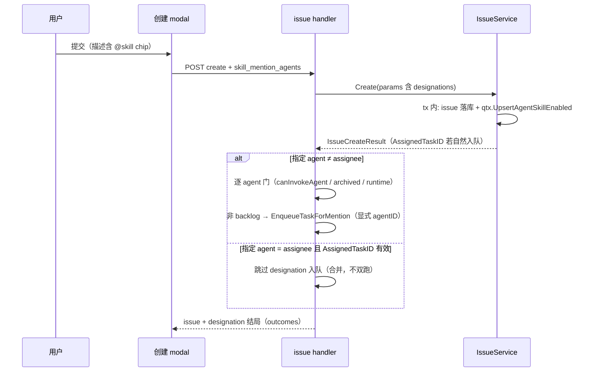
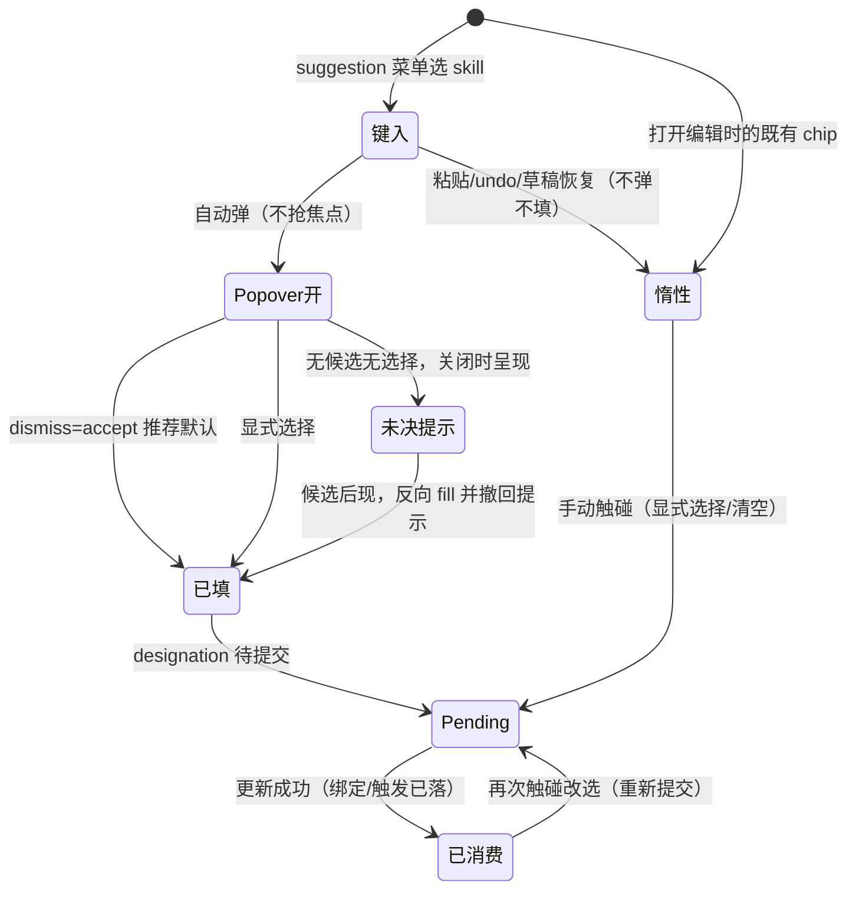
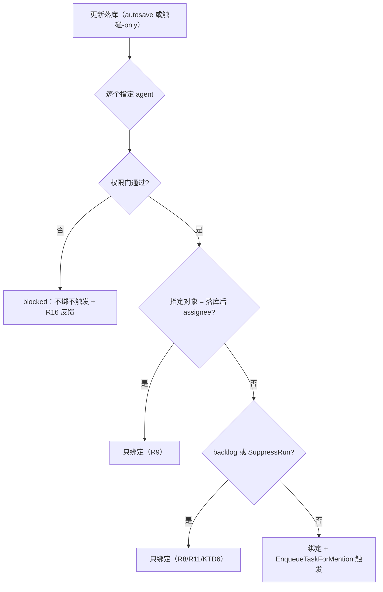

# Skill Designation in Issue Descriptions - Plan

## Goal Capsule

- **Objective:** issue 描述编辑器（创建 modal 与编辑态）具备与评论框同等的 `@skill` designation 能力——键入即弹 agent-picker、推荐预选、提交产生 durable 绑定并按路径分流触发。描述面的「`@skill` 被静默忽略」路径被消除。
- **Means:** 延伸评论路径已建立的 designation 手势与后端可组合的绑定/入队步骤，把管道接到 issue 创建与更新接口（复用而非新造模式）。
- **Product authority:** 本 plan owns 描述编辑器 designation 的交互语义、推荐来源、以及创建/编辑两路的触发与绑定分流规则。评论路径（CommentInput / ReplyInput）的既有行为沿用不改。
- **Scope:** web/desktop 共享层的两个描述编辑器——创建 modal manual 模式 + issue 编辑态。agent 模式 prompt 面板、评论编辑模式、mobile 不在范围。
- **Open blockers:** 无。

---

## Product Contract

### Summary

把 `@skill` designation 手势扩展到两个描述编辑器：键入 `@skill` 自动弹 agent-picker、预选推荐 agent、关闭即接受默认；创建提交时 designation 随 issue 落库——durable 绑定 + 立即触发被指定的 agent（backlog 压制入队、绑定照落）；编辑提交时按指定对象分流——assignee（默认）只绑定不触发，指定非 assignee 的 agent 则绑定 + 触发。

### Problem Frame

评论 composer 的 `@skill` designation 交互已在 `2026-08-18-1759` 闭合：键入即弹、推荐预选、dismiss=accept、提交产生 durable 绑定与运行。但该交互止步于评论框。issue 描述编辑器是完整空白：`@` 菜单能列出 skill、chip 能插入，却没有任何 agent-picker 上下文，designation 也没有提交管道——issue 创建与更新接口均无 `skill_mention_agents` 处理。

这在创建路径最疼。issue 描述是任务意图最完整的载体，用户在创建时写 `@code-review` 期望 agent 带着 skill 接手，实际是纯装饰：skill 不绑定、agent 不运行。描述里的 `@skill` 被静默忽略——正是评论路径已消灭的问题在描述面的存活。编辑路径同理：维护性编辑中想给 assignee 预装 skill、或刻意拉另一个 agent 入场，没有通路；用户只能创建后再去评论框补一次 `@skill`，或手动到 agent 设置里绑技能。

### Key Decisions

- KD1. **创建 modal 描述编辑器支持 `@skill` designation**（session-settled: user-directed — chosen over 接受父 plan `2026-08-18-1759` 的 F3 延期现状：「`@skill` 不能丢」在创建路径同样成立）。Governs R1–R8.
- KD2. **创建路径指定即触发**（session-settled: user-directed — chosen over 只绑不跑 / 仅 assignee 触发：与 CONCEPTS.md「Skill Mention Gesture」词条的 bind+enqueue 一体语义一致；指定非 assignee 的 agent 也入队）。Governs R7.
- KD3. **backlog 停住一切**（session-settled: user-directed — chosen over 严格镜像评论语义：backlog 是更强的「先别跑」停放信号，绑定照落、入队压制；接受非 assignee 指定在 backlog 下可能等不到自然触发时机的代价）。Governs R8, R11.
- KD4. **编辑态按指定对象分流**（session-settled: user-directed — chosen over 编辑态全触发 / 全不触发：issue 已有属主，接受 assignee 默认 = 内容维护、只绑定；显式指定非 assignee = 刻意的「拉人入场」手势、绑定 + 触发）。Governs R9.
- KD5. **只覆盖 manual 模式描述编辑器**（session-settled: user-directed — chosen over 双模式覆盖：agent 模式的 prompt 本身就是发给选定 actor 的指令，designation 语义在那里会混淆）。约束 R1 的适用面。
- KD6. **编辑态推荐优先级沿用「描述内显式 `@agent` mention > assignee」，mention 来源限本次编辑会话新键入**：与创建路径及评论路径 R2 优先级一致，新鲜度约束防止长寿命描述中的陈旧 mention 劫持推荐；mention 指向非 assignee 时，接受推荐即构成 R9 的「指定非 assignee」→ 绑定 + 触发。Governs R2.
- KD7. **编辑态不水合既有 chip 的绑定状态**：`agent_skill` 是 agent 级 durable 事实，服务端不按 mention 实例持久化 designation map；打开编辑时既有 chip 不显示绑定状态、不参与 auto-bind。Governs R10.
- KD8. **auto-fill sticky，不追逐 assignee 变更**（沿用评论路径 KTD5 语义）：fill 落地后再改 assignee 不更新已填推荐；反向时序——chip 先插入、assignee 后选定——候选出现且 entry 未触碰时即 fill（保证「`@skill` 不丢」）。Governs R3.
- KD9. **指定门控沿评论路径门集**：issue 两路径的 designation 对每个被指定 agent 过调用权限门（AccessScope 不可 invoke、archived、无可用 runtime），单 agent 失败不 abort 其余指定——镜像评论路径 `bindAndEnqueueSkillMentions` 的既有门集，堵住「任意 member 经一个 API 字段入队他人私有 agent」的缺口。Governs R15.
- KD10. **指定结局必须可见**：bind-only（含创建 backlog）与被门挡下都是用户在意的结局，一律给非阻断反馈——Objective 消灭静默路径的承诺不因结局不同而豁免。Governs R16.

### Requirements

**Popover 交互（两个描述编辑器共享）**

- R1. 用户从 `@` 菜单选中 skill 后，agent-picker popover 在描述编辑器中自动弹出且不抢焦点；工作区无可绑定 agent（列表为空）时不自动弹、保留手动点击手势，列表 in-flight 时待就绪再弹。创建 modal manual 模式与 issue 编辑态两处一致。
- R2. Popover 打开时预选推荐 agent：描述内显式 `@agent`/`@squad` mention 的 agent > assignee（创建路径为表单 assignee，编辑路径为 issue 当前 assignee）；无候选时不预选。编辑路径的 mention 推荐来源仅计本次编辑会话新键入的 mention（与 R10 的 chip 资格对齐），既有 mention 不参与推荐。「新键入」指经 suggestion 菜单路径插入——粘贴、undo 来源不计入（与 R5 的来源分类一致）。
- R3. 关闭 popover（Esc、点击外部、直接提交）即接受推荐默认；用户显式选择或清空后，推荐永不覆盖（touched 语义与评论路径一致）。
- R4. 手动点击 chip 打开 popover 的既有手势保持功能不变。
- R5. 粘贴、undo、草稿恢复来源的 chip 不自动弹出 popover、不参与 auto-fill（保留手动点击手势）。

**创建路径的绑定与触发**

- R6. designation 随 issue 创建请求一次提交（`skill_mention_agents` 随创建 payload），服务端在创建落库的同一原子边界内完成 durable 绑定（`agent_skill`），保证创建产生的首个 run（若有）已携带对应 skill。
- R7. 指定即触发：创建完成后，每个被指定的 agent 被入队携带对应 skill 运行。指定对象恰为 assignee 时，designation 触发与创建的自然入队合并为一次 run，不产生双跑。
- R8. 创建状态为 backlog 时，指定只建立绑定、不入队。

**编辑路径的绑定与触发**

- R9. 编辑已有 issue 的描述时，designation 随 issue 更新请求提交，按指定对象分流：指定 assignee（含接受推荐默认）只绑定不触发；指定非 assignee 的 agent 则绑定并触发该 agent 在此 issue 上运行。分流裁决以本次更新落库后的最终 assignee/status 为基准（与创建路径以落库状态为准对齐）；绑定不受 status/assignee 编辑影响，assignee/status 的后续变更不追溯影响已发生的 run、只影响将来的触发。
- R10. 打开编辑时，描述中已存在的 `@skill` chip 不显示绑定状态、不参与 auto-bind；仅本次编辑会话新键入的 chip 参与 auto-fill 与提交。提交资格按用户触碰而非 chip 年龄界定：手动点击既有 chip 打开 popover 并显式选择或清空后，该 chip 的指定随本次更新提交（无需绑定态水合，per R4 手动手势）；未触碰的既有 chip 保持惰性。编辑态 autosave 仅由描述变更驱动，而 designation 是 composer 状态不写回文档——popover 触碰关闭且无待提交描述变更时，客户端主动发起一次仅携带 designation 的更新，保证「触碰后随本次更新提交」在零文档变更时仍可达。
- R11. 编辑路径的触发同受 backlog 压制（per R8，以落库后最终状态为准，per R9）：backlog 状态下指定非 assignee 只绑定。
- R13. 编辑路径 bind-only 结局提供轻量反馈：更新落库后以非阻断提示（如 toast）指出绑定落到了哪个 agent；触发类结局沿用既有 run 可见性，无需额外反馈。

**门控与结局反馈（两路径共享）**

- R15. 指定门控：服务端对每个被指定 agent 逐个执行调用权限门（与评论路径同款门集：AccessScope 不可 invoke、agent archived、无可用 runtime）。门失败的 agent 不绑定、不入队，以 blocked 结局反馈（per R16）；单 agent 失败不影响其余指定的绑定与触发。
- R16. 指定结局反馈：创建或更新落库后，以非阻断方式反馈指定结局——bind-only（编辑指定 assignee、或 backlog 压制下的创建/编辑指定）指出绑定落到了哪个 agent（编辑路径即 R13，创建路径补齐同一反馈）；被门挡下的 agent（per R15）聚合呈现被挡对象与原因，不逐条打断。触发类结局沿用既有 run 可见性。

**回落**

- R12. 未产生 designation 的提交不产生绑定或触发。覆盖三种到达方式：工作区无可绑定 agent（popover 不弹、chip 回落纯文本，per R1）；有可绑定 agent 但无推荐候选且用户未显式选择；用户显式清空指定。不带 `skill_mention_agents` 的 API 调用方（CLI、程序化创建）同属此类——chip 以纯文本落库，沿用评论路径已文档化的静默 no-op 契约。
- R14. 有可绑定 agent 但无推荐候选且用户未显式选择时，对**本次编辑会话新键入且到达过 popover** 的 chip 呈现「未决 designation」非阻断提示；粘贴、undo、草稿恢复来源与未触碰的既有 chip 不提示（per R5/R10 保持安静）。创建路径在提交前呈现，用户确认后以纯文本提交；编辑路径无提交闸门，提示在 popover 关闭时呈现、呈现即不静默——不延迟、不阻止 autosave，用户继续编辑即视为知情接受。提示呈现后若推荐候选出现并完成 fill（per R3、KD8），提示随之撤回。不静默降级（覆盖创建与编辑两路径；工作区无可绑定 agent 的场景 per R1 不弹 popover，不适用本条）。

### Key Flows

- F1. 创建 + 接受 assignee 默认
  - **Trigger:** 创建 modal 中描述含 `@skill`，表单选了 agent assignee，状态非 backlog。
  - **Steps:** popover 自动弹、预选 assignee → 用户直接提交 → 创建事务内绑定 assignee → 创建自然入队与 designation 触发合并。
  - **Outcome:** assignee 被 durable 绑定，恰一个首个 run 携带 skill。
  - **Covers R1, R2, R3, R6, R7.**
- F2. 创建 + 描述内显式 mention 覆盖默认
  - **Trigger:** 创建 modal 中描述含 `@agent-x` 与 `@skill`，assignee 是另一 agent。
  - **Steps:** popover 预选 agent-x（mention 优先）→ 提交 → 创建事务内绑定 agent-x → agent-x 入队。
  - **Outcome:** 非 assignee 的 agent-x 被绑定并在新 issue 上运行。
  - **Covers R2, R6, R7.**
- F3. 创建 backlog + designation
  - **Trigger:** 创建 modal 状态选 backlog，描述含 `@skill` 且指定 agent。
  - **Steps:** 提交 → 绑定落库 → 无入队 → R16 反馈指出 bind-only。
  - **Outcome:** `agent_skill` 有行、无该 agent 的 run；issue 离开 backlog 后由自然触发携带 skill。
  - **Covers R8, R16.**
- F4. 编辑 + 接受 assignee 默认
  - **Trigger:** 编辑已有 issue 描述，新键入 `@skill`，issue 有 agent assignee。
  - **Steps:** popover 自动弹、预选 assignee → 直接提交更新 → 绑定 assignee，不触发。
  - **Outcome:** assignee 技能列表新增该 skill，无新 run。
  - **Covers R1, R2, R3, R9.**
- F5. 编辑 + 显式指定非 assignee
  - **Trigger:** 编辑已有 issue 描述，新键入 `@skill` 并在 popover 选择非 assignee 的 agent，状态非 backlog。
  - **Steps:** 提交更新 → 绑定该 agent → 该 agent 在此 issue 入队。
  - **Outcome:** 非 assignee agent 被绑定并触发一次运行。
  - **Covers R9, R11.**
- F6. 无候选
  - **Trigger:** 创建或编辑中键入 `@skill`，无 assignee、无 mention。
  - **Steps:** popover 自动弹但不预选 → 创建路径提交前 / 编辑路径 popover 关闭时呈现未决 designation 提示 → 用户确认（创建）或继续编辑（编辑）后提交。
  - **Outcome:** 无绑定、无触发，chip 以纯文本提交（per R14）。
  - **Covers R12, R14.**

### Acceptance Examples

- AE1. **创建 backlog 只绑定**
  - **Given:** 创建 modal 状态为 backlog，描述 `@skill` 指定 agent A。
  - **When:** 提交创建。
  - **Then:** `agent_skill` 出现 A 的绑定行，队列中无 A 的 run。Covers R8.
- AE2. **编辑指定 assignee 不触发**
  - **Given:** 编辑 issue 描述，`@skill` 接受 assignee 默认。
  - **When:** 提交更新。
  - **Then:** 绑定落库，无新 run 产生。Covers R9.
- AE3. **编辑指定非 assignee 触发**
  - **Given:** 编辑 issue 描述，`@skill` 显式选择非 assignee 的 agent B，状态非 backlog。
  - **When:** 提交更新。
  - **Then:** B 被绑定且恰产生一个新 run，run 携带该 skill。Covers R9, R11.
- AE4. **创建 designate assignee 不双跑**
  - **Given:** 创建时 assignee 为 agent A、状态 todo，`@skill` 指定 A。
  - **When:** 提交创建。
  - **Then:** A 恰有一个 run（自然入队与 designation 合并），run 携带 skill。Covers R7.
- AE5. **先 chip 后 assignee 仍 fill**
  - **Given:** 创建 modal 无 assignee 时键入 `@skill`（popover 无预选），随后在表单选定 agent assignee。
  - **When:** assignee 选定。
  - **Then:** 该 chip auto-fill assignee；提交产生绑定与触发。Covers R2, R3.
- AE6. **粘贴不弹不绑**
  - **Given:** 描述编辑器中粘贴含 `@skill` markup 的文本。
  - **When:** 提交。
  - **Then:** popover 未自动弹出过，提交 payload 无该 chip 的 designation。Covers R5.
- AE7. **门挡私有 agent**
  - **Given:** member 无该 agent 的 invoke 权限（owner-only agent），创建或编辑中 `@skill` 指定该 agent，同请求还指定了另一个可 invoke 的 agent。
  - **When:** 提交。
  - **Then:** 私有 agent 无绑定、无 run，另一 agent 照常绑定/触发；反馈聚合呈现被挡 agent。Covers R15, R16.
- AE8. **触碰-only 提交**
  - **Given:** 编辑态用户手动点开既有 chip 并选择 agent，随后未做任何文字编辑。
  - **When:** popover 关闭。
  - **Then:** 客户端主动发起一次携带该 designation 的更新（不等待描述变更），绑定按 R9 分流落库。Covers R10.

### Scope Boundaries

**Out of scope / non-goals:**

- agent 模式 prompt 面板的 designation（KD5）——该面板沿用同一描述编辑器、`@` 菜单 skill 条目与 chip 插入今日可用；为守住 Objective 的「消除」断言，agent 模式面板须抑制 `@` 菜单的 skill 条目、且 manual→agent 模式切换的 description seed 须把 skill chip 剥除为纯文本，使死 affordance 不再可达（纳入 designation 范围与 KD5 裁决冲突）。
- 描述内显式 `@agent` mention 作为独立触发源——mention 只作推荐信号；运行只经由 `@skill` designation（R7/R9）或既有触发路径产生。
- CLI 与程序化调用方的 designation 暴露——无 `skill_mention_agents` 字段的调用一律 per R12 纯文本 no-op（评论路径已在 builtin skill 文档确立该契约，issue 面继承）。
- 评论路径（CommentInput / ReplyInput）任何行为改动。
- mobile（独立体系）。

**Deferred to Follow-Up Work:**

- 评论编辑模式 picker：后端 `UpdateComment` 已接受 `skill_mention_agents` 字段，但前端 edit composer 未接 context，且水合需要 timeline API 暴露历史绑定信息（designation map 不按评论持久化），依赖与本 plan R10 同源的取舍。
- 服务端 issue trigger preview 纳入 designation（run hint 的服务端权威化）：本 plan 以客户端 hint 行 + 提交后结局反馈覆盖知情面（KTD8/KTD9），preview 扩展待反馈出现再做。

### Dependencies / Assumptions

- 评论路径的绑定与入队在后端已是可独立组合的步骤（`bindDesignatedSkillsForTriggers` 与 `enqueueCommentAgentTriggers` 分离，2026-08-19 验证）；issue 路径复用绑定原语（`UpsertAgentSkillEnabled`）与入队叶子件（`EnqueueTaskForMention`、pending-task 唯一索引），不复刻评论折叠机制。
- 创建路径推荐数据源：issue trigger preview（`is_create` 模式）只答 assignee 源；描述内 mention 推荐由客户端 `parseMentions` 同步计算。编辑路径 assignee 从 issue 详情同步可得。两处推荐均为同步计算，无评论路径的冷启动竞态。
- `@` 菜单已默认列出 skill、chip 插入今日已可用；缺的是 popover 上下文、auto-bind 接线与提交管道。
- `agent_skill` 绑定是 agent 级 durable 事实、workspace 范围内共享，不按 issue 或 mention 实例持久化（R10 的直接推论）。

### Sources / Research

- 父 plan：`docs/plans/2026-08-18-1759-feat-skill-auto-bind-popover-plan.md`（评论路径 auto-bind 全量语义、KTD5 sticky/touched 机制、KTD3 键入插入检测）。
- `CONCEPTS.md`「Skill Mention Gesture」词条（bind+enqueue 一体、bind 与 run 解耦两条不变量）。
- 绑定/入队原语：`server/internal/handler/comment.go` 的 `bindAndEnqueueSkillMentions`（:2073-2186，含逐 agent 权限门）、`bindDesignatedSkillsForTriggers`（:2218-2239，`UpsertAgentSkillEnabled` 调用点 :2226）、`filterSuppressedCommentAgentTriggers`（:2267）；入队叶子件 `EnqueueTaskForMention`（`server/internal/service/task.go:1173-1175`，接受显式 agentID、容忍空 commentID）。
- 创建链路：`server/internal/handler/issue.go` 的 `CreateIssueRequest`（:2683-2709）、`IssueService.Create`（`server/internal/service/issue.go:202-372`，labels 事务内写入先例 :349-357，`IssueCreateResult.AssignedTaskID` :167-169）；`maybeEnqueueOnAssign`（:608-647，backlog 拒绝 :615-617）。
- 更新链路：`UpdateIssueRequest`（`issue.go:3005-3040`，`SuppressRun` :3029）；`updateIssueWithDescriptionMerge`（:3119-3173，自带事务 + 行锁）；变更基准计算（:3410-3420，落库后 vs 锁前）；`WillEnqueueRun`（`server/internal/service/issue_trigger.go:97-193`，只裁 assignee/squad-leader）；`dispatchIssueRun`（`server/internal/handler/issue_trigger.go:84-94`）。
- 权限门：`canInvokeAgent`（`server/internal/handler/agent_access.go:48`）；`validateAssigneePair` 只盖 assignee（`issue.go:3538`）——designation 门为净新增。
- 前端管道：编辑态 autosave（`packages/views/issues/components/issue-detail.tsx:2728-2768`，debounce 1500ms，onUpdate 接入点 :2754-2758）；`useUpdateIssue` 控制字段剔除（`packages/core/issues/mutations.ts:111-124, :204-224`）；创建 modal（`packages/views/modals/create-issue.tsx:864-874`，draft store `packages/core/issues/stores/draft-store.ts` 跨会话持久化）；`@` 菜单抑制三层穿线（`packages/views/editor/extensions/mention-suggestion.tsx:740-751, :857-860`、`extensions/index.ts:275-283`、`content-editor.tsx:123-254`，`disableMentions` 先例）。
- 测试母本：`server/internal/handler/skill_mention_trigger_test.go`（24 用例；`_BindsDespiteDedup` :820、`_SuppressedDesignatedAgentStillBound` :879、`TestUpdateComment_ReTriggersSkillMentionDesignation` :539、cap 400 :919/:964）。
- 留档：`docs/solutions/logic-errors/bind-on-skip-when-dedup-rewrites-source.md`（bind 永不以 trigger source 为 key）、`docs/solutions/test-failures/whole-module-vi-mock-shadows-new-named-export.md`（整模块 mock 陷阱）、`docs/solutions/ui-bugs/access-picker-unstable-reference-useeffect-reset.md`（popover 稳定引用）、`docs/solutions/ui-bugs/skill-autocomplete-cold-cache.md`（缓存预热）、`docs/solutions/integration-issues/cross-workspace-cloned-agent-skill-refs-leak-source-uuids.md`（不持久化 designation 进文档正文的依据）。
- 2026-08-20 规划研究：三路研究 + 流分析（repo patterns / learnings / agent-native parity / spec-flow），AccessScope 门缺口与触碰-only 提交缺口均出于此。

---

## Planning Contract

Product Contract 保存记录：changed: R2（补「新键入」定义）、R10（补触碰-only 提交触发器）、R14（资格矩阵 + 编辑路径无闸门变体）修订，R15/R16 新增（规划研究发现门控缺失与结局反馈缺口）——2026-08-20 scope 确认经用户确认；F3/F6 步骤、Scope Boundaries（CLI 契约显性化、seed 剥 chip）、AE7/AE8、F 组同步；Outstanding Questions 四项与 Deferred 区 autosave 条目已全部由下列 KTD 收编，原节移除。其余 Product Contract 原样保留。

### Key Technical Decisions

- KTD1. **触发次数语义：服务端 per-request，客户端单次提交消费**。服务端沿用 `UpdateComment` 先例——携带 `skill_mention_agents` 的请求各自裁决一次（失败重试自然重发，语义正确）。客户端在会话内保证每个 designation 恰好提交一次：提交成功即标记该 chip 已消费，后续 autosave 不再携带——关闭「run 完成后的下一次 autosave 重触发」窗口（pending 期内另有 `idx_one_pending_task_per_issue_agent_v2` 唯一索引兜底，migration 257；v1 已被 migration 258 drop）。不引入服务端幂等锚（KD7 已移除 mention 实例持久化，无处安放）。已消费 chip 再次触碰 = 新的显式手势，重新提交、可再触发。reload/关 tab 丢失未提交 designation：接受（与未保存的描述编辑同命运，`flushPendingOnUnmount` 覆盖路由内导航）。Governs R9, R10.
- KTD2. **两路径绑定耐久性契约不同**：创建路径 bind 必须在创建事务内（designations 进 `IssueCreateParams`，`qtx.UpsertAgentSkillEnabled`，labels 同模式先例）——评论路径的 post-commit best-effort 若照抄，自然入队可能先于 bind 落库被派发，违反 R6「首个 run 携带 skill」。编辑路径沿用 post-commit best-effort（bind 在 handler 序列中先于 designation 入队执行，顺序已保证），与评论先例一致。Governs R6, R9.
- KTD3. **创建合并以 `AssignedTaskID` 为信号，落点在 handler 层 post-create**：service 返回的自然入队 task id 只有 handler 消费；指定 agent 恰为 assignee 且该 id 有效 → 跳过 designation 入队、只补（事务内已落的）绑定，即达成 R7 不双跑，无需移植评论路径 dedup。Governs R7.
- KTD4. **非 assignee 入队载体：handler 层 `dispatchIssueRun` 旁的新分支**，走 `EnqueueTaskForMention`（显式 agentID + 空 triggerCommentID + `memberActorUserID` 归因）；`WillEnqueueRun` 保持 assignee/squad-leader 专职，不扩谓词。编辑路径上「designation 触发 X」与「稍后 assign X 经 run-confirm 确认」是两次独立显式手势，各自成 run 属接受行为（时间重叠时 pending 唯一索引去重）。Governs R9.
- KTD5. **AccessScope 门照抄评论路径门集，推荐位不做前置权限过滤**：逐 agent `canInvokeAgent`（以创建者/编辑者为 actor）、archived、runtime 检查，单失败不 abort；门失败不绑定不入队。推荐（mention > assignee）保持本地计算不过滤——assignee 是工作区自己的选择，预选它被门挡时由 R16 反馈兜底；流有终点即不静默。Governs R15.
- KTD6. **`SuppressRun` 压制 designation run、绑定照落**：镜像评论路径 `_SuppressedDesignatedAgentStillBound` 先例；消费点在 `issue.go:3478` 同一分支语义下扩展。Governs R9.
- KTD7. **handoff 内容 = designation 事件摘要**：编辑路径触发的 run 复用 `AgentTaskQueue.HandoffNote` 机制（daemon 渲染进开场 prompt），内容为「actor + skill 标签 + 编辑描述时指定」的事件摘要，不引用描述正文、不劫持用户手写的 handoff 字段；旧 daemon 丢弃 note 时降级为读描述自悟（`runtimeSupportsHandoff` 版本门已处理）。
- KTD8. **创建 modal 外围完整性**：designation map + touched/filled 守卫随 `multica_issue_draft` 持久化（父 plan 评论路径 KTD5 把 map 持久化进 `CommentDraftPayload` 的同款裁决——误关 modal 再打开不丢）；CreateRunHint 增加客户端指定行（「指定 X 将携带 skill 运行」/ backlog 时「只绑定不运行」——纯前端、不动 preview API）；manual→agent 模式切换的 description seed 把 skill chip 剥为纯文本；提交时 payload 组装做终填（popover 开着直接点 Create 也接受默认，父 plan U4 先例）；多 chip 顺序逐个弹（父 plan KTD2 单槽先例）。Governs R3, R14.
- KTD9. **服务端 preview 不扩**：沿评论路径 parse-and-discard 先例，`PreviewIssueTrigger` 不认 designation；run hint 的指定知情面由 KTD8 客户端行覆盖，服务端权威化 Deferred。Governs R2.
- KTD10. **API 兼容与边界**：`CreateIssueRequest`/`UpdateIssueRequest`（Go 与 `packages/core/types/api.ts` 两处）加可选 `skill_mention_agents?: Record<string, string[]>`（空 map 不发送，评论先例）；请求边界复用 `parseSkillMentionAgents`（per-skill 8 / 全 map 16 cap 一并复用）；响应侧 designation 结局走新增响应字段（沿用评论 `trigger_outcomes` 形状），create/update 响应 schema 补 zod + malformed-response 测试——顺手补齐 `updateIssue` client 今日无 schema 的既存偏差；`useUpdateIssue` 的 `onMutate`/`onSuccess` 控制字段剔除列表同步加入新字段（同 `suppress_run` 待遇）；旧客户端不发送即无字段，天然兼容（mobile 引用同类型亦然）。Governs R6, R9, R16.
- KTD11. **fork 面**：`skill_mention_agents` 进两个 issue request struct 扩张 Fork Invariant Set（`bindAndEnqueueSkillMentions`/`parseSkillMentionAgents`/`skill_mention_trigger.go` 自 v0.4.17 起 fork-only）——`docs/customizations.md` ledger 同 PR 登记；后续 upgrade 若 upstream 动这两个 struct 触发 Strategy D（union-of-extensions）；builtin skills 文档义务同 PR（multica-mentioning SKILL.md 适用面/Step 3/CLI gap 注记 + `references/mentioning-source-map.md` 新行 + `builtin_skills_test.go` pin）。

### High-Level Technical Design

创建路径（提交 → 事务内绑定 → 合并/分流入队 → 结局反馈）：

编辑态 chip 生命周期（触碰/消费状态机）：

编辑路径落库后的分流裁决（autosave 与触碰-only 更新共用）：

### Risks and System-Wide Impact

- **API 面**：新增请求字段 + 新增响应结局字段——旧桌面客户端对旧后端（无字段）靠 optional-chain 防御（CLAUDE.md API 兼容规则）；malformed-response 测试随 schema 落。
- **fork 面**：Fork Invariant Set 扩张（KTD11）；upgrade 审计须含两个 request struct 的签名变更扫描（含 `*_test.go`）。
- **测试盲区**：`use-skill-auto-bind` 引擎新增具名导出会击中既有整模块 `vi.mock`——新增导出前 grep 全部 mock 站点，新 mock 一律 `importActual` 展开；提交前跑整包 views 套件而非定向套件。
- **UI 细节风险**：picker/popover 传参全走稳定引用（内联 `{[]}` 会重置预选）；新编辑器挂载点确认 `ensureCaches` 四缓存预热。
- **接受的取舍**：preview 低报（KTD9）、并发双显式手势双 run（KTD4）、reload 丢 pending designation（KTD1）、门挡候选仍可被推荐（KTD5，反馈兜底）。

---

## Implementation Units

### U1. Server：请求字段与边界校验（两路径共享）

- **Goal:** `CreateIssueRequest` 与 `UpdateIssueRequest` 接受并校验 `skill_mention_agents`，malformed 输入 400。
- **Requirements:** R6, R9（字段载体）；R12（无字段 = no-op）。
- **Dependencies:** 无。
- **Files:** `server/internal/handler/issue.go`（`CreateIssueRequest` :2683-2709、`UpdateIssueRequest` :3005-3040）、`server/internal/handler/handler.go`（复用 `parseSkillMentionAgents`）；测试 `server/internal/handler/skill_mention_issue_test.go`（新建，镜像 `skill_mention_trigger_test.go` 结构）。
- **Approach:**
  1. 两个 request struct 加 `SkillMentionAgents map[string][]pgtype.UUID`，JSON tag `skill_mention_agents,omitempty`。
  2. 边界解析走 `parseSkillMentionAgents`（fieldName 参数化），per-skill 8 / 全 map 16 cap 照抄。
  3. 空 map / 缺省字段在 handler 内等价于无 designation，零行为变化。
- **Test scenarios:**
  - 创建与更新各一：malformed agent UUID → 400，issue 不落库。
  - per-skill 超 8 agent → 400（镜像 `TestUpdateComment_SkillMentionAgentsOverPerSkillCap400s`）。
  - map 超 16 skill → 400。
  - 请求不带字段 → 行为与今日完全一致（回归钉）。
- **Verification:** 新测试全绿；`go vet` 通过。

### U2. Server：创建路径事务内绑定与合并入队

- **Goal:** 创建落库的同一事务内完成 durable 绑定；post-create 按 R7/R8/R15 分流入队并产出结局。
- **Requirements:** R6, R7, R8, R15；Covers AE1, AE4, AE7。
- **Dependencies:** U1。
- **Files:** `server/internal/service/issue.go`（`IssueCreateParams` + Create 事务，labels 先例 :349-357）、`server/internal/handler/issue.go`（CreateIssue post-create 段）、`server/internal/service/task.go`（`EnqueueTaskForMention` 复用）；测试 `server/internal/handler/skill_mention_issue_test.go`。
- **Approach:**
  1. designations 进 `IssueCreateParams`，事务内 `qtx.UpsertAgentSkillEnabled`（KTD2 强保证）。
  2. handler post-create：逐指定 agent 过门（KTD5 门集，actor = 创建者）；门失败记 blocked 结局。
  3. 通过者：指定恰为 assignee 且 `res.AssignedTaskID` 有效 → 不再入队（KTD3 合并）；否则非 backlog → `EnqueueTaskForMention`（KTD4 载体），backlog → 只绑定。
  4. 响应携带 designation 结局（KTD10 outcomes 字段）。
- **Execution note:** 先写失败测试再实现（repo 约定）；bind 落点在事务内是 R6 的硬约束，勿照抄评论路径 post-commit 形状。
- **Test scenarios:**
  - Covers AE1. backlog + 指定 A → `agent_skill` 有行、无 run。
  - Covers AE4. assignee = A 且指定 A → 恰一个 run，携带 skill（合并）。
  - 事务原子性：创建失败回滚时无 `agent_skill` 行。
  - 指定非 assignee B（todo）→ B 绑定 + 入队，恰一个 run。
  - Covers AE7. 指定含无权限私有 agent → 该 agent 无 bind 无 run，其余照常，结局含 blocked。
  - archived / runtime offline agent → blocked 结局（`target_unavailable` / `runtime_offline` 类）。
- **Verification:** 上述测试全绿；`make test` server 侧无回归。

### U3. Server：编辑路径门控、分流与非 assignee 入队

- **Goal:** 更新落库后以最终 assignee/status 为基准分流（assignee 只绑、非 assignee 门 + 绑 + 触发），backlog 与 `SuppressRun` 压 run 不撤 bind，产出结局。
- **Requirements:** R9, R11, R13, R15, R16；Covers AE2, AE3, AE7。
- **Dependencies:** U1。
- **Files:** `server/internal/handler/issue.go`（UpdateIssue handler，落库后、`dispatchIssueRun` 判定旁）、`server/internal/handler/comment.go`（复用 `HasPendingTaskForIssueAndAgent` 叶子件 :3220-3237）、`server/internal/service/task.go`（`EnqueueTaskForMention`）；测试 `server/internal/handler/skill_mention_issue_test.go`。
- **Approach:**
  1. 落库后（`updateIssueWithDescriptionMerge` 返回的最终 issue + `prevIssue`）逐指定 agent：门（KTD5）→ assignee 匹配（R9 最终基准）→ backlog / `SuppressRun` 检查（R11/KTD6）→ `EnqueueTaskForMention` 或 bind-only。
  2. bind 为 post-commit best-effort（KTD2 编辑侧契约），顺序先于任何入队。
  3. `WillEnqueueRun` 不动（KTD4）；归因用 `memberActorUserID`。
  4. 响应携带 designation 结局。
- **Test scenarios:**
  - Covers AE2. 指定 assignee → 绑定、无新 run。
  - Covers AE3. 指定非 assignee B（todo）→ B 绑定 + 恰一个 run 携带 skill。
  - backlog 状态下指定非 assignee → 只绑定（R11）。
  - `SuppressRun=true` 指定非 assignee → 无 run、绑定在（镜像 `_SuppressedDesignatedAgentStillBound`）。
  - 同请求内改 assignee + 携带 designation：以落库后 assignee 仲裁（指定了新 assignee → bind-only；指定了旧 assignee（现为非 assignee）→ bind + 触发）。
  - Covers AE7. 无权限私有 agent → blocked，其余不受影响。
  - designation map 为空时零行为变化（回归钉）。
- **Verification:** 上述测试全绿；既有 UpdateIssue 测试无回归。

### U4. 前端：两编辑器 designation 上下文与 agent 模式抑制

- **Goal:** `skillMentionContext` 接入创建 modal manual 描述编辑器与编辑态描述编辑器；agent 模式面板抑制 `@` 菜单 skill 条目且 seed 剥 chip。
- **Requirements:** R1（载体）、KD5 scope（抑制 + 剥 chip）。
- **Dependencies:** 无（可与 U1 并行）。
- **Files:** `packages/views/modals/create-issue.tsx`（:864-874 ContentEditor）、`packages/views/issues/components/issue-detail.tsx`（:2728-2768 ContentEditor）、`packages/views/modals/quick-create-issue.tsx`（:623-636 agent 面板 + mode-switch seed）、`packages/views/editor/extensions/mention-suggestion.tsx`（`disableSkillItems` 选项）、`packages/views/editor/extensions/index.ts`（透传）、`packages/views/editor/content-editor.tsx`（prop 穿线）、`packages/views/editor/skill-mention-context.ts`；测试 `packages/views/modals/create-issue.test.tsx`、新建编辑态描述编辑器组件测试。
- **Approach:**
  1. `disableSkillItems` 三层穿线，镜像 `disableMentions` 既有路径（KTD 研究结论：源头条件化覆盖 suggestion 两模式）。
  2. 两个目标编辑器挂 `skillMentionContext` provider（沿评论路径 CommentInput 样板）。
  3. agent 面板传抑制 flag；manual→agent seed 时把 skill mention 节点降为纯文本。
- **Test scenarios:**
  - agent 模式面板 `@` 菜单无 skill 条目；manual 模式有。
  - mode-switch seed 后 agent prompt 文本不含 skill chip markup。
  - 两个目标编辑器中键入 skill 后 context 登记 chip（供 U5 消费）。
  - `ensureCaches` 预热在新挂载点生效（冷缓存下拉非空）。
- **Verification:** `pnpm --filter @multica/views test` 相关套件绿；`pnpm typecheck` 通过。

### U5. 前端：自动弹、推荐与 auto-fill 适配

- **Goal:** 键入自动弹（不抢焦点）、推荐预选（mention > assignee，会话新鲜度）、dismiss=accept、touched 不覆盖、粘贴/undo/草稿不弹不填、反向时序 fill。
- **Requirements:** R1, R2, R3, R5；Covers AE5, AE6。
- **Dependencies:** U4。
- **Files:** `packages/views/issues/hooks/use-skill-mention-auto-open.ts`（复用）、`packages/views/issues/hooks/use-skill-auto-bind.ts`（适配扩展）、`packages/views/issues/hooks/use-recommended-skill-agent.ts`（fast-path 形态）、`packages/core/issues/comment-trigger-outcomes`（`parseMentions` 复用）；测试沿既有 hook/组件套件位（`use-recommended-skill-agent.test.ts` 等）。
- **Approach:**
  1. 创建路径无 issueId：推荐走同步 fast-path——客户端 `parseMentions(description)` 取本次会话新键入的 `@agent`/`@squad` mention > 表单 assignee；squad assignee 解析 leader（squads + agents query 同步算，净新增）。
  2. 编辑路径：issueId + 详情 assignee 同步来源；mention 过滤器只认 suggestion 路径插入（R2「新键入」定义）。
  3. auto-open/auto-fill 沿用 `useSkillMentionAutoOpen` / `useSkillAutoBind` 既有机制；popover 传参全稳定引用（无内联 `{[]}`）。
- **Test scenarios:**
  - Covers AE5. 无 assignee 键入 chip → 选定 assignee → fill。
  - Covers AE6. 粘贴 chip → 不弹、不填、提交无 designation。
  - 推荐优先级：新键入 mention agent > assignee；既有（非本会话）mention 不参与。
  - squad assignee → leader 被预选。
  - touched 后 assignee 变更不覆盖（KD8 sticky）。
- **Verification:** hook/组件测试绿；手动 smoke：两编辑器键入 `@skill` 弹出且不抢焦点。

### U6. 前端：提交管道、单次消费与草稿持久化

- **Goal:** 创建 payload 携带 designation（含终填）；编辑态 designation 搭 autosave + 触碰-only 触发器；成功即消费；draft 持久化。
- **Requirements:** R6, R9, R10；Covers AE8。
- **Dependencies:** U4, U5。
- **Files:** `packages/core/types/api.ts`（两 request 类型）、`packages/core/api/client.ts`（`createIssue`/`updateIssue` 字段 + `updateIssue` 响应 schema 补齐 + outcomes schema）、`packages/core/issues/mutations.ts`（控制字段剔除 :111-124/:204-224）、`packages/core/issues/stores/draft-store.ts`（map + 守卫持久化）、`packages/views/issues/components/issue-detail.tsx`（onUpdate 接入 :2754-2758 + onSuccess 消费 + 触碰-only 触发）、`packages/views/issues/actions/use-issue-actions.ts`、`packages/views/modals/create-issue.tsx`（submit 组装）；测试 `packages/core/api/client.test.ts`（malformed）、`packages/core/issues/stores/draft-store.test.ts`、views 组件测试。
- **Approach:**
  1. 创建：submit handler 组装 payload 时终填（ref 读已解析推荐），携带 map，空 map 省略字段。
  2. 编辑：onUpdate 携带当前 pending designation；mutation onSuccess 标记消费（KTD1）；popover 触碰关闭且无 pending 描述变更 → 主动发一次仅含 designation 的 update（R10 触发器）。
  3. draft store 增存 `skillMentionAgents` + touched/filled 守卫（KTD8），恢复后按 R5 不 re-fill 但 designation 不丢。
  4. mutation 控制字段剔除列表加 `skill_mention_agents`。
- **Test scenarios:**
  - 创建提交 payload 含 designation map；终填在 popover 未关时发生。
  - 编辑 autosave 首次携带 designation、成功后第二次 autosave 不再携带（消费）。
  - 更新失败 → designation 保持 pending，下个 autosave 重发。
  - Covers AE8. 触碰-only（零文档变更）→ 恰发起一次携带 designation 的更新。
  - draft 保存/恢复后 map 与守卫还原。
  - `updateIssue` 响应 malformed → `parseWithFallback` 兜底不抛。
- **Verification:** 上述测试绿；`pnpm --filter @multica/views test` 整包绿（整模块 mock 盲区防线）。

### U7. 前端：反馈面（bind-only、blocked、未决提示、run hint）

- **Goal:** R13/R16 的非阻断反馈与 R14 的未决 designation 提示，及 CreateRunHint 指定行。
- **Requirements:** R13, R14, R16；Covers F3, F6。
- **Dependencies:** U6。
- **Files:** `packages/views/issues/actions/use-issue-actions.ts`（onSuccess 钩子位，:101-110 先例）、`packages/views/modals/create-issue.tsx`（CreateRunHint 扩展 + 提交前检查）、编辑态提示组件（issue-detail 内或新组件，reveal-band 模式）；测试 views 组件套件。
- **Approach:**
  1. bind-only（编辑 R13 + 创建 backlog）→ sonner toast 指出绑定 agent（`toast` 全仓标准，注意 sonner 渲染于 NavigationProvider 外的约束）。
  2. blocked 结局从响应 outcomes 读，聚合一条 toast（Q8 默认）。
  3. 未决提示：创建 = 提交前 reveal band（`grid-rows-[0fr]→[1fr]` + `aria-live="polite"`，CreateRunHint 同款）；编辑 = popover 关闭时呈现，候选出现 fill 后撤回（R14/KTD8）。
  4. CreateRunHint 加客户端指定行（KTD8）。
- **Test scenarios:**
  - Covers F3. 创建 backlog bind-only → 提交后 toast 指出绑定 agent。
  - 编辑 bind-only（指定 assignee）→ toast；触发类 → 无额外 toast（run 可见性已有）。
  - Covers F6. 无候选未决 → 创建：提交前提示、确认后纯文本提交；编辑：popover 关闭呈现、继续编辑即接受。
  - 未决提示呈现后 assignee 出现并 fill → 提示撤回。
  - 混合结局（1 blocked + 1 success）→ 恰一条聚合 toast。
  - hint：指定非 assignee 且非 backlog → 出现「将携带 skill 运行」行；backlog → 「只绑定不运行」。
- **Verification:** 组件测试绿；手动 smoke 覆盖 F3/F6。

### U8. 文档与 fork 登记

- **Goal:** builtin skills 文档同步 + customization ledger 登记，满足 repo 同 PR 义务。
- **Requirements:** KTD11（义务）；R12 契约显性化。
- **Dependencies:** U1-U3 定型（字段与结局面形状）。
- **Files:** `server/internal/service/builtin_skills/multica-mentioning/SKILL.md`、`server/internal/service/builtin_skills/multica-mentioning/references/mentioning-source-map.md`、`server/internal/service/builtin_skills_test.go`、`docs/customizations.md`。
- **Approach:**
  1. SKILL.md：frontmatter 适用面扩到 issue 描述；Step 3 增 issue create/update designation 语义（KD2/KD4/KD3 摘要）；CLI gap 注记扩 `multica issue create --description`。
  2. source-map 增行：两 request 字段、issue 路径 bind/enqueue/gate 调用点、outcomes 面。
  3. `builtin_skills_test.go` 按既有 pin 先例补新 claim。
  4. `docs/customizations.md` 登记本 cluster（fork-only 表面扩张、Strategy D 触发条件备注）。
- **Test scenarios:**
  - Test expectation: none — 纯文档/登记；验收靠 `builtin_skills_test.go` 既有 + 新增 pin 全绿。
- **Verification:** `make test` 中 builtin_skills 套件绿；ledger 行可检索。

---

## Verification Contract

| 检查 | 命令 | 适用 |
| --- | --- | --- |
| Server 全量 | `make test` | 合入门（handler 集成测试需本地 dev DB 已迁移到当前 schema） |
| 定向迭代 | `(cd server && go test ./internal/handler/ -run 'SkillMentionIssue' -count=1)` | U1-U3 迭代期 |
| 类型 | `pnpm typecheck` | 全前端单元合入门 |
| Views 整包 | `pnpm --filter @multica/views test` | U4-U7 合入门（整模块 mock 盲区防线，勿用定向套件替代） |
| 全量 TS | `pnpm test` | 收尾门 |
| Lint | `pnpm lint` | 收尾门 |
| E2E | 不新增 | 评论路径无 e2e 先例；服务端 handler 测试 + views 组件测试为本 feature 的权威层 |

行为技能评估：无。malformed-response 测试（`packages/core/api/client.test.ts`）与 builtin skills pin（U8）为 API 兼容与文档义务的硬验收。

---

## Definition of Done

**全局：**

- R1-R16 逐条可指认到实现代码与测试（trace 到 U-ID）。
- 上表全部命令绿；`gofmt`/`go vet` 干净。
- CLAUDE.md API 兼容规则满足：新响应字段有 zod schema + malformed-response 测试；下游 optional-chain 防御。
- 无残留实验/死代码（放弃的尝试已从 diff 移除）。
- fork ledger 行与 builtin skills 文档在同一 diff（U8）。
- 手动 smoke：创建 modal 与编辑态各走一遍 F1/F4 主路径 + F3/F6 反馈路径。

**Per-unit：** 各 unit 的 Verification 字段全部达成。

**明确不在 DoD 内：** 服务端 preview 扩展、评论编辑模式 picker、CLI designation 暴露（均 Deferred / non-goal）。
